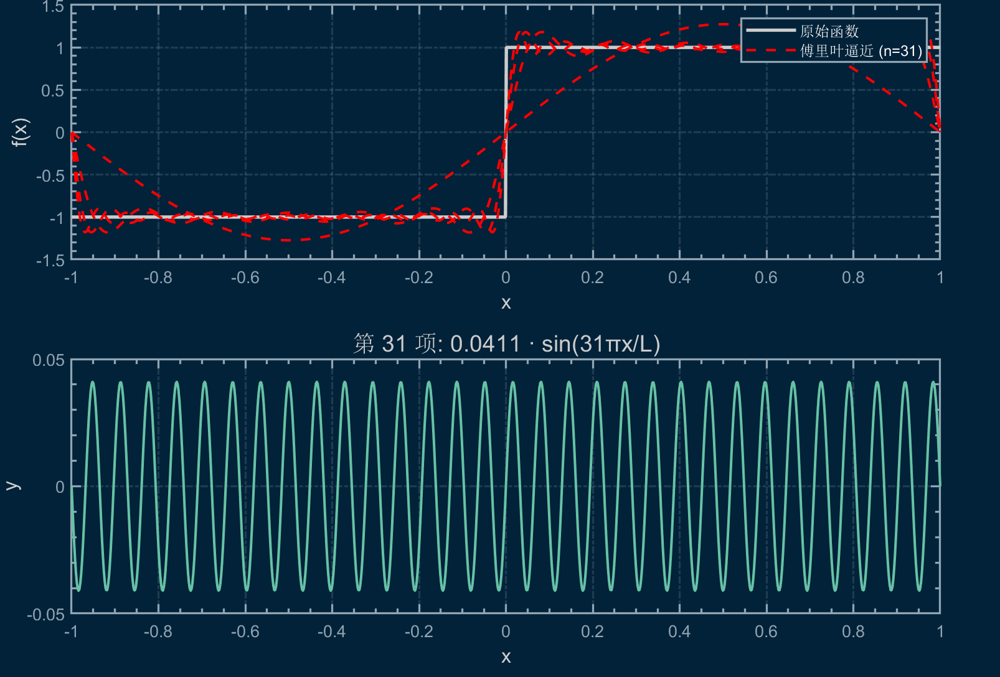

# 傅里叶变换
这是一个定义在 $[-1, 1]$ 上的方波函数


现在，我们定义一系列的正弦波函数

$$
f_k(x) = \frac{2(1 - \cos(k \pi))}{k \pi}  sin(k \pi x)
$$

令其前 $N$ 项的和为 $F(N)$

$$
F(N) = \sum_{k=1}^{N} f_k(x)
$$

我们来把 $F(1)$ 的图像画出来看看


看起来正弦波和方波之间没什么联系，我们把 $F(11)$ 的图像画出来，和方波比较看看


看起来正弦波有点向方波靠拢的趋势了，继续增加 $N$ 的值，看看 $F(31)$ 的图像



图像和真正的方波越来越接近了


叠加到 $F(100)$ 的时候，图像已经和方波几乎重合了，我们把 $F(100)$ 单独画出来看看。


可以发现，我们用一系列正弦函数的叠加模拟出了一个方波函数，像这样，将满足一定条件的函数用三角函数级数的和来表示，我们称之为傅里叶级数。

## 傅里叶级数的提出

[傅里叶](https://zhuanlan.zhihu.com/p/31371519) 发现傅里叶级数的过程有若干种说法，相对比较流行的说法是傅里叶在解有关于热传导的偏微分方程时（傅里叶曾从事有关于热传导的研究，著有《热的解析理论》），发现该微分方程的解是一个三角级数。

在经过一些更为广泛的论证后，傅里叶做出了一个大胆的猜想，他认为所有的周期函数都可以表示为正弦级数的形式，即

$$
f(t) = A_0 + \sum_{n = 1}^{\infty} A_n \sin(n \omega t + \phi_n)
$$

> 此时 $f(t)$ 的周期为 $T = \frac{2 \pi}{\omega}$，$A_0, A_n, \phi_n$ 为常数项。

傅里叶几乎是个天才，因为右边的式子涉及到无穷级数，明显就比左边的更复杂，把一个式子变得更复杂有什么呢。但是傅里叶认为右边的式子都是都是简单的正弦函数的叠加，在处理上更为方便，于是继续有

$$
f(t) = A_0 + \sum_{n = 1}^{\infty} [A_n \sin(n \omega t) \cos(\phi_n) + B_n \cos(n \omega t) \sin(\phi_n)]
$$

令 $a_n = A_n \cos(\phi_n), b_n = B_n \sin(\phi_n)$，则

$$
f(t) = A_0 + \sum_{n = 1}^{\infty} [a_n \sin(n \omega t) + b_n \cos(n \omega t)]
$$

现在，要求出 $A_0, a_n, b_n$，我们可以利用三角函数的正交性。

!!! note "三角函数的正交性"
    对于 $\sin{n \omega x}$ 和 $\cos{n \omega x}$ 而言，以下关系式成立

    $$
    \int_{-\frac{\pi}{\omega}}^{\frac{\pi}{\omega}} \sin(n \omega x) dx = 0
    $$

    $$
    \int_{-\frac{\pi}{\omega}}^{\frac{\pi}{\omega}} \cos(n \omega x) dx = 0
    $$

    $$
    \int_{-\frac{\pi}{\omega}}^{\frac{\pi}{\omega}} \sin(k \omega x) \cos(n \omega x) dx = 0
    $$

    $$
    \int_{-\frac{\pi}{\omega}}^{\frac{\pi}{\omega}} \sin(k \omega x) \sin(n \omega x) dx = 0
    $$

    $$
    \int_{-\frac{\pi}{\omega}}^{\frac{\pi}{\omega}} \cos(k \omega x) \cos(n \omega x) dx = 0
    $$

    其中 $n, k \in \mathbb{N}$，且 $n \neq k$；

    通过积化和差不难证明其正确性。

于是，我们首先对等式两边积分

$$
\int_{-\frac{\pi}{\omega}}^{\frac{\pi}{\omega}} f(t) dt = \int_{-\frac{\pi}{\omega}}^{\frac{\pi}{\omega}} A_0 dt + \sum_{n = 1}^{\infty} [a_n \int_{-\frac{\pi}{\omega}}^{\frac{\pi}{\omega}} \sin(n \omega t) dt + b_n \int_{-\frac{\pi}{\omega}}^{\frac{\pi}{\omega}} \cos(n \omega t) dt]
$$

根据正交性，我们可以得到

$$
\int_{-\frac{\pi}{\omega}}^{\frac{\pi}{\omega}} f(t) dt = \frac{2 \pi}{\omega} A_0 + \sum_{n = 1}^{\infty} [a_n \cdot 0 + b_n \cdot 0] = \frac{2 \pi}{\omega} A_0
$$

所以

$$
A_0 = \frac{\omega}{2 \pi} \int_{-\frac{\pi}{\omega}}^{\frac{\pi}{\omega}} f(t) dt
$$

对等式两边同时乘 $\sin(k \omega t)$，并对等式两边积分

$$
\int_{-\frac{\pi}{\omega}}^{\frac{\pi}{\omega}} f(t) \sin(k \omega t) dt = \int_{-\frac{\pi}{\omega}}^{\frac{\pi}{\omega}} A_0 \sin(k \omega t) dt + \sum_{n = 1}^{\infty} [a_k \int_{-\frac{\pi}{\omega}}^{\frac{\pi}{\omega}} \sin(k \omega t) \sin(n \omega t) dt + b_k \int_{-\frac{\pi}{\omega}}^{\frac{\pi}{\omega}} \cos(n \omega t) \sin(k \omega t) dt]
$$

根据正交性，无穷级数中有且仅有一项不为零，即

$$
\int_{-\frac{\pi}{\omega}}^{\frac{\pi}{\omega}} f(t) \sin(k \omega t) dt = a_k \int_{-\frac{\pi}{\omega}}^{\frac{\pi}{\omega}} \sin(k \omega t) \sin(k \omega t) dt = a_k \cdot \frac{\pi}{\omega}
$$

所以

$$
a_k = \frac{\omega}{\pi} \int_{-\frac{\pi}{\omega}}^{\frac{\pi}{\omega}} f(t) \sin(k \omega t) dt
$$

同样的道理，我们对等式两边同时乘 $\cos(k \omega t)$，并对等式两边积分，最终也可以推导出

$$
b_k = \frac{\omega}{\pi} \int_{-\frac{\pi}{\omega}}^{\frac{\pi}{\omega}} f(t) \cos(k \omega t) dt
$$

我们称

$$
\begin{cases}
a_0 = \frac{\omega}{\pi} \int_{-\frac{\pi}{\omega}}^{\frac{\pi}{\omega}} f(t) dt \\
a_k = \frac{\omega}{\pi} \int_{-\frac{\pi}{\omega}}^{\frac{\pi}{\omega}} f(t) \sin(k \omega t) dt \\
b_k = \frac{\omega}{\pi} \int_{-\frac{\pi}{\omega}}^{\frac{\pi}{\omega}} f(t) \cos(k \omega t) dt
\end{cases}
$$

这些系数为傅里叶系数，$A_0$ 称为常数项，$a_k$ 称为正弦项，$b_k$ 称为余弦项。根据这些系数的值，我们就可以把一个周期函数表示为上述三角函数级数

$$
f(t) = \frac{a_0}{2} + \sum_{n = 1}^{\infty} [a_n \sin(n \omega t) + b_n \cos(n \omega t)]
$$

> 这里为了统一系数的格式，常数项 $A_0$ 被除以 $2$。

由此，我们也可以知道，在无穷三角级数中，第 $k$ 项三角函数的

1. 角速度为 $k \omega$

2. 振幅为 $\sqrt{a_n^2 + b_n^2}$

3. 相位角为 $\arctan(\frac{b_n}{a_n})$

## 狄利克雷条件

傅里叶本人提出了这个级数的存在，但是他的成果一开始并未得到认可，1807 年，傅里叶提交的论文被巴黎科学院拒绝了，原因是他并未证明这个级数对于一切周期函数都有收敛性，在数学上不够严密。

1822 年，[狄利克雷](https://baike.baidu.com/item/%E7%BA%A6%E7%BF%B0%C2%B7%E5%BD%BC%E5%BE%97%C2%B7%E5%8F%A4%E6%96%AF%E5%A1%94%E5%A4%AB%C2%B7%E5%8B%92%E7%83%AD%E7%BA%B3%C2%B7%E7%8B%84%E5%88%A9%E5%85%8B%E9%9B%B7/8200419) 对傅里叶级数产生了兴趣，并在 1829 年在他的论文《关于三角函数的收敛性》中，证明了傅里叶级数的收敛性。

严格来讲，傅里叶的结论并不正确，傅里叶级数并不适用于所有的周期函数，只有在满足一定条件的周期函数上，傅里叶级数才是收敛的，狄利克雷指出了其收敛的充分条件

!!! note "狄利克雷条件"
    周期函数 $f(x)$ 若在其一个周期内满足

    1. $f(x)$ 在 $[-\pi, \pi]$ 上是分段连续的，即在 $[-\pi, \pi]$ 上只有有限个间断点，且在每个间断点处的左右极限存在；

    2. $f(x)$ 在 $[-\pi, \pi]$ 上是分段单调的，即在 $[-\pi, \pi]$ 上只有有限个极值点，且在每个极值点处的左右导数存在；

    则 $f(x)$ 的傅里叶级数处处收敛。

    > 注：该条件本文不予证明。

狄利克雷条件的提出，使得傅里叶级数的收敛性有了理论依据，傅里叶级数也因此被广泛应用于物理学、工程学等领域。

在狄利克雷条件的基础上，后来的数学家对于傅里叶级数的收敛性又提出了更为严密的理论，不过我们这里就不继续展开了。

## 傅里叶级数的复数形式

考虑以下傅里叶系数

$$
\begin{cases}
a_0 = \frac{\omega}{\pi} \int_{-\frac{\pi}{\omega}}^{\frac{\pi}{\omega}} f(t) dt \\
a_k = \frac{\omega}{\pi} \int_{-\frac{\pi}{\omega}}^{\frac{\pi}{\omega}} f(t) \sin(k \omega t) dt \\
b_k = \frac{\omega}{\pi} \int_{-\frac{\pi}{\omega}}^{\frac{\pi}{\omega}} f(t) \cos(k \omega t) dt
\end{cases}
$$

根据欧拉公式

$$
e^{i k \omega t} = \cos(k \omega t) + i \sin(k \omega t)
$$

所以有

$$
\sin(k \omega t) = \frac{e^{i k \omega t} - e^{-i k \omega t}}{2 i}
$$

$$
\cos(k \omega t) = \frac{e^{i k \omega t} + e^{-i k \omega t}}{2}
$$

代入上面的傅里叶系数中，我们可以得到

$$
a_k = \frac{\omega}{\pi} \int_{-\frac{\pi}{\omega}}^{\frac{\pi}{\omega}} f(t) \cdot \frac{e^{i k \omega t} - e^{-i k \omega t}}{2 i} dt
$$

$$
b_k = \frac{\omega}{\pi} \int_{-\frac{\pi}{\omega}}^{\frac{\pi}{\omega}} f(t) \cdot \frac{e^{i k \omega t} + e^{-i k \omega t}}{2} dt
$$

重新将目光看回傅里叶级数，将其中的三角函数替换为复指数函数

$$
f(t) = \frac{a_0}{2} + \sum_{n = 1}^{\infty} [a_n \cdot \frac{e^{i n \omega t} - e^{-i n \omega t}}{2 i} + b_n \cdot \frac{e^{i n \omega t} + e^{-i n \omega t}}{2}]
$$

$$
f(t) = \frac{a_0}{2} + \sum_{n = 1}^{\infty} [\frac{b_n - i a_n}{2} e^{i n \omega t} + \frac{b_n + i a_n}{2} e^{-i n \omega t}]
$$

现在将 $a_k, b_k$ 重新代入上面的式子中，先有

$$
b_n - i a_n = \frac{\omega}{\pi} \int_{-\frac{\pi}{\omega}}^{\frac{\pi}{\omega}} f(t) e^{-i n \omega t} dt
$$

$$
b_n + i a_n = \frac{\omega}{\pi} \int_{-\frac{\pi}{\omega}}^{\frac{\pi}{\omega}} f(t) e^{i n \omega t} dt
$$

所以

$$
f(t) = \frac{a_0}{2} + \frac{\omega}{2\pi} \sum_{n = 1}^{\infty} [e^{i n \omega t} \int_{-\frac{\pi}{\omega}}^{\frac{\pi}{\omega}} f(t) e^{-i n \omega t} dt + e^{-i n \omega t} \int_{-\frac{\pi}{\omega}}^{\frac{\pi}{\omega}} f(t) e^{i n \omega t} dt]
$$

取最后一项积分式内的向量方向相反，那么有

$$
f(t) = \frac{a_0}{2} + \frac{\omega}{2\pi} \sum_{n = 1}^{\infty} e^{i n \omega t} \int_{-\frac{\pi}{\omega}}^{\frac{\pi}{\omega}} f(t) e^{-i n \omega t} dt + \sum_{n = -\infty}^{-1} e^{-i n \omega t} \int_{-\frac{\pi}{\omega}}^{\frac{\pi}{\omega}} f(t) e^{-i n \omega t} dt
$$

考虑到当 $n = 0$ 时有

$$
\frac{\omega}{2\pi} e^{i n \omega t} \int_{-\frac{\pi}{\omega}}^{\frac{\pi}{\omega}} f(t) e^{-i n \omega t} dt = \frac{\omega}{2\pi} \int_{-\frac{\pi}{\omega}}^{\frac{\pi}{\omega}} f(t) dt = \frac{a_0}{2}
$$

所以将三项直接合成，有

$$
f(t) = \frac{\omega}{2\pi} \sum_{n = -\infty}^{\infty} e^{i n \omega t} \int_{-\frac{\pi}{\omega}}^{\frac{\pi}{\omega}} f(t) e^{-i n \omega t} dt
$$

此时可以令 $C_k = \frac{\omega}{2 \pi} \int_{-\frac{\pi}{\omega}}^{\frac{\pi}{\omega}} f(t) e^{-i k \omega t} dt$ ，于是有

$$
f(t) = \sum_{n = -\infty}^{\infty} C_n e^{i n \omega t}
$$

称 $C_k$ 为复数形式下的傅里叶系数。

## 非周期函数与傅里叶变换

以上所有的讨论都建立在 $f(t)$ 是一个周期函数的情况下，那难道非周期函数就不能用傅里叶级数来表示吗？

我们刚刚推到了傅里叶级数的复数形式，现在，不妨考虑一个极端情况，假设 $f(t)$ 是一个周期为 $T$ 的周期函数，那么当 $T \to \infty$，即函数周期为无穷大时，函数的第二个周期就永远不会出现，此时可以认为函数是一个非周期函数。

让我们考虑上面的傅里叶级数式

$$
f(t) = \sum_{n = -\infty}^{\infty} \frac{\omega}{2 \pi} \int_{-\frac{\pi}{\omega}}^{\frac{\pi}{\omega}} f(t) e^{-i n \omega t} dt \cdot e^{i n \omega t}
$$

将上面的式子化为由 $T$ 表达的形式

$$
f(t) = \sum_{n = -\infty}^{\infty} \frac{1}{T} \int_{-\infty}^{\infty} f(t) e^{-i n \frac{2 \pi}{T} t} dt \cdot e^{i n \frac{2 \pi}{T} t}
$$

出于 $T \to \infty$，所以 $\frac{1}{T}$ 可以看作是一个小增量，令 $\frac{2 \pi n}{T} = \mu$，$\frac{2 \pi}{T} = d\mu$，那么就有

$$
f(t) = \sum_{n = -\infty}^{\infty} \frac{1}{2\pi} \int_{-\infty}^{\infty} f(t) e^{-i \mu t} dt \cdot e^{i \mu t} d\mu
$$

不妨将这个无穷级数之和理解为黎曼和，那么就有其积分形式

$$
f(t) = \frac{1}{2\pi} \int_{-\infty}^{\infty} \int_{-\infty}^{\infty} (f(t) e^{-i \mu t} dt) \cdot e^{i \mu t} d\mu
$$

如何理解这个公式？先看看最内层的积分 $\int_{-\infty}^{\infty} (f(t) e^{-i \mu t} dt)$，这个式子可以看作是一个函数 $f(t)$ 在指定频率 $\frac{\mu}{2 \pi}$ 时在复平面上的累计情况。

而外层积分 $\int_{-\infty}^{\infty} F(\frac{\mu}{2 \pi}) e^{i \mu t} d\mu$ 则又是一个复平面上的积分，实际上是对 $f(t)$ 所覆盖的整个频域的累计情况进行积分。

所以，这个函数 $f(t)$ 在时域上的积分可以看作是对一个函数在整个频域下的累计情况的积分。

相应地，$f(t) e^{-i \mu t}$ 描述了函数在指定频率下的情况，我们不妨规定

$$
\mu = 2 \pi f
$$

那么就有

$$
f(t) = \int_{-\infty}^{\infty} F(f) e^{i 2 \pi f t} df
$$

其中

$$
F(f) = \int_{-\infty}^{\infty} f(t) e^{-i 2 \pi f t} dt
$$

于是乎， $F(f)$ 就是一个描述 $f(t)$ 在频率方面特性的函数，我们称 $F(f)$ 是 $f(t)$ 的傅里叶变换，记作

$$
F(f) = \mathcal{F}(f(t)) = \int_{-\infty}^{\infty} f(t) e^{-i 2 \pi f t} dt
$$

同时，$f(t)$ 是 $F(f)$ 的傅里叶逆变换

$$
f(t) = \mathcal{F}^{-1}(F(f)) = \int_{-\infty}^{\infty} F(f) e^{i 2 \pi f t} df
$$

上述两个式子的角频率形式也很常用，令 $w = 2 \pi f$

$$
F(w) = \mathcal{F}(f(t)) = \int_{-\infty}^{\infty} f(t) e^{-i w t} dt
$$

$$
f(t) = \mathcal{F}^{-1}(F(w)) = \frac{1}{2 \pi} \int_{-\infty}^{\infty} F(w) e^{i w t} dw
$$

!!! warning "傅里叶变换存在的充分必要条件"
    这里需要注意的是，傅里叶变换的存在是有条件的，并不是所有的函数都可以进行傅里叶变换。

    一个函数存在傅里叶变换的充分必要条件是其在 $(-\infty, \infty)$ 上绝对可积，即

    $$
    \int_{-\infty}^{\infty} |f(t)| dt < \infty
    $$

    这是因为如果 $f(t)$ 是绝对可积的，即 $\int_{-\infty}^{\infty} |f(t)| dt < \infty$，那么：

    由于 $|e^{-i\omega t}| = 1$，所以 $|f(t)e^{-i\omega t}| = |f(t)|$

    所以如果 $|f(t)|$ 的积分收敛，那么 $f(t)e^{-i\omega t}$ 的积分也一定收敛，这样频域函数才不会发散，上述推理才能成立

    所以，诸如 $f(x) = e^x, f(x) = 2x$ 之类的函数，就不满足这个条件，不能进行傅里叶变换。

## 非常规傅里叶变换

### 狄拉克函数

<!-- 分析周期函数，我们知道其周期是一个确切的值，$T \to \infty$ 的条件就不成立了，以至于上面的分析就是无效的。

但这并不代表周期函数就只有傅里叶级数，不能进行傅里叶变换，实际上，周期函数的傅里叶变换可以用一种特殊的函数来表示。 -->

我们知道，傅里叶变换的前提条件是函数在 $(-\infty, \infty)$ 上绝对可积，而诸如 $e^x$ 之类的函数就不满足这个条件，不能进行傅里叶变换，那难道这类函数就没有频域特性吗？

我们介绍一类特殊的函数，它可以帮我们解决这个疑惑，我们来看一个例子，强行对指数函数做傅里叶变换

$$
\mathcal{F}(e^{i w_0 t}) = \int_{-\infty}^{\infty} e^{i w_0 t} e^{-i 2 \pi f t} dt
$$

令 $w = 2 \pi f$，则有

$$
\mathcal{F}(e^{i w_0 t}) = \int_{-\infty}^{\infty} e^{i (w_0 - w) t} dt
$$

观察该函数，发现当 $w \neq w_0$ 时，$F(w) = 0$（旋转向量抵消）；而当 $w = w_0$ 时，$F(w)$ 的值为无穷大（对 $1$ 积分）。

为了研究相应的问题，我们引入一个新的函数，称为狄拉克函数，记作 $\delta(w)$，作为指数函数的傅里叶变换结果，其定义为

$$
\delta(w) = 
\begin{cases}
+\infty, & w = 0 \\
0, & w \neq 0
\end{cases}
$$

同时，为了使得频域狄拉克函数的逆变换是时域指数函数，即

$$
\mathcal{F}^{-1}(\delta(w - w_0)) = \frac{1}{2 \pi} e^{i w_0 t}
$$

**规定**狄拉克函数在全域上的积分为 $1$

$$
\int_{-\infty}^{+\infty} \delta(w) dw = 1
$$

所以我们可以知道，狄拉克函数是一个这样的函数，它满足

$$
\begin{cases}
\int_{-\infty}^{+\infty} \delta(w) dw = 1 \\
\delta(w) = 0, & w \neq 0 \\
\delta(w) = +\infty, & w = 0
\end{cases}
$$

这个性质看似矛盾，因为函数几乎处处为 $0$，却能积分得到 $1$。这是因为狄拉克函数严格来说不是普通函数，这个函数是我们通过观察其他函数（例如 $e^x$）的特性与极限来定义的，像这样，通过观察函数对其他函数所起的作用来定义的函数，我们称之为[广义函数](https://zhuanlan.zhihu.com/p/514695737)。

### 周期函数的傅里叶变换

我们知道，一个分段连续且单调的周期函数可以表示为下列傅里叶级数

$$
f(t) = \sum_{n=-\infty}^{\infty} c_n e^{i n \omega_0 t}
$$

其中

$$
c_k = \frac{\omega}{2 \pi} \int_{-\frac{\pi}{\omega}}^{\frac{\pi}{\omega}} f(t) e^{-i k \omega t} dt 
$$

所以说，对该周期函数做傅里叶变换有

$$
\mathcal{F}(f(t)) = \sum_{n=-\infty}^{\infty} c_n \mathcal{F}(e^{i n \omega_0 t}) = \sum_{n=-\infty}^{\infty} 2 \pi c_n \delta(w - nw_0)
$$

所以说，周期函数的傅里叶变换是离散的狄拉克函数的叠加，狄拉克函数的幅值之比反映其在不同频率下的强度。

!!! example "$sin(2x)$ 的傅里叶变换"
    考虑

    $$
    \mathcal{F}(\sin(2t)) = \int_{-\infty}^{\infty} \sin(2t) e^{-i\omega t} dt
    $$

    利用欧拉公式，$\sin(2t) = \frac{e^{i2t} - e^{-i2t}}{2i}$，将其代入：

    $$
    \mathcal{F}(\sin(2t)) = \int_{-\infty}^{\infty} \frac{e^{i2t} - e^{-i2t}}{2i} e^{-i\omega t} dt
    $$

    $$
    = \frac{1}{2i}\int_{-\infty}^{\infty} (e^{i(2-\omega)t} - e^{-i(2+\omega)t}) dt
    $$

    这两个积分的结果是狄拉克函数。对于形如 $\int_{-\infty}^{\infty} e^{i\alpha t} dt$ 的积分，其结果为 $2\pi\delta(\alpha)$，因此

    $$
    \mathcal{F}(\sin(2t)) = \frac{1}{2i}[2\pi\delta(2-\omega) - 2\pi\delta(-(2+\omega))]
    $$

    $$
    = \frac{\pi}{i}[\delta(2-\omega) - \delta(-2-\omega)]
    $$

    $$
    = -i\pi[\delta(2-\omega) - \delta(2+\omega)]
    $$

    这个结果表明 $\sin(2t)$ 的傅里叶变换在频率 $\omega = 2$ 和 $\omega = -2$ 处有冲激。在 $\omega = 2$ 处系数为 $-i\pi$，在 $\omega = -2$ 处系数为 $i\pi$。

    这符合我们对 $\sin(2t)$ 的频率特性的理解：它是一个纯频率为 $2$ 的正弦波，其频谱应当在 $\omega = \pm2$ 处有对称的冲激。这也验证了正弦函数可以被看作是两个复指数函数的组合，分别对应于正频率和负频率。

### 周期延拓

假设有函数 $y = 2x$，尝试分析其频域特性，发现其并非周期函数，也不满足绝对可积的条件，不能进行傅里叶变换。

那么难道我们就不能分析其频域特性吗？实际上，$y = 2x$ 的函数图像很少出现在实际情况中，该函数表明信号不随时间衰减，且强度分布在无限远处，现实中很少有类似的情景，单独分析这个信号的频域本身意义不大。

> 注：硬要分析也是可以分析的，引入广义傅里叶变换和分布理论，最终其频域特性函数和狄拉克函数的导数有关，但这不是本文讨论的范围。

不过，有一种信号，它有和 $y = 2x$ 类似的特性，这就是锯齿波函数，其函数图像如下


$$
f(t) = 2 (t - [t]) - 1
$$

锯齿波函数是周期函数，且其周期为 $T = 1$，通过分析其频域特性，我们就可以分析 $y = 2x$ 在局部的频域特性，对其进行傅里叶级数展开。

$$
\begin{cases}
f(t) = \sum_{n = -\infty}^{\infty} C_n e^{i n \omega t} \\
C_k = \frac{\omega}{2 \pi} \int_{-\frac{\pi}{\omega}}^{\frac{\pi}{\omega}} f(t) e^{-i k \omega t} dt \\
\end{cases}
$$

明显这里的 $T = 1$，所以代入 $w = 2 \pi$，有

$$
C_k = \int_{0}^{1} f(t) e^{-i k 2 \pi t} dt
$$

代入首个周期时的函数表达式， $y = 2t - 1$

$$
C_k = \int_{0}^{1} (2t - 1) e^{-i k 2 \pi t} dt
$$

要化简积分表达式
$$
C_k = \int_{0}^{1} f(t) e^{-i k 2 \pi t} dt
$$

$$
= 2\int_{0}^{1} t e^{-i k 2 \pi t} dt - \int_{0}^{1} e^{-i k 2 \pi t} dt
$$

其中后面一项有

$$
\int_{0}^{1} e^{-i k 2 \pi t} dt = \left. \frac{e^{-i k 2 \pi t}}{-i k 2 \pi} \right|_{0}^{1} = \frac{1 - 1}{-i k 2 \pi} = 0
$$

计算第一项分部积分

$$
\int_{0}^{1} t e^{-i k 2 \pi t} dt = \left. \frac{t e^{-i k 2 \pi t}}{-i k 2 \pi} \right|_{0}^{1} - \int_{0}^{1} \frac{e^{-i k 2 \pi t}}{-i k 2 \pi} dt = \frac{-1}{i k 2 \pi}.
$$

合并有

$$
C_k = \begin{cases}
0, & k = 0, \\
\displaystyle \frac{i}{k \pi}, & k \neq 0.
\end{cases}
$$

所以锯齿波函数的傅里叶级数展开为

$$
f(t) = \sum_{n = -\infty}^{\infty} \frac{i}{n \pi} e^{i n 2 \pi t}
$$

绘制频谱图


就像这样，我们取一个非周期函数的一部分，将其看作是一个函数的一个周期，再对该周期函数做傅里叶展开，得到的频谱图就可以看作是该非周期函数在该部分的频域特性，这就是周期延拓。

## 离散傅里叶变换

对于一个连续的函数，例如 $y = \frac{1}{1 + x^2}$，我们可以用傅里叶变换来分析其频域特性，通常可以得到一个连续的频谱图。


但是，无论是一些常见的传感器、ADC、还是计算机，它们都是在离散的时间点上对信号进行采样的，实际上我们得到的都是离散的信号数据。

> 注：很多传感器在物理上是连续感应的，例如温度传感器，但是即便如此，针对数据的采样过程仍然是离散的。

例如，假设有一个 ADC 芯片对一个波形采样，那么我们得到的时序数据大概率会是这样的散点图。


现在，要分析这个离散信号的频域特性，我们就不能直接使用傅里叶变换了，因为傅里叶变换是针对连续函数的，而我们得到的是离散的时序数据。

为了分析离散信号的频域特性，我们引入一种新的傅里叶变换方法，称为离散傅里叶变换。

### 冲击采样函数
冲击采样函数是用于表示离散信号的数学工具。

$$
y_s(t) = \sum_{n=-\infty}^{\infty} y(t) \delta(t - nT_s)
$$

其中 $\delta(t - nT_s)$ 是狄拉克函数。

你会发现，这个函数仅当 $t = nT_s$ 时有值，且值为 $y(t)$，而在其他时刻则为处处为 $0$，这个函数有助于我们描述以 $\triangle x = T_s$ 为取样间隔时，函数离散的状态。

将该函数代入傅里叶变换中，得到

$$
\mathcal{F}(y_s(t)) = \int_{-\infty}^{\infty} \sum_{n=-\infty}^{\infty} y(t) \delta(t - nT_s) \cdot e^{-i w t} dt
$$

整理得到

$$
\mathcal{F}(y_s(t)) = \sum_{n=-\infty}^{\infty} \int_{-\infty}^{\infty}  y(t) \delta(t - nT_s) \cdot e^{-i w t} dt
$$

发现当且仅当 $t = nT_s$ 时，积分才有值，且值为 $y(nT_s)$，所以有

$$
\mathcal{F}(y_s(t)) = \sum_{n=-\infty}^{\infty} y(nT_s) e^{-i w n T_s}
$$

### 离散傅里叶变换公式

为了方便表示，我们建立一个数列 $y[n]$，使得 $y[n] = y(nT_s)$，那么就有

$$
\mathcal{F}(y_s(t)) = \sum_{n=-\infty}^{\infty} y[n] e^{-i w n T_s}
$$

现实情况中，采样点的数量不可能是无穷的，所以我们实际上只取有限个采样点，然后对 $N$ 个采样点外的部分采用边沿截断方式进行处理，即认为函数在该范围外无任何响应。

仅考虑 $N$ 个采样点的情况，$n = 0, 1, 2, \cdots, N - 1$，那么就有

$$
Y(w) = \sum_{n=0}^{N - 1} y[n] e^{-i w n T_s}
$$

出于电脑无法处理连续变化的 $w$（计算所有频率下的傅里叶变换值的算法复杂度是 $O(\infty)$，因为频率有无穷个），我们不妨将 $w$ 离散化为 $w_k = \frac{2\pi k}{N T_s}$，其中 $k \in \mathbb{N}$。

那么，代入即有

$$
Y[k] = \sum_{n=0}^{N - 1} y[n] e^{-i \frac{2\pi k}{N} n}
$$

这就是离散傅里叶变换，对于一组样本量为 $N$ 的采样数据 $y[n]$，其离散傅里叶变换的结果是一个复数序列 $Y[k]$，其长度也是 $N$，反应了目标序列的频域特性。


!!! warning "$k$ 的取值范围"
    这里需要注意的是，$k$ 有一个取值范围 $0 \leq k < N$。

    这是因为当 $k > N - 1$ 时，有

    $$
    Y[k] = \sum_{n=0}^{N - 1} y[n] e^{-i \frac{2\pi (k - N)}{N} n} \cdot e^{-i 2 \pi n} = Y[k - N]
    $$

    也就意味着 $Y[k]$ 和 $Y[k - N]$ 是相同的，当 $k$ 超过 $N - 1$ 时会导致频谱上有无意义重复部分，这是应当避免的。

离散傅里叶变换也有逆变换，即为

$$
y[n] = \frac{1}{N} \sum_{k=0}^{N - 1} Y[k] e^{i \frac{2\pi k}{N} n}
$$

推导过程和上方推理类似。

### 采样定理
请看下面这个例子，对函数 $f(t) = \sin(3t) + \cos(2t) + \sin(7t) + \cos(11t)$ 以 $f = \frac{12}{\pi}$ 进行采样，做傅里叶变换，有以下频谱图


虽然通过散点已经很难看出来这是正弦波叠加而成的波形了，但是傅里叶变换却精确指出了其频率成分（每个三角函数对应正负一对频率冲激），我们仍然可以知道波形由四个频率成分组成，分别是 $w = 3, 2, 7, 11$。

现在，以 $f = \frac{9}{\pi}$ 对信号进行采样，做傅里叶变换，得到的频谱图如下


可以看到，频谱图上现在只剩下了三个频率成分，$w = 3, 2, 7$，而 $w = 11$ 的频率成分已经消失了，我们降低了采样频率，导致了频谱图上出现了某些频率冲激消失的情况，这被称作频谱混叠。

为什么会出现频谱混叠？直觉告诉我们，在采样点数量太少的时候，原波形就越来越难被看出，对它的复原也越来越难，所以频谱图上就会出现一些频率成分消失，即复原失败的情况，这就是频谱混叠出现的原因。

但是，频率具体要低到什么程度才会出现频谱混叠呢？接下来我们通过一个例子简要说明；

设想一个三角函数 $f(t) = A\sin(w t + \phi)$，在三角函数的一个周期内，我们需要几个在三角函数上的点才能确定这个三角函数的所有参数（$A, w, \phi$）呢？答案应当是 $3$ 个，因为这里总共有 $3$ 个未知量，要使得三个参数有唯一解，就需要 $3$ 个方程。

所以，要想通过采样复原一个三角函数波形，我们需要在一个周期内至少采样 $3$ 次，而为了保证这一点，我们需要采样频率至少是 $2w$，也就是采样频率至少是信号频率的两倍。

!!! note "为什么采样频率至少是 $2w$"
    

    由上图可以注意到，要保证一个周期内有 $3$ 个采样点，两个相邻采样点之间的采样间隔不应当超过 $\frac{T}{2}$，也就是采样频率至少是信号频率的两倍。

而对于一个时变信号而言，傅里叶变换的思想告诉我们信号可以被表示为不同频率的正弦波叠加而成，所以，为了保证信号的频率成分不丢失，我们需要保证采样频率至少是正弦波组中频率最高信号频率的两倍，这就是采样定理

$$
f_s \geq 2f_{max}
$$

所以，为了完美复现信号 $f(t) = \sin(3t) + \cos(2t) + \sin(7t) + \cos(11t)$ 的频域特性，采样频率 $f > \frac{11}{2 \pi}$ 是必要的，这就是为什么 $f = \frac{9}{2 \pi}$ 时会出现频谱混叠的原因，主要是采样过于稀疏不足以确定 $w = 11$ 的频率特性。

## 快速傅里叶变换

计算离散傅里叶变换

$$
Y[k] = \sum_{n=0}^{N - 1} y[n] e^{-i \frac{2\pi k}{N} n}
$$

朴素算法的算法复杂度是 $O(N^2)$，因为有 $N$ 个离散的频域点，每个频域点要计算 $N$ 次的复数乘法和加法。

而快速傅里叶变换是一种高效的算法，它可以将离散傅里叶变换的计算复杂度降低到 $O(N \log N)$，下文将介绍其原理。

### 原理介绍

快速傅里叶变换的原理是基于分治法的思想，将一个大的离散傅里叶变换问题分解为两个较小的离散傅里叶变换问题，然后递归地解决这些子问题，我们接下来从数学上推导这种分解的过程。

首先，列写出原式

$$
Y[k] = y[0] e^{-i \frac{2\pi k}{N} \cdot 0} + y[1] e^{-i \frac{2\pi k}{N} \cdot 1} + y[2] e^{-i \frac{2\pi k}{N} \cdot 2} + \cdots + y[N - 1] e^{-i \frac{2\pi k}{N} (N - 1)}
$$

为了方便表示，不妨令 $x = e^{-i \frac{2\pi k}{N}}$，那么就有

$$
Y[k] = y[0] + y[1] x + y[2] x^2 + \cdots + y[N - 1] x^{N - 1}
$$

然后按照奇数项和偶数项拆分，规定

$$
\begin{cases}
Y_1[k] = y[0] + y[2] x^2 + y[4] x^4 + \cdots + y[N - 2] x^{N - 2} \\
Y_2[k] = y[1] x + y[3] x^3 + y[5] x^5 + \cdots + y[N - 1] x^{N - 1}
\end{cases}
$$

$$
Y[k] = Y_1[k] + Y_2[k]
$$

> 这里假设 $N$ 是偶数，若 $N$ 是奇数，可以在 $y[n]$ 数列后面补 $0$ 项使其变为偶数。

接下来，从 $Y_2[k]$ 中提取出 $x$，重新规定有

$$
Y_2[k] = y[1] + y[3] x^2 + y[5] x^4 + \cdots + y[N - 1] x^{N - 2}
$$

$$
Y[k] = Y_1[k] + x Y_2[k]
$$


此时，将 $k = k + \frac{N}{2}$ 代入 $x$ 中，得到

$$
x = e^{-i \frac{2\pi (k + \frac{N}{2})}{N}} = e^{-i \pi} e^{-i \frac{2\pi k}{N}} = -x
$$

出于 $Y_1, Y_2$ 都是 $x$ 的偶数次项，所以代入其相反数不改变函数值，有

$$
Y[k + \frac{N}{2}] = Y_1[k] - x Y_2[k]
$$

好在 $Y[k]$ 和 $Y[k + \frac{N}{2}]$ 的表达式仅相差一个常数项，所以当其中一者求出后，另一者也可以 $O(1)$ 的复杂度求出。

然后，令 $u = x^2 = e^{-i \frac{2 \pi k}{\frac{N}{2}}}$，

$$
\begin{cases}
Y_1[k] = y[0] + y[2] u + y[4] u^2 + \cdots + y[N - 2] u^{\frac{N - 2}{2}} \\
Y_2[k] = y[1] + y[3] u + y[5] u^2 + \cdots + y[N - 1] u^{\frac{N - 2}{2}}
\end{cases}
$$

所以有

$$
Y[k] = Y_1[k] + x Y_2[k]
$$

不难看出， $Y_1[k]$ 和 $Y_2[k]$ 也是独立的离散傅里叶变换问题，所以我们可以认为该公式将 $Y[k]$ 和 $Y[k + \frac{N}{2}]$ 转换为了两个规模为 $\frac{N}{2}$ 的离散傅里叶变换问题。

写出该转换的主函数

$$
T(N) = 2T(\frac{N}{2}) + O(N)
$$

对于 $a = 2, b = 2, d = 1$，运用主定理可得

$$
T(N) = O(N \log N)
$$

相比较于朴素算法，快速傅里叶变换的算法复杂度显著降低，能够更高效地处理离散傅里叶变换问题。

!!! warning "算法在处理样本量上的局限性"
    由于算法采用分治法解决问题，在每个处理回合都会将样本量减半，为了使得这个减半有意义（即样本量不在过程中变成奇数），样本量 $N$ 应当是 $2$ 的幂级数，即应当有

    $$
    N = 2^k, k \in \mathbb{N}
    $$

### 代码实现

以下是用 C++ 实现的简单版本的快速傅里叶变换函数 `fastFourierTransform()`，注意该实现仅支持 $N$ 为 $2^k$ 的情况。

```cpp
vector<complex<double>> fastFourierTransform(const vector<double>& samplePoints) {
    int sampleCnt = samplePoints.size();
    vector<complex<double>> result(sampleCnt, 0.0);

    if (sampleCnt == 1) {
        result[0] = samplePoints[0] * complex<double>(1.0, 0.0);
        return result;
    }

    vector<double> evenPoints(sampleCnt / 2, 0.0);
    vector<double> oddPoints(sampleCnt / 2, 0.0);
    for (int i = 0; i < sampleCnt / 2; i++) {
        evenPoints[i] = samplePoints[2 * i];
        oddPoints[i] = samplePoints[2 * i + 1];
    }

    auto evenResult = fastFourierTransform(evenPoints);
    auto oddResult = fastFourierTransform(oddPoints);

    for (int k = 0; k < sampleCnt / 2; k++) {
        double angle = -2.0 * M_PI * k / sampleCnt;
        complex<double> w(cos(angle), sin(angle));
        result[k] = evenResult[k] + w * oddResult[k];
        result[k + sampleCnt / 2] = evenResult[k] - w * oddResult[k];
    }

    return result;
}
```

为了确保输入的长度为 $2^k$，可以调用 `InsertZeroToMakeSizePowerOfTwo()` 函数，该函数会在输入的样本点后面补零，直到样本点的长度为 $2^k$。

```cpp
vector<double> InsertZeroToMakeSizePowerOfTwo(const vector<double>& samplePoints) {
    int size = samplePoints.size();
    int powerOfTwo = 1;
    while (powerOfTwo < size) {
        powerOfTwo *= 2;
    }
    vector<double> result(powerOfTwo, 0.0);
    copy(samplePoints.begin(), samplePoints.end(), result.begin());
    return result;
}
```

至此，我们完成了对傅里叶变换的简单介绍。