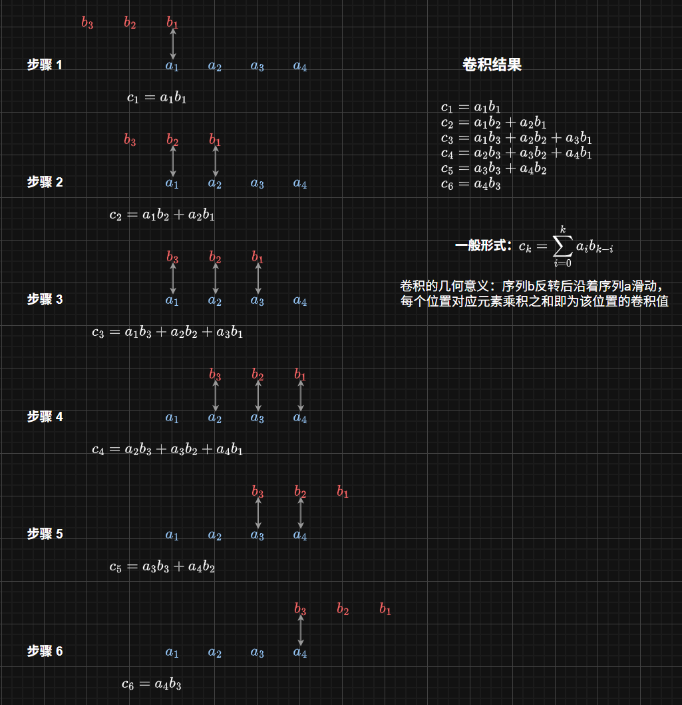

# 卷积

考虑两个多项式

$$
f(x) = a_0 + a_1 x + a_2 x^2 + \cdots + a_n x^n
$$

$$
g(x) = b_0 + b_1 x + b_2 x^2 + \cdots + b_m x^m
$$

那么两个多项式的乘积为

$$
h(x) = f(x) \cdot g(x) = c_0 + c_1 x + c_2 x^2 + \cdots + c_{n+m} x^{n+m}
$$

其中有

$$
c_k = \sum_{i=0}^k a_i b_{k-i}, \quad 0 \leq k \leq n+m
$$

针对运算 $\sum_{i=0}^k a_i b_{k-i}$，我们将形如这种形式的运算称作离散卷积运算，记作 $a * b$，即

$$
c_k = (a * b)_k = \sum_{i=0}^k a_i b_{k-i}
$$

这便是卷积的定义。

除了用多项式乘积系数的方法理解卷积，我们还可以直观地从平移反转序列的角度来理解卷积运算



卷积对连续函数也有定义

$$
s(t) = (f*g)(t) = \int_{ - \infty }^{ + \infty } {f(x)g(t - x)dx}
$$

## 傅里叶变换与卷积的关系

卷积在傅里叶变换下有一个重要的性质：卷积的傅里叶变换等于各自傅里叶变换的乘积。

设 $f(x)$ 和 $g(x)$ 的傅里叶变换分别为 $F(f)$ 和 $G(f)$，则有

$$
\mathcal{F}(f * g)(t) = F(f)G(f)
$$

!!! note "证明傅里叶变换对卷积有分配律"
    $$
    \mathcal{F}(f * g)(t) = \int_{-\infty}^{+\infty} \left[\int_{-\infty}^{+\infty} f(x)g(t - x)dx \right] e^{-2\pi i f t} dt
    $$

    交换积分次序

    $$
    = \int_{-\infty}^{+\infty} f(x) \left[\int_{-\infty}^{+\infty} g(t - x)e^{-2\pi i f t} dt \right] dx
    $$

    提取指数项凑傅里叶变换形式

    $$
    = \int_{-\infty}^{+\infty} f(x) e^{-2\pi i f x} \left[\int_{-\infty}^{+\infty} g(t - x)e^{-2\pi i f (t - x)} dt \right] dx
    $$

    $$
    = \int_{-\infty}^{+\infty} f(x) e^{-2\pi i f x} \left[\int_{-\infty}^{+\infty} g(t)e^{-2\pi i f t} dt \right] dx
    $$

    $$
    = \int_{-\infty}^{+\infty} f(x) e^{-2\pi i f x} G(f) dx
    $$

    $$
    = F(f) G(f)
    $$

所以，要计算两个函数的卷积，可以有

$$
(f * g)(t) = \mathcal{F}^{-1}(F(f) G(f))
$$

出于快速傅里叶变换的算法复杂度为 $O(N \log N)$，我们也可以在 $O(N \log N)$ 的时间复杂度内计算卷积。

```cpp
```