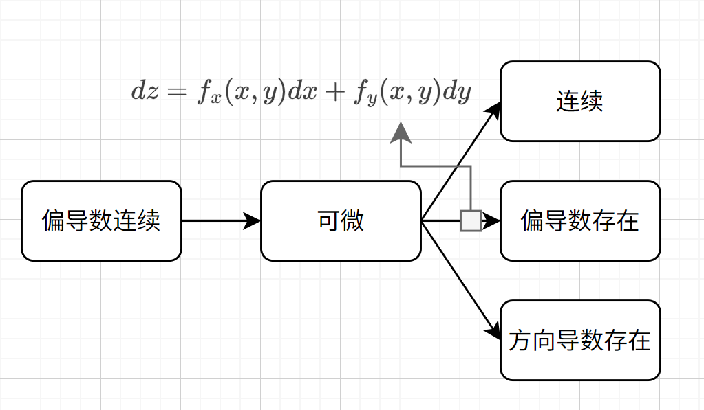

# 可微和偏导数
## 可微
对于 $f(x, y)$ 而言，如果我们对它的两个自变量取一个极小增量，那么函数值也会有一个小增量

$$
\triangle z = f(x + \triangle x, y + \triangle y) - f(x, y)
$$

对这个增量做线性近似，如果说存在线性函数

$$
dz = A \triangle x + B \triangle y
$$

使得两者之差为增量距离的高阶无穷小

$$
\lim_{\rho \to 0} \frac {\triangle z - dz} {\rho} = 0
$$

那么我们能称函数可微。

## 可微时的偏导数

!!! theorem "可微时全微分与偏导数的关系"
    如果 $z = f(x, y)$ 在点 $(x, y)$ 可微，那么函数在该点的偏导数 $f_{x}(x, y)$ 和 $f_{y}(x, y)$ 存在，且

    $$
    dz = f_{x}(x, y) dx + f_{y}(x, y) dy
    $$

!!! proof "证明"
    由可微的定义，存在常数 $A$ 和 $B$，使得

    $$
    \lim_{\rho \to 0} \frac {\triangle z - (A \triangle x + B \triangle y)} {\rho} = 0
    $$

    其中 $\rho = \sqrt{(\triangle x)^2 + (\triangle y)^2}$。

    首先证明 $f_x(x,y)$ 存在且等于 $A$：
    令 $\triangle y = 0$，则 $\rho = |\triangle x|$，此时有

    $$
    \lim_{\triangle x \to 0} \frac {f(x + \triangle x, y) - f(x, y) - A \triangle x} {|\triangle x|} = 0
    $$

    这等价于

    $$
    \lim_{\triangle x \to 0} \frac {f(x + \triangle x, y) - f(x, y)} {\triangle x} = A
    $$

    由偏导数的定义，$f_x(x,y) = A$。

    类似地，令 $\triangle x = 0$，可证 $f_y(x,y) = B$。

    因此，当函数在点 $(x,y)$ 可微时，有

    $$
    dz = f_x(x,y) dx + f_y(x,y) dy
    $$

由此，我们知道当函数可微时，线性函数的常数值等于偏导数的值，这也说明偏导数存在是函数可微的必要条件。

## 求全微分的一般过程
### 1.求偏导
先对函数求偏导，若其偏导数不存在，则其一定不可微。

### 2.检验线性函数是否良好近似
我们知道当 $\lim_{\rho \to 0} \frac {\triangle z - dz} {\rho} = 0$ 时，函数一定可微，于是我们可以令 $dz = f_x(x,y) dx + f_y(x,y) dy$，代入该式，并验证

$$
\triangle z - dz = o(\rho)
$$

!!! example "例题"
    求函数
    $$
    z = f(x, y) = \begin{cases}
    \frac{xy}{x^2 + y^2}, & (x, y) \neq (0, 0) \\
    0, & (x, y) = (0, 0)
    \end{cases}
    $$

    在点$(0, 0)$处是否可微。

    首先求在$(0, 0)$处，偏导数为
    $$
    f_x(0, 0) = \lim_{h \to 0} \frac{f(h, 0) - f(0, 0)}{h} = \lim_{h \to 0} \frac{0 - 0}{h} = 0
    $$

    $$
    f_y(0, 0) = \lim_{h \to 0} \frac{f(0, h) - f(0, 0)}{h} = \lim_{h \to 0} \frac{0 - 0}{h} = 0
    $$

    虽然偏导数存在，但我们需要检验是否满足可微的条件

    $$\lim_{\rho \to 0} \frac{\triangle z - dz}{\rho} = 0$$

    考虑沿着直线$y = x$接近原点
    $$
    \lim_{x \to 0} \frac{f(x, x) - f(0, 0) - 0 \cdot x - 0 \cdot x}{|x|} = \lim_{x \to 0} \frac{x^2/(2x^2)}{|x|} = \lim_{x \to 0} \frac{1/2}{|x|} \to \infty
    $$

    可以发现，在特定的趋近路线上，$\triangle z - dz \neq o(\rho)$，因此，尽管函数在$(0,0)$处的偏导数存在，但函数在该点不可微。

### 3.得出结论
若在上述过程中，能验证 $\triangle z - dz = o(\rho)$，则 $dz = f_x(x,y) dx + f_y(x,y) dy$

除了朴素的求偏导方法，我们还可以用全微分形式不变性求全微分，不过这不是本篇文章的内容。

## 连续的偏导数与可微性
!!! theorem "偏导数连续可推出可微"
    若函数 $f(x,y)$ 在点 $(x_0,y_0)$ 的某个邻域内有偏导数，且这些偏导数在点 $(x_0,y_0)$ 处连续，则 $f(x,y)$ 在点 $(x_0,y_0)$ 可微。

!!! proof "证明"
    设函数 $f(x,y)$ 在点 $(x_0,y_0)$ 的某个邻域内有偏导数，且这些偏导数在点 $(x_0,y_0)$ 处连续。

    考虑函数的增量
    $$
    \triangle z = f(x_0+\triangle x, y_0+\triangle y) - f(x_0,y_0)
    $$

    利用中值定理，存在 $\theta_1, \theta_2 \in (0,1)$ 使得
    $$
    \triangle z = f_x(x_0+\theta_1\triangle x, y_0+\triangle y)\triangle x + f_y(x_0, y_0+\theta_2\triangle y)\triangle y
    $$

    令 $dz = f_x(x_0,y_0)\triangle x + f_y(x_0,y_0)\triangle y$，则
    $$
    \triangle z - dz = [f_x(x_0+\theta_1\triangle x, y_0+\triangle y) - f_x(x_0,y_0)]\triangle x + [f_y(x_0, y_0+\theta_2\triangle y) - f_y(x_0,y_0)]\triangle y
    $$

    由于偏导数在 $(x_0,y_0)$ 处连续，当 $(\triangle x, \triangle y) \to (0,0)$ 时
    $$
    f_x(x_0+\theta_1\triangle x, y_0+\triangle y) - f_x(x_0,y_0) \to 0
    $$

    $$
    f_y(x_0, y_0+\theta_2\triangle y) - f_y(x_0,y_0) \to 0
    $$

    设 $\rho = \sqrt{(\triangle x)^2 + (\triangle y)^2}$，则：
    $$
    \frac{|\triangle z - dz|}{\rho} \leq \frac{|f_x(x_0+\theta_1\triangle x, y_0+\triangle y) - f_x(x_0,y_0)||\triangle x|}{\rho} + \frac{|f_y(x_0, y_0+\theta_2\triangle y) - f_y(x_0,y_0)||\triangle y|}{\rho}
    $$

    由于 $\frac{|\triangle x|}{\rho} \leq 1$ 且 $\frac{|\triangle y|}{\rho} \leq 1$，当 $\rho \to 0$ 时上式趋向于零。

    因此：
    $$
    \lim_{\rho \to 0}\frac{\triangle z - dz}{\rho} = 0
    $$

    这表明 $f(x,y)$ 在点 $(x_0,y_0)$ 可微。

所以，偏导数的存在是函数可微的必要条件，而偏导数的连续则又是函数可微的充分条件。

## 总结
根据上述内容，我们可以总结出如下关系图。

