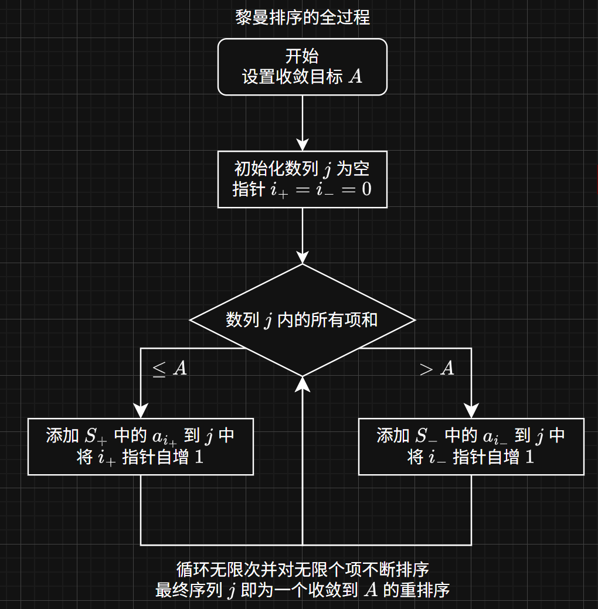
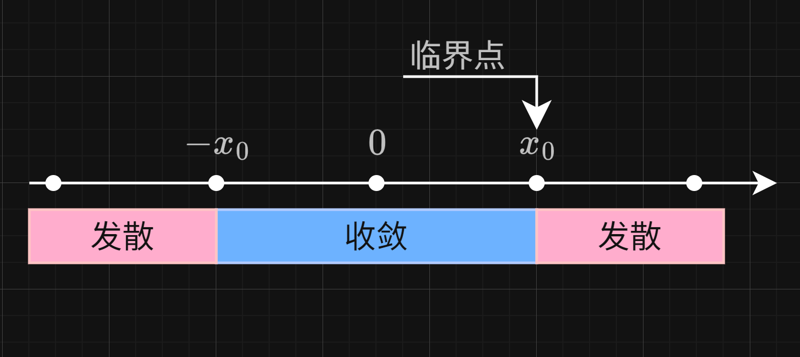

# 无穷级数

给定数列 $a_n$，称由该数列构成的表达式 $S = \sum_{n=1}^{\infty} a_n$ 为无穷级数。即无穷级数指的是一个数列所有项的和。

无穷级数是一个重要的工具，它可以用来表示各类函数，将函数化为多项式的和，例如一些常见的初等函数

$$
\sin(x) = \sum_{n=0}^{\infty} \frac{(-1)^n}{(2n+1)!} x^{2n+1}
$$

还有很多常用的非初等函数，通常是一些解无法用初等函数表示的微分方程的解，例如[高斯误差函数](https://zhuanlan.zhihu.com/p/164894362)，用来描述正态分布的累积分布函数

$$
\text{erf}(x) = \frac{2}{\sqrt{\pi}} \int_0^x e^{-t^2} dt = \sum_{n=0}^{\infty} \frac{(-1)^n}{n! (2n+1)} x^{2n+1}
$$

借助无穷级数，我们还可以对一些函数进行近似计算与分析，如近似计算 $\pi$

$$
\frac{1}{\pi} = \frac{2\sqrt{2}}{9801} \sum_{n=0}^{\infty} \frac{(4n)!(1103+26390n)}{(n!)^4 396^{4n}}
$$

> 此为 Ramanujan 提出的 $\pi$ 近似计算公式，收敛速度极快，几乎就是魔法。

总之，无穷级数的应用非常广泛，表示函数、近似计算、数值分析等都离不开无穷级数。

## 收敛与发散

如果无穷级数 $S = \sum_{n=1}^{\infty} a_n$ 的部分和 $S_n = \sum_{k=1}^{n} a_k$ 有极限

$$
\lim_{n \to \infty} S_n = S
$$

则称该无穷级数收敛，$S$ 称为该无穷级数的和。否则称该无穷级数发散。

不难看出，数列收敛的必要条件是其一般项收敛于 $0$，即

$$
\lim_{n \to \infty} a_n = 0
$$

收敛的无穷级数还具有可加、数乘的性质

$$
\sum_{n=1}^{\infty} a_n + \sum_{n=1}^{\infty} b_n = \sum_{n=1}^{\infty} (a_n + b_n)
$$

$$
\sum_{n=1}^{\infty} c a_n = c \sum_{n=1}^{\infty} a_n
$$

## 正项级数收敛定理

如果无穷级数 $S = \sum_{n=1}^{\infty} a_n$ 中的每一项 $a_n \ge 0$，则称其为正项级数；对于这类级数，我们有判定其收敛的基本定理。

如果对于级数的部分和 $S_n = \sum_{k=1}^{n} a_k$，存在正数 $M$ 使得

$$
S_n \le M, \forall n \in \mathbb{N}^+
$$

则该级数收敛。

!!! note "对于正项级数收敛定理的说明"
    正项级数的部分和 $S_n$ 是单调递增的，且有上界 $M$，根据数列的单调有界准则，数列一定收敛，所以其极限存在。

## 正项级数的常用收敛判别法

### 比较审敛法

对于两个正项级数 $\sum_{n=1}^{\infty} a_n$ 和 $\sum_{n=1}^{\infty} b_n$，如果有

$$
\lim_{n \to \infty} \frac{a_n}{b_n} = L
$$

1. 当 $L = C (C \neq 0)$ 时，则 $\sum_{n=1}^{\infty} a_n$ 和 $\sum_{n=1}^{\infty} b_n$ 敛散性相同；

2. 当 $L = 0$ 时，则当 $\sum_{n=1}^{\infty} b_n$ 收敛时，$\sum_{n=1}^{\infty} a_n$ 也收敛。

3. 当 $L = \infty$ 时，则当 $\sum_{n=1}^{\infty} b_n$ 发散时，$\sum_{n=1}^{\infty} a_n$ 也发散。

### 比值审敛法

若 $\sum_{n=1}^{\infty} a_n$ 为正项级数，有

$$
\lim_{n \to \infty} \frac{a_{n+1}}{a_n} = L
$$

1. 当 $L < 1$ 时，则该级数收敛；
2. 当 $L > 1$ 时，则该级数发散；

> $L = 1$ 时级数的收敛与否不能由此确定。

!!! proof "比值审敛法的证明"
    设 $L < 1$，则取一个适当小的 $\epsilon$，使得 $L + \epsilon < 1$，则存在正整数 $N$，使得当 $n > N$ 时，有

    $$
    \frac{a_{n+1}}{a_n} < L + \epsilon < 1
    $$

    令 $r = L + \epsilon$，$r < 1$，则有

    $$
    a_{n+1} < r a_n \implies a_{n+2} < r^2 a_n \implies \cdots \implies a_{n+k} < r^k a_n
    $$

    这意味着数列 $\{a_{n+1}, a_{n+2}, a_{n+3}, \ldots\}$ 的数列和应当小于 $\{ ra_n, r^2 a_n, r^3 a_n, \ldots\}$，而对于 $r < 1$ 的情况，后者的数列和是收敛的，因此前者也必定收敛。

    $\{a_{n+1}, a_{n+2}, a_{n+3}, \ldots\}$ 加上 $a_1, a_2, \ldots, a_N$ 之后，仍然是收敛的（有限项不影响数列的敛散性），因此 $\sum_{n=1}^{\infty} a_n$ 收敛。

    当 $L > 1$ 时，类似的可以得到该比值数列是发散的，因此 $\sum_{n=1}^{\infty} a_n$ 也发散。

    当 $L = 1$ 时，无法确定该级数的收敛性，调和级数就是一个例子。

### 根值审敛法

若 $\sum_{n=1}^{\infty} a_n$ 为正项级数，有

$$
\lim_{n \to \infty} \sqrt[n]{a_n} = L
$$

1. 当 $L < 1$ 时，则该级数收敛；
2. 当 $L > 1$ 时，则该级数发散；

> $L = 1$ 时级数的收敛与否不能由此确定。

!!! proof "根值审敛法的证明"
    这里的证明思路类似于比值审敛法，设 $L < 1$，则取一个适当小的 $\epsilon$，使得 $L + \epsilon < 1$，则存在正整数 $N$，使得当 $n > N$ 时，有

    $$
    \sqrt[n]{a_n} < L + \epsilon < 1
    $$

    令 $r = L + \epsilon$，$r < 1$，则有

    $$
    a_n < r^n \implies a_{n+1} < r^{n+1} \implies \cdots \implies a_{n+k} < r^{n+k}
    $$

    这意味着数列 $\{a_{n+1}, a_{n+2}, a_{n+3}, \ldots\}$ 的数列和应当小于 $\{ r^n, r^{n+1}, r^{n+2}, \ldots\}$，而对于 $r < 1$ 的情况，后者的数列和是收敛的，因此前者也必定收敛。

    $\{a_{n+1}, a_{n+2}, a_{n+3}, \ldots\}$ 加上 $a_1, a_2, \ldots, a_N$ 之后，仍然是收敛的（有限项不影响数列的敛散性），因此 $\sum_{n=1}^{\infty} a_n$ 收敛。

    当 $L > 1$ 时，类似的可以得到该比值数列是发散的，因此 $\sum_{n=1}^{\infty} a_n$ 也发散。

    当 $L = 1$ 时，无法确定该级数的收敛性。

### 放缩与夹逼定理
要证明一个正项级数收敛，可以证明一个比它大的正项级数收敛；要证明一个正项级数发散，可以证明一个比它小的正项级数发散。

!!! example "运用放缩解决问题的例子"
    对于 $p$ 级数 $\sum_{n=1}^{\infty} \frac{1}{n^p}$，讨论其敛散性。

    1. $p = 1$ 时，$\sum_{n=1}^{\infty} \frac{1}{n}$ 是调和级数，发散；

    2. $p < 1$ 时，$\sum_{n=1}^{\infty} \frac{1}{n^p} \ge \sum_{n=1}^{\infty} \frac{1}{n}$，后者发散，故前者必定发散；

    3. $p < 1$ 时的情况略为复杂，这里我们要用到积分将离散情况化为连续情况，出于

    $$
    \frac{1}{k^p} = \int_k^{k+1} k^{-p} dx \le \int_k^{k+1} x^{-p} dx
    $$

    所以

    $$
    S_n = 1 + \sum_{k=1}^{n} \frac{1}{k^p} \le 1 + \int_1^{n+1} x^{-p} dx
    $$

    计算该积分，容易知道 $p > 1$ 时，$S_n$ 有上界，收敛。

## 绝对收敛与条件收敛

不是所有级数都是正项级数，对于一个既有正项也有负项的级数，其收敛情况可分为绝对收敛与条件收敛。

若级数所对应的每一项的绝对值之和组成的级数 $\sum_{n=1}^{\infty} |a_n|$ 收敛，则称该级数绝对收敛；

而当 $\sum_{n=1}^{\infty} |a_n|$ 发散但 $\sum_{n=1}^{\infty} a_n$ 收敛时，则称该级数条件收敛。

绝对收敛是比条件收敛更加严格的条件，绝对收敛的级数一定收敛。

!!! proof ""绝对收敛的级数一定收敛的证明"
    为了从绝对收敛数列构造出原数列，不妨设

    $$
    v_n = \frac{|u_n| - u_n}{2}
    $$

    那么就有原数列可以被表示为

    $$
    \sum_{n=1}^{\infty} u_n = \sum_{n=1}^{\infty} |u_n| - \sum_{n=1}^{\infty} 2 v_n
    $$

    好在右边的两个级数都是收敛的，因此它们的差也是收敛的，所以绝对级数收敛的级数是收敛的。

由上面的证明，我们同时也可以得到绝对收敛级数的正项级数和负项级数 （$v_n$） 都是收敛的。同时，发散级数的正项级数和负项级数一定都是发散的。

## 交错级数的特别审敛法
交错级数是指正负项交替的级数，形式为

$$
\sum_{n=1}^{\infty} (-1)^{n+1} a_n
$$

其中 $a_n \ge 0$。

如果对于这样的一个交错级数，有

1. $a_n$ 单调递减，即 $a_{n+1} \le a_n$，
2. $\lim_{n \to \infty} a_n = 0$

那么该级数一定收敛，这个审敛方法被称作莱布尼茨审敛法。

!!! proof "交错级数审敛法的证明"
    对于这样的一个级数，讨论其部分和 $S_{2n}$，有

    $$
    S_{2n} = a_1 - a_2 + a_3 - a_4 + \cdots + a_{2n-1} - a_{2n}
    $$

    适当添加括号，得到

    $$
    S_{2n} = a_1 - (a_2 - a_3) - (a_4 - a_5) - \cdots - (a_{2n-2} - a_{2n-1}) - a_{2n} \le a_1
    $$

    所以其部分和 $S_{2n}$ 有上界，又有

    $$
    S_{2n} = S_{2n - 2} + (a_{2n-1} - a_{2n}) \ge S_{2n - 2}
    $$

    所以其部分和 $S_{2n}$ 是单调递增的，因此 $S_{2n}$ 是收敛的。

    与此同时，$S_{2n + 1} = S_{2n} + a_{2n + 1}$，而 $a_{2n + 1} \to 0$，故 $S_{2n + 1}$ 与 $S_{2n}$ 收敛于同一处，所以 $S_{2n + 1}$ 也是收敛的。

    综上所述，$S_{n}$ 是收敛的。

## 黎曼重排定理

对于一个条件收敛的级数 $\sum_{n=1}^{\infty} a_n$，可以通过重新排列其项的顺序来改变其和。

!!! example "黎曼重排定理的例子"
    比如说，对于交错调和级数，有

    $$
    S = 1 - \frac{1}{2} + \frac{1}{3} - \frac{1}{4} + \frac{1}{5} - \frac{1}{6} + \frac{1}{7} - \frac{1}{8} + \cdots = \ln(2)
    $$

    $$
    \frac{S}{2} = 0 + \frac{1}{2} + 0 - \frac{1}{4} + 0 + \frac{1}{6} + 0 - \frac{1}{8} + \cdots = \frac{\ln(2)}{2}
    $$

    将两者按照对应位置交错相加，得到
    $$
    \frac{3S}{2} = 1 + \frac{1}{3} - \frac{1}{2} + \frac{1}{5} + \frac{1}{7} - \frac{1}{4} + \frac{1}{9} + \frac{1}{11} - \frac{1}{6} + \cdots = \frac{3\ln(2)}{2}
    $$

    最下方的算式仅仅是对原级数的重新排列，然而它的和却是 $\frac{3\ln(2)}{2}$，而不是 $\ln(2)$。

而对于绝对收敛的级数，重新排列其项的顺序**一定**不会改变其和（读者大可以自己举几个例子），这也便是绝对收敛数列的交换律。

好了，现在定理摆在这里，下一个难题便是说明其正确性，我们引入一种特殊的重排方式：

1. 设 $S = \sum_{n=1}^{\infty} a_n$ 是一个条件收敛的级数，分别将其所有正项和负项提取出来，得到两个级数 $S_+ = \sum_{n=1}^{\infty} a_n^+$ 和 $S_- = \sum_{n=1}^{\infty} a_n^-$。

!!! note "交错级数的正项和负项"
    以交错级数为例子，有

    $$
    S = 1 - \frac{1}{2} + \frac{1}{3} - \frac{1}{4} + \frac{1}{5} - \frac{1}{6} + \cdots
    $$

    那么

    $$
    S_+ = 1 + \frac{1}{3} + \frac{1}{5} + \cdots
    $$

    $$
    S_- = -\frac{1}{2} - \frac{1}{4} - \frac{1}{6} - \cdots
    $$

2. 接下来执行以下流程，从 $S_+$ 和 $S_-$ 中提取项目构建一个重排列 $j$。

3. 经过该流程，重排列 $j$ 一定会收敛到指定的常数 $A$。

为什么一定可以？因为在条件收敛时，$S_+$ 和 $S_-$ 都是发散的，若 $S_+$ 当前被提取的所有项的总和为 $B$，那么因为 $S_-$ 是无界的，总存在 $S_-$ 的项使得其和趋近于 $A - B$，所以这种排列一定存在。

不过，对于绝对收敛的数列来说，收敛目标就不能指向任意值了，因为 $S_+$ 和 $S_-$ 都是收敛的，所以两者都有界，使得 $S_-$ 的项使得其和趋近于 $A - B$ 的部分和数列也就不一定存在了。

这就是对于黎曼重排定理的原理的一种简单叙述。

## 幂级数

形如

$$
f(x) = c_0 + c_1 (x - x_0)^1 + \dots = \sum_{n=0}^\infty c_n (x-x_0)^n
$$

的函数为幂级数，$c_n$ 为常数数列，$x_0$ 为常数，此处规定即便 $x = x_0$，也有 $(x - x_0)^0 = 1$。

这个级数不一定是收敛的，其敛散性主要由 $c_n, x, x_0$ 的值决定，于是我们规定若是右式的幂级数在 $x = x_1$ 的极限存在，则称该幂级数在该点收敛，否则称该幂级数该点发散；由所有的收敛点组成的集合称为该幂级数的**收敛域**，同理也有发散域。

### 阿贝尔定理

直觉告诉我们，一个幂级数的收敛域按道理是连续的，阿贝尔定理说明了这一点的正确性。

给定一个幂级数 $f(x) = \sum_{n=0}^\infty c_n x^n$，如果该级数在 $x = x_0$ 收敛，则对于 $\forall |x| \le |x_0|$，该级数也收敛；如果该级数在 $x = x_1$ 发散，则对于 $\forall |x| \ge |x_1|$，该级数也发散。

!!! proof "阿贝尔定理的证明"
    由于

    $$
    f(x_0) = \sum_{n=0}^\infty c_n (x_0)^n
    $$

    收敛，故数列是有界的，设有 $M > 0$，使得 $|c_n (x_0)^n| < M$

    那么就有

    $$
    |c_n x^n| < M \cdot |\frac{x}{x_0}|^n
    $$

    对于 $|x| < |x_0|$，有 $|\frac{x}{x_0}| < 1$，故对于等比级数 $\sum_{n=0}^\infty M \cdot |\frac{x}{x_0}|^n$，它是收敛的，所以该正项级数 $\sum_{n=0}^\infty |c_n x^n|$ 也是收敛的。

    所以 $\sum_{n=0}^\infty c_n x^n$ 绝对收敛，该数列确实收敛。

    要证明发散的情况，可以用反证法，若是有 $|x| > |x_1|$ 令数列收敛，则按照之前证明的定理，则 $x = x_1$ 按道理也收敛，这与 $x = x_1$ 处发散是矛盾的。

所以说，幂级数 $f(x) = \sum_{n=0}^\infty c_n x^n$ 的收敛域应当是一个以 $x = 0$ 为中心的连续区域，在该区域内，$f(x)$ 是收敛的；在该区域外，$f(x)$ 是发散的，存在一个临界点 $x_0$，规定了这个区域的边界。

### 收敛半径

我们称这个临界点 $x_0$ 为该幂级数的收敛半径，记为 $R$，那么有

1. $\forall x \in (-R, R)$，$f(x)$ 收敛；
2. $\forall x \in (-\infty, -R) \cup (R, +\infty)$，$f(x)$ 发散；
3. $|x| = R$ 时，$f(x)$ 有可能收敛，也有可能发散。

对于幂级数 $\sum_{n=0}^\infty c_n x^n$ 来说，其收敛半径 $R$ 可以通过以下公式计算

$$
R = \lim_{n \to \infty} | \frac{c_n}{c_{n+1}} |
$$

!!! proof "收敛半径公式的正确性"
    设 $R$ 为收敛半径，$|x| < R$，则有

    $$
    \lim_{n \to \infty} \frac{|c_{n+1} x^{n+1}|}{|c_{n} x^{n}|} = \lim_{n \to \infty} \frac{|c_{n+1}|}{|c_{n}|} |x| = \frac{|x|}{R} < 1
    $$

    根据比值审敛法，该级数绝对收敛，所以该级数收敛。

    同理，当 $|x| > R$，则有 $\frac{|x|}{R} > 1$，所以该级数发散。

此外，收敛半径的计算公式也可以写作

$$
R = \lim_{n \to \infty} \frac{1}{\sqrt[n]{|c_n|}}
$$

证明过程同上，使用根值审敛法证明即可。

### 泰勒级数

幂级数的形式长得就很像泰勒级数，好吧，确实，泰勒级数就是非常常见的一种幂级数。

根据泰勒公式，若 $f(x)$ 在 $x = x_0$ 处有 $k$ 阶导数，则有

$$
f(x) = \sum_{n=0}^k \frac{f^{(n)}(x_0)}{n!} (x - x_0)^n + R_k(x)
$$

其中 $R_k(x)$ 为余项，表示为

$$
R_k(x) = \frac{f^{(k+1)}(\eta)}{(k+1)!} (x - x_0)^{k+1}
$$

其中 $\eta$ 为 $x$ 和 $x_0$ 之间的某个点。

根据上述泰勒公式的启发，我们可以定义一个函数 $f(x)$ 的泰勒级数为

$$
f(x) = \sum_{n=0}^\infty \frac{f^{(n)}(x_0)}{n!} (x - x_0)^n
$$

然而，泰勒级数是根据泰勒公式定义的，泰勒公式的成立是有条件的，为了让该幂级数能够收敛，我们应当保证

$$
R_n(x) = \frac{f^{(n+1)}(\eta)}{(n+1)!} (x - x_0)^{n+1}
$$

$$
\lim_{n \to \infty} R_n(x) = 0
$$

这是显然的，该条件即为泰勒级数收敛的条件，这也就意味着，函数可以表示为泰勒级数的充要条件是它可以进行泰勒展开。

有一些函数的任意 $n$ 阶导数都存在，但是它的泰勒级数却不收敛，这种函数被称为**非解析函数**，例如

$$
f(x) = \begin{cases}
e^{-\frac{1}{x^2}} & x \neq 0 \\
0 & x = 0
\end{cases}
$$

你会发现，$f(x)$ 在 $x = 0$ 处的任意阶导数都存在且都为 $0$（这是因为它的导函数必然是多项式和 $e^{-\frac{1}{x^2}}$ 的乘积，而多项式的变化速度远比不上指数函数$），但是如果按照泰勒级数展开，则有

$$
f(x) = \sum_{n=0}^\infty \frac{f^{(n)}(0)}{n!} x^n = 0
$$

显然 $f(x) \equiv 0$ 的结论是不成立的，这个函数的泰勒展开是无效的，所以说，任意 $n$ 阶导数都存在仅仅是泰勒级数存在的必要条件，而不是充分条件。

## 傅里叶级数

本部分内容将单独成文，敬请期待。