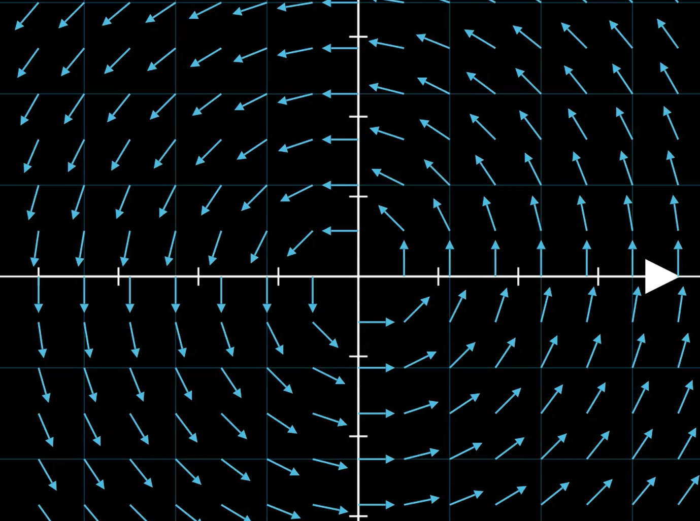

# 环量与旋度
## 环量
环量指的是力场沿着封闭曲线的积分。如果在向量场 $F$ 中，有一封闭曲线 $\Gamma$，那么称

$$
\oint_{\Gamma} F dr = \oint_{\Gamma} Pdx + Qdy + Rdz
$$

为向量场 $F$ 沿着 $\Gamma$ 的环量。

环量在上个世纪提出，用于研究固定翼飞机，现在环量是空气动力学中一个重要的研究对象。

## 旋度
我们曾经提到了场的散度，其定义为

$$
\text{div} F = \nabla \cdot F = \frac{\partial P}{\partial x} + \frac{\partial Q}{\partial y} + \frac{\partial R}{\partial z}
$$

它反映了向量场的流量流入/出区域的强度。

旋度的定义与其类似

$$
\text{rot} F = \nabla \times F = \vec{i}\left(\frac{\partial R}{\partial y} - \frac{\partial Q}{\partial z}\right) + \vec{j}\left(\frac{\partial P}{\partial z} - \frac{\partial R}{\partial x}\right) + \vec{k}\left(\frac{\partial Q}{\partial x} - \frac{\partial P}{\partial y}\right)
$$

旋度反映了向量场围绕区域做旋转运动的强度。

> 如图，这是一个在原点处散度为0，但是旋度不为0的向量场

---

回想我们之前关于保守力的定义，我们可以知道如果一个场满足对于其中任意的封闭曲线 $\Gamma$，有

$$
\oint_{\Gamma} F dr = 0
$$

则该场为保守场，场做的功和路径无关。

现在，我们可以用旋度描述这个性质，我们称一个处处满足

$$
\text{rot} F = 0
$$

的向量场为无旋场，一个场为无旋场是其为保守场的**充要条件**。

关于该定理的证明，在我们完成斯托克斯公式的叙述后我们再来。

## 斯托克斯公式

设 $S$ 是一个定向光滑曲面，其边界是一个闭合曲线 $\Gamma$（按照右手法则给定方向），如果向量场 $F(x,y,z)$ 在包含 $S$ 和 $\Gamma$ 的区域内具有连续的一阶偏导数，则有：

$$
\oint_{\Gamma} F \cdot dr = \iint_S \text{rot} F \cdot dS
$$

斯托克斯公式表明了区域的旋度和区域边界上的环量的关系，沿着闭合曲线 $\Gamma$ 的环量等于穿过由该曲线围成的曲面 $S$ 的旋度通量。

!!! proof "证明斯托克斯公式"
    和证明高斯公式时一样，我们分开证明这个式子，先证明

    $$
    \iint_{\Sigma} \frac{\partial P}{\partial z} dzdx - \frac{\partial P}{\partial y} dzdy = \oint_{\partial \Sigma^{+}} Pdx
    $$

    右边的式子仅仅与 $dx$ 有关，故可将 $\partial \Sigma^{+}$ 投影到 $xOy$ 平面，得到投影的曲线 $\partial D_{xy}^{+}$，有
    $$
    \oint_{\partial \Sigma^{+}} Pdx = \oint_{\partial D_{xy}^{+}} Pdx
    $$

    对这个在 $xOy$ 平面上的曲线运用格林公式，设 $D_{xy}$ 是曲面在 $xOy$ 上的投影，那么有
    $$
    \oint_{\partial D_{xy}^{+}} Pdx = \iint_{D_{xy}} - \frac{\partial P}{\partial y} - \frac{\partial P}{\partial z} \frac{\partial z}{\partial y} dxdy
    $$

    接下来证明 $\iint_{\Sigma} \frac{\partial P}{\partial z} dzdx - \frac{\partial P}{\partial y} dzdy$ 也等于 $\frac{\partial P}{\partial z} \frac{\partial z}{\partial y} dxdy$，有对于曲面 $\Sigma$，设其方程为 $z = z(x, y)$，那么曲面上的微元可以表示为

    $$
    dS = \left(-\frac{\partial z}{\partial x}, -\frac{\partial z}{\partial y}, 1\right) dxdy
    $$

    所以有

    $$
    \iint_{\Sigma} \frac{\partial P}{\partial z} dzdx - \frac{\partial P}{\partial y} dzdy = \iint_{D_{xy}} \frac{\partial P}{\partial z} \cdot 1 \cdot dxdy - \frac{\partial P}{\partial y} \cdot 1 \cdot dxdy
    $$

    $$
    = \iint_{D_{xy}} \left(\frac{\partial P}{\partial z} - \frac{\partial P}{\partial y}\right) dxdy
    $$

    由于 $z = z(x, y)$，函数 $P(x, y, z)$ 在曲面上实际上是 $P(x, y, z(x, y))$，应用链式法则

    $$
    \frac{\partial P}{\partial y} = \frac{\partial P}{\partial y}\bigg|_z + \frac{\partial P}{\partial z} \frac{\partial z}{\partial y}
    $$

    将此代入上式

    $$
    \iint_{\Sigma} \frac{\partial P}{\partial z} dzdx - \frac{\partial P}{\partial y} dzdy = \iint_{D_{xy}} \left(\frac{\partial P}{\partial z} - \frac{\partial P}{\partial y}\bigg|_z - \frac{\partial P}{\partial z} \frac{\partial z}{\partial y}\right) dxdy
    $$

    $$
    = \iint_{D_{xy}} \left(-\frac{\partial P}{\partial y}\bigg|_z - \frac{\partial P}{\partial z} \frac{\partial z}{\partial y}\right) dxdy
    $$

    这与我们前面得到的 $\oint_{\partial D_{xy}^{+}} Pdx$ 的表达式一致，所以等式成立。

    接下来对另外两个平面 $yOz$ 和 $xOz$ 上的投影也做同样的运算，将算式相加，即有

    $$
    \iint_{\Sigma} \text{rot} F \cdot dS = \iint_{\Sigma} \left(\frac{\partial R}{\partial y} - \frac{\partial Q}{\partial z}\right) dydz + \left(\frac{\partial P}{\partial z} - \frac{\partial R}{\partial x}\right) dzdx + \left(\frac{\partial Q}{\partial x} - \frac{\partial P}{\partial y}\right) dxdy
    $$

    $$
    = \oint_{\partial \Sigma} Pdx + Qdy + Rdz
    $$

    $$
    = \oint_{\partial \Sigma} F \cdot dr
    $$

    所以，斯托克斯公式成立。

斯托克斯公式的正方向依靠右手定则所确定，将手掌摊开为一个平面，大拇指和四指成直角，令四指指向曲线环绕方向，大拇指垂直于平面，则大拇指所指方向为法向量正向。

有了斯托克斯公式，旋度和环量的关系就此建立，接下来，我们就可以证明前面的无旋场和保守场的关系。

!!! proof "证明无旋场和保守场等价"
    我们用反证法证明。

    假设有一个向量场 $F$ 不是保守场，则存在某个封闭曲线 $\Gamma$ 使得 $\oint_{\Gamma} F dr \neq 0$。

    由于 $\oint_{\Gamma} F dr \neq 0$，则 $\iint_S \text{rot} F \cdot dS \neq 0$，这意味着曲面 $S$ 上必然存在某点使得 $\text{rot} F \neq 0$。

    因此，若向量场 $F$ 不是保守场，则 $F$ 不可能是无旋场。

    反之，若 $F$ 是无旋场，即处处有 $\text{rot} F = 0$，那么对任意封闭曲线 $\Gamma$ 和由其围成的曲面 $S$，根据斯托克斯公式有

    $$
    \oint_{\Gamma} F dr = \iint_S \text{rot} F \cdot dS = \iint_S 0 \cdot dS = 0
    $$

    这正是保守场的定义。

    因此，无旋场是保守场的充要条件。

## 关于格林公式的再思考
如果我们反过头去观察格林公式，我们可以发现格林公式实际上是斯托克斯公式的推广。它表明了在二维平面上的一个区域的边界上的环量等于该区域内的旋度通量。

$$
\oint_{\partial D} F \cdot dr = \iint_D \text{rot} F \cdot dS
$$

其中在二维条件下，$F \cdot dr$ 是一个向量场的线积分，表示沿着闭合曲线的环量。

$$
F \cdot dr = Pdx + Qdy
$$

而在二维条件下，旋度的定义为

$$
\text{rot} F = \nabla \times F =
\begin{vmatrix}
 \hat{i} & \hat{j} & \hat{k} \\
 \frac{\partial}{\partial x} & \frac{\partial}{\partial y} & 0 \\
 P & Q & 0
\end{vmatrix}
= (\frac{\partial Q}{\partial x} - \frac{\partial P}{\partial y}) \hat{k}
$$

由于二维条件下，$z$ 轴的分量为 $0$，所以我们可以将 $\text{rot} F$ 看作是一个标量场。

所以，我们从斯托克斯公式推出了格林公式。

$$
\oint_{\partial D} Pdx + Qdy = \iint_D \frac{\partial Q}{\partial x} - \frac{\partial P}{\partial y} dS
$$