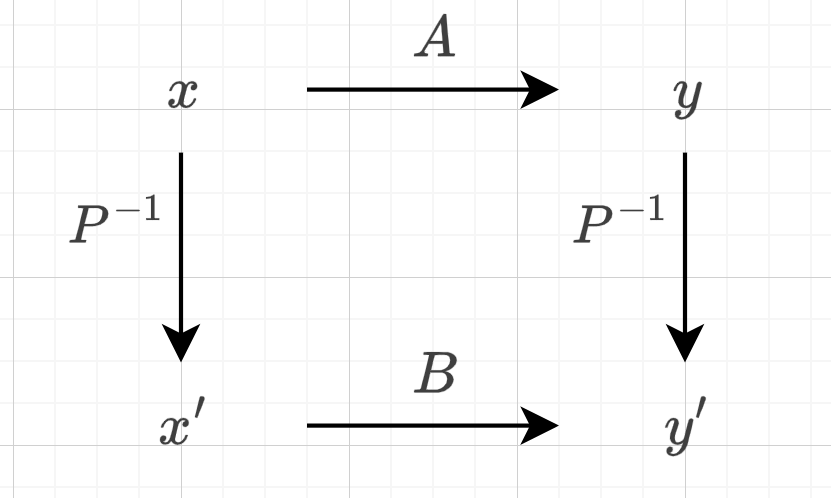

# 矩阵的相似
矩阵的相似指的是对于两个 $n$ 阶方阵 $A$ 和 $B$，如果存在一个可逆矩阵 $P$，使得 $P^{-1}AP=B$，则称矩阵 $A$ 与 $B$ 相似，记作 $A \sim B$。

## 相似的几何意义
矩阵相似的几何意义可以从线性变换的角度理解。如果两个矩阵 $A$ 和 $B$ 相似，它们实际上表示的是同一个线性变换在不同基底下的矩阵表示。

例如，假设对于一个向量 $x$ 而言，有

$$
y = A \cdot x
$$

又有另外一个坐标基，从当前坐标基到它的过渡矩阵为 $P$，使得 $x$ 在该坐标基下的坐标为

$$
x' = P^{-1} \cdot x
$$

我们知道对于 $y$ 而言，$y$ 在这个另外的坐标系中的坐标为

$$
y' = P^{-1} \cdot y
$$

此时，假设一个变换矩阵 $B$ 满足 $y' = B \cdot x'$，那么有

$$
P^{-1} \cdot y = B P^{-1} \cdot x
$$

$$
y = PBP^{-1} \cdot x
$$

$$
PBP^{-1} = A
$$

由此可见， $A$ 和 $B$ 都表明了将 $x$ 转换到 $y$ 的变换，只是对应的坐标基有所不同。

## 相似的性质
若 $A \sim B$，则 $A$ 和 $B$ 有相同的特征值。

**证明：**
假设 $A \sim B$，即存在可逆矩阵 $P$，使得 $P^{-1}AP=B$。

考虑矩阵 $A$ 的特征值 $\lambda$，存在非零向量 $x$，使得 $Ax = \lambda x$。

那么对于 $B$ 而言，就有以下推导过程

$$
P^{-1}APx = \lambda P^{-1}Px = \lambda x
$$

$$
Bx = \lambda x
$$

所以对于任意 $A$ 的特征值，$B$ 也有相应的特征值，所以两者的特征值相等。

由特征值相等，可以导出推论，诸如两者的秩、行列式、迹、特征多项式相等。

## 相似的判定
不妨对 $A$ 与 $B$ 都做特征值分解，那么就有

$$
A = QDQ^{-1}
$$

$$
B = RFR^{-1}
$$

设 $P = QR^{-1}$，则有
$$
PBP^{-1} = (QR^{-1})RFR^{-1}(RQ^{-1}) = QFQ^{-1}
$$

此时我们知道，当$D = F$时，$A$ 与 $B$即相似；我们得出结论，当 $A$ 和 $B$ 的特征值都相等，那么两个矩阵相似。

但是这个结论不完全正确，若是 $Q$ 或 $R$ 是奇异的，则 $Q^{-1}$ 或 $R^{-1}$ 不存在，上述的推理就并不成立。

---

现在引入 **"可对角化"** 的定义，若一个矩阵的特征向量组线性无关，则称一个矩阵是可对角化的。

例如，矩阵 $A = \begin{bmatrix} 1 & 1 \\ 0 & 1 \end{bmatrix}$ 的特征值是 $\lambda = 1$（重数为2），但它只有一个线性无关的特征向量 $\begin{bmatrix} 1 \\ 0 \end{bmatrix}$，因此矩阵 $A$ 不可对角化。

对于 $A$ 与 $B$ 是否可以对角化，我们做分情况讨论判定其是否相似。

- $A$ 与 $B$ 都可以对角化  
    此时 $Q$ 或 $R$ 都是满秩的，上述推理成立，所以在 $A$ 与 $B$ 特征值相等时，两个矩阵相似。

- $A$ 与 $B$ 只有一方可以对角化，另一方不可以  
    此时可以知道，相应的坐标变化矩阵 $P$ 一定不存在，两个矩阵绝对不相似

- $A$ 与 $B$ 两方都不能对角化  
    此时根据上述推理过程不能得出双方是否相似，可以使用其它方法，诸如计算两者的 Jordan 标准型来判断，这就不是本文涉及的了。