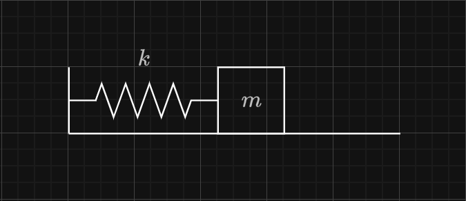
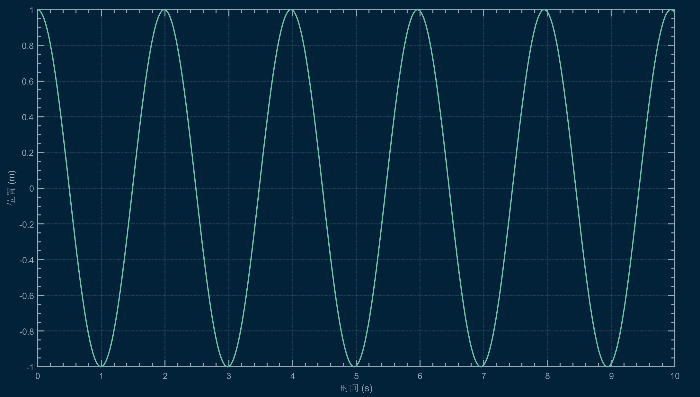
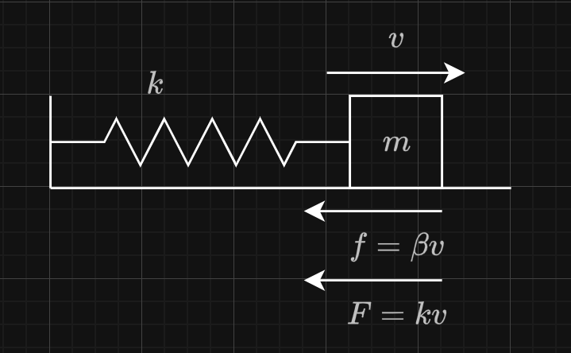
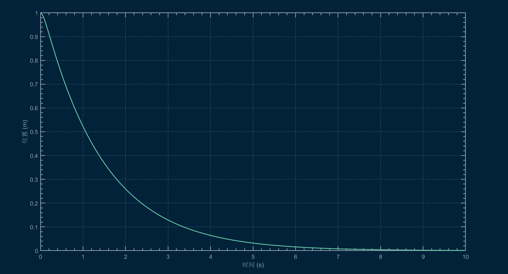
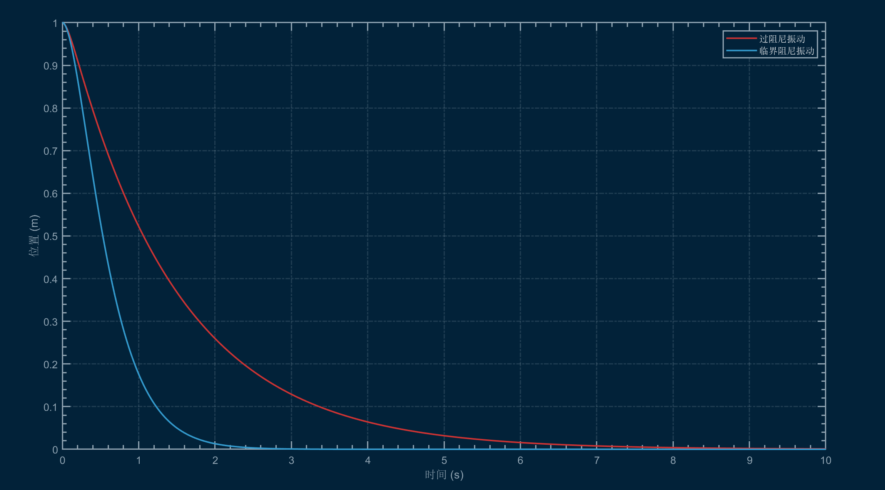
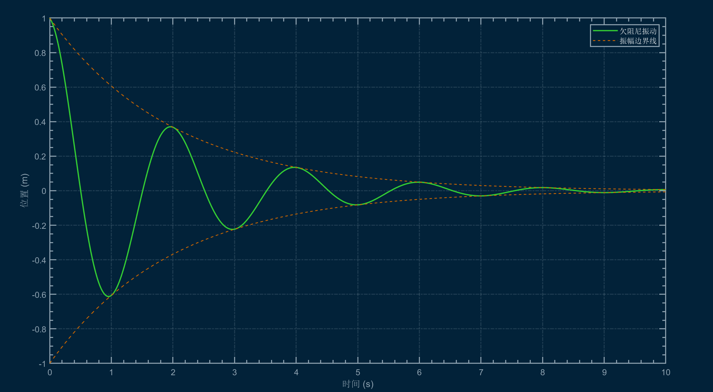
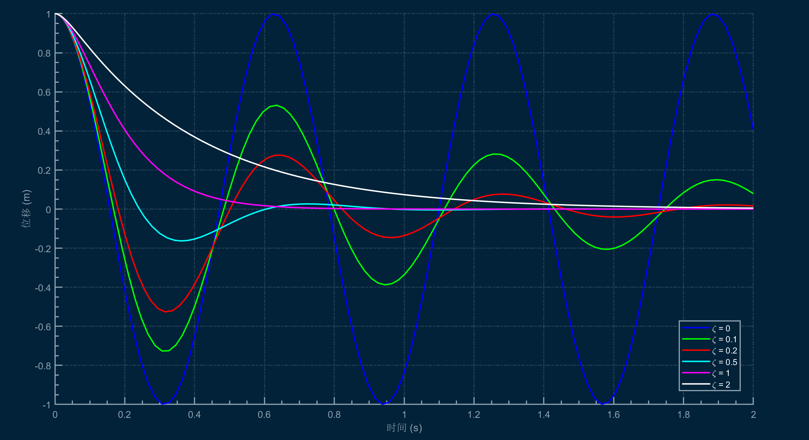
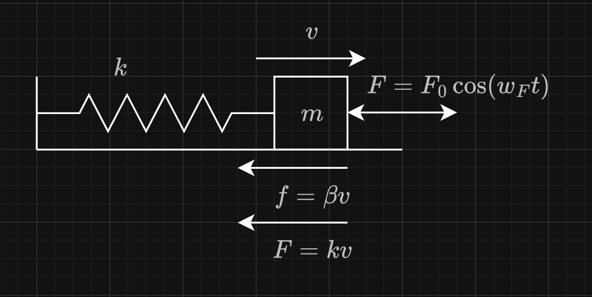

# 弹簧振子的运动

弹簧振子是指一个质点受到与位移成正比的弹性力作用而做往复运动的系统。它是物理学中最基本的振动系统之一，也称为简谐振子。

在理想情况下，弹簧振子由一个质量为 $m$ 的质点，一个理想的满足胡克定律的弹簧构成。

弹簧振子的运动受到多种因素的共同影响，接下来我们来分析弹簧振子的几种常见运动情况。

## 自由振动
自由振动是弹簧振子运动的一种理想模型，在其自由振动时，其运动无阻力，无外力，振子仅受弹簧的弹性恢复力作用。

此时，弹簧振子的动力分析方程为

$$
m\frac{d^2x}{dt^2} = -kx
$$

作为二阶线性常微分方程，我们可以将其化为标准形式

$$
\frac{d^2x}{dt^2} + \frac{k}{m} x = 0
$$

接下来求其特征方程，设 $x = e^{rt}$，那么有
$$
r^2 + \frac{k}{m} = 0
$$

解得 $r = \pm i\sqrt{\frac{k}{m}}$，带回方程，得到通解为

$$
x(t) = C_1 e^{i\sqrt{\frac{k}{m}}t} + C_2 e^{-i\sqrt{\frac{k}{m}}t}
$$

运用欧拉公式化简为

$$
x(t) = C_1 \cos(\sqrt{\frac{k}{m}}t) + C_2 \sin(\sqrt{\frac{k}{m}}t)
$$

> 注意：该方程中的 $C_1, C_2$ 和 上一个方程中的 $C_1, C_2$ 并不是一样的，它们只是泛指常数。

代入简谐振子的初始条件（位移和速度），再通过三角变换，我们可以知道，总的表达式应当为一个三角函数

$$
x(t) = A \cos(\sqrt{\frac{k}{m}}t + \phi)
$$

所以，我们知道，自由振动下的弹簧振子做 $\omega = \sqrt{\frac{k}{m}}$ 的简谐运动，其位移随时间的关系满足正弦函数关系。

## 阻尼振动
### 定性分析
阻尼振动是弹簧振子在受到阻力作用下的运动状态。一般来说，阻力是一个和速度有关的量，与速度方向相反，且可认为和速度成线性关系。

我们认为阻力的方程为 $f = -\beta \frac{dx}{dt}$，其中 $\beta$ 是阻力系数，那么有以下关系成立。

$$
m\frac{d^2x}{dt^2} = -kx - \beta \frac{dx}{dt}
$$

作为二阶线性常微分方程，我们可以将其化为标准形式

$$
\frac{d^2x}{dt^2} + \frac{\beta}{m} \frac{dx}{dt} + \frac{k}{m} x = 0
$$

接下来求其特征方程，设 $x = e^{rt}$，那么有

$$
r^2 + \frac{\beta}{m} r + \frac{k}{m} = 0
$$

求解该二次方程的根，得到

$$
r = \frac{-\frac{\beta}{m} \pm \sqrt{\left(\frac{\beta}{m}\right)^2 - 4\frac{k}{m}}}{2}
$$

接下来，是时候分类讨论了，当 $m, \beta, k$ 的值不同的时候，弹簧振子的运动会有不同的表现。我们来根据这些参数的不同情况进行分析

1. 当 $\frac{\beta^2}{4m^2} - \frac{k}{m} > 0$ 时，根为实数且不相等，设其为 $r_1, r_2$，那么有方程的通解为

    $$
    x(t) = C_1 e^{r_1 t} + C_2 e^{r_2 t}
    $$

    这种情况下，随着时间的推移，振子的运动是单调衰减的，最终静止在平衡位置。

    

    我们称像这样的振动为过阻尼振动。

2. 当 $\frac{\beta^2}{4m^2} - \frac{k}{m} = 0$ 时，根为实数且相等，设其为 $r_1 = r_2 = r$，那么有方程的通解为

    $$
    x(t) = (C_1 + C_2 t)e^{r t}
    $$

    这种情况下，随着时间的推移，振子的运动也是单调衰减的，最终静止在平衡位置。

    

    我们称像这样的振动为临界阻尼振动。

3. 当 $\frac{\beta^2}{4m^2} - \frac{k}{m} < 0$ 时，根为复数，设其为 $r = \alpha + i\beta$，那么有方程的通解为

    $$
    x(t) = e^{\alpha t}(C_1 \cos(\beta t) + C_2 \sin(\beta t))
    $$

    这种情况下，随着时间的推移，振子的运动是周期性的，且振幅逐渐减小。

    

    我们称像这样的振动为欠阻尼振动。

### 量化分析
令

$$
\gamma = \frac{\beta}{2m}
$$

称上面的 $\gamma$ 为阻尼因子。

回顾阻尼振动动力学方程的特征方程解

$$
r = \frac{-\frac{\beta}{m} \pm \sqrt{\left(\frac{\beta}{m}\right)^2 - 4\frac{k}{m}}}{2}
$$

带入 $\gamma$，和固有角频率 $\omega = \sqrt{\frac{k}{m}}$ 我们可以得到

$$
r = -\gamma \pm \sqrt{\gamma^2 - \omega^2}
$$

所以，上方的三种阻尼振动情况用 $\gamma$ 和 $\omega$ 来表示，就分别为

1. 过阻尼振动：$\gamma > \omega$

    微分方程通解化为

    $$
    x(t) = e^{-\gamma t} \left[ C_1 e^{\sqrt{\gamma^2 - \omega^2} \cdot t} + C_2 e^{-\sqrt{\gamma^2 - \omega^2} \cdot t} \right]
    $$

    引入阻尼比 $\zeta = \frac{\gamma}{\omega} > 1$，可以重写为

    $$
    x(t) = e^{-\gamma t} \left[ C_1 e^{\omega\sqrt{\zeta^2 - 1} \cdot t} + C_2 e^{-\omega\sqrt{\zeta^2 - 1} \cdot t} \right]
    $$

2. 临界阻尼振动：$\gamma = \omega$

    微分方程通解化为

    $$
    x(t) = e^{-\gamma t} \left[ C_1 + C_2 t \right]
    $$

3. 欠阻尼振动：$\gamma < \omega$

    微分方程通解化为

    $$
    x(t) = e^{-\gamma t} \left[ C_1 \cos(\omega\sqrt{1 - \zeta^2} \cdot t) + C_2 \sin(\omega\sqrt{1 - \zeta^2} \cdot t) \right]
    $$

    引入阻尼比 $\zeta = \frac{\gamma}{\omega} < 1$，可以重写为

    $$
    x(t) = e^{-\gamma t} \left[ C_1 \cos(\omega\sqrt{1 - \zeta^2} \cdot t) + C_2 \sin(\omega\sqrt{1 - \zeta^2} \cdot t) \right]
    $$

对于一个固定的固定的弹簧振子，其固有角频率 $\omega$ 是一个常数，所以我们可以通过调节阻力系数 $\beta$ 来改变阻尼因子 $\gamma$，从而改变振子的阻尼运动状态。

虽然不是很好通过数学公式直接看出来，但是根据仿真绘图，我们可以知道，对于同一个弹簧振子而言，阻尼比越接近于 $1$，振子的运动衰减越快，我们接下来说明这点的数学原理。

!!! note "关于阻尼因子和衰减速度的说明"
    先从过阻尼开始分析，设弹簧振子在远离原点的位置静止释放，则应用该初始条件得

    $$
    C_1 + C_2 = x_0
    $$

    $$
    C_1(\gamma - \omega\sqrt{\zeta^2-1}) - C_2(\gamma + \omega\sqrt{\zeta^2-1}) = 0
    $$

    由此求出 $C_1, C_2$ 的值

    $$
    C_1 = \frac{x_0}{2}\left(1 + \frac{\gamma}{\omega\sqrt{\zeta^2-1}}\right)
    $$

    $$
    C_2 = \frac{x_0}{2}\left(1 - \frac{\gamma}{\omega\sqrt{\zeta^2-1}}\right)
    $$

    代入原方程 $x(t) = e^{-\gamma t} \left[ C_1 e^{\omega\sqrt{\zeta^2 - 1} \cdot t} + C_2 e^{-\omega\sqrt{\zeta^2 - 1} \cdot t} \right]$

    $$
    y = \frac{x_0}{2} \left( (1 + \frac{\zeta}{\sqrt{\zeta^2-1}}) e^{\omega (\sqrt{\zeta^2 - 1} - \zeta) \cdot t} + (1 - \frac{\zeta}{\sqrt{\zeta^2-1}}) e^{\omega (-\sqrt{\zeta^2 - 1} - \zeta) \cdot t} \right)
    $$

    关于该方程，对 $t$ 求导，得到

    $$
    \frac{dy}{dt} = \frac{\omega x_0}{2} \cdot (\sqrt{\zeta^2 - 1} - \frac{\zeta^2}{\sqrt{\zeta^2 - 1}}) \cdot (e^{\omega (\sqrt{\zeta^2 - 1} - \zeta) \cdot t} - e^{\omega (-\sqrt{\zeta^2 - 1} - \zeta) \cdot t})
    $$

    期望这个导数越小越好（意思是为负值且绝对值越大），观察表达式，对于 $e^{\omega (\sqrt{\zeta^2 - 1} - \zeta) \cdot t} - e^{\omega (-\sqrt{\zeta^2 - 1} - \zeta) \cdot t}$，我们发现 $\zeta$ 越趋近于 $1$，该表达式的值越小；对于 $\sqrt{\zeta^2 - 1} - \frac{\zeta^2}{\sqrt{\zeta^2 - 1}}$，我们也发现 $\zeta$ 越趋近于 $1$，该表达式的值也会减小。

    所以，对于过阻尼情况，我们可以知道，阻尼因子越接近于 $1$，振子的运动衰减越快。而临界阻尼，即 $\zeta = 1$，是衰减最快的情况。

    对欠阻尼的分析就更为简单一些，我们观察上图，发现 $e^{\alpha t}$ 是其三角函数振幅的变化函数，随着 $\zeta$ 越接近于 $1$，这个振幅衰减越快，规律仍然成立。

阻尼比在机械设计中是一个非常重要的参数，有的时候我们希望弹簧振子快速衰减到平衡位置，有些时候我们希望弹簧振子慢慢衰减到平衡位置，有时候我们希望弹簧振子保持轻微振荡，这时我们会采用不同的设计。

例如汽车悬挂系统，会设计成轻微的欠阻尼状态，允许机械结构有一定的弹跳；精密天平的支架则采用临界阻尼设计，令指针以最快速度稳定于平衡位置；而过阻尼，出于其稳定性和慢响应，被用于门禁的机械设计中。

## 受迫振动
受迫振动是弹簧振子在受到外力作用下的运动状态

我们假设有一个外力 $F(t) = F_0 \cos(\omega_F t)$ 作用在弹簧振子上，那么有以下关系成立。

$$
m\frac{d^2x}{dt^2} = -kx - \beta \frac{dx}{dt} + F_0 \cos(\omega_F t)
$$

这是一个二阶线性非齐次常微分方程，它的齐次部分的通解我们已经求过了，即为上面的三个情况对应的运动方程。

所以，这个运动的方程通解为

$$
x(t) = x_h(t) + x_p(t)
$$

其中 $x_h(t)$ 是齐次部分的通解（参考阻尼振动得出的方程），$x_p(t)$ 是该方程的特解。

---

接下来，我方使用惊人的注意力，假设特解的形式为

$$
x_p(t) = C e^{i\omega_F t}
$$

那么，不妨将其带回原微分方程，由 $x_p'(t) = iw_F C e^{iw_F t}$，$x_p''(t) = -w_F^2 C e^{iw_F t}$，带入后得到

$$
C e^{i\omega_F t} \left( -mw_F^2 + k + \beta iw_F \right) = F_0 \cos(\omega_F t)
$$

为了凑齐 $e^{i\omega_F t}$，我们可以将右侧的余弦函数表示为复指数形式，得到
$$
F_0 \cos(\omega_F t) = \frac{F_0}{2} \left( e^{i\omega_F t} + e^{-i\omega_F t} \right)
$$

于是，我们可以求出常数 $C$ 的值，应当为

$$
C = \frac{F_0}{-m\omega_F^2 + k + \beta i\omega_F}
$$

常数 $C$ 内有虚部，不妨将其化为相量形式

$$
C = A e^{i \theta}
$$

于是我们可以知道，特解的形式为

$$
x_p(t) = A e^{i(\omega_F t + \theta)}
$$

所以受迫振动的通解为

$$
x(t) = x_h(t) + A e^{i(\omega_F t + \theta)}
$$

其中 $x_h(t)$ 是该方程对应齐次部分 $m\frac{d^2x}{dt^2} = -kx - \beta \frac{dx}{dt}$ 的通解（参考阻尼振动得出的方程）。

---

分析振幅 $A = |\frac{F_0}{\sqrt{(-m\omega_F^2 + k)^2 + (\beta \omega_F)^2}}|$ 的表达式，将分母下方整理为二次函数，有

$$
A = |\frac{F_0}{\sqrt{m^2 \omega_F^4 + (\beta^2 - 2km) \omega_F^2 + k^2}}|
$$

振幅取得极大值时该二次函数取得最小值，即 $w_F$ 的值位于其对称轴处，为

$$
\omega_F^2 = -\frac{b}{2a} = \frac{k}{m} - \frac{\beta^2}{2m^2}
$$

设 $\frac{k}{m} = \omega_0^2$，为其无阻尼固有频率时，原表达式化为

$$
\omega_F^2 = \omega_0^2 - 2\gamma^2
$$

这个频率很有趣，它揭示了下面的一些规律

1. 如果弹簧振子无阻尼，则当 $\omega_F = \omega_o$ 时，外力施加的振动幅度达到最大。

2. 如果弹簧振子有阻尼且 $\zeta < \frac{\sqrt{2}}{2}$，则当外力施加的频率接近 $\omega_F = \omega_0^2 - 2\gamma^2$，外力施加的振动幅度达到最大，随着时间逐渐推移，最终振子的稳态状态将会是以该频率进行的简谐振动。

3. 如果弹簧振子有阻尼且 $\zeta \geq \frac{\sqrt{2}}{2}$，则振动幅度随着外力频率的增加逐渐变小，随着时间逐渐推移，最终振子的稳态状态将会是以该频率进行的简谐振动。

> 读者还可以自行分析相位角的规律，笔者已经非常累了。

## 共振

在上文的前两种情况中，当外力频率接近于 $\omega_F = \omega_0^2 - 2\gamma^2$ 时，外力施加的振动幅度达到最大，这就是共振现象。

塔科马海峡吊桥坍塌（大风的振动频率接近桥的固有频率），人声震碎玻璃杯，等等现象都是共振的案例。在实际工程设计中，设计师会利用或避免共振，以达到设计目的。