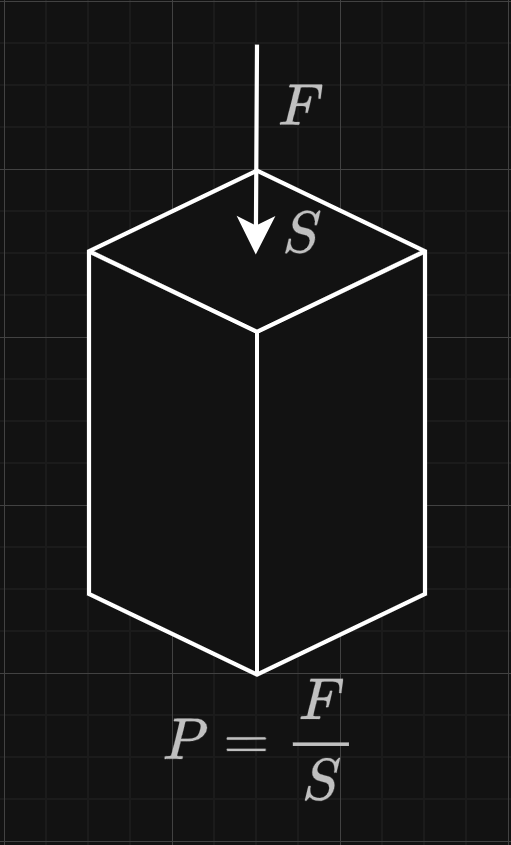
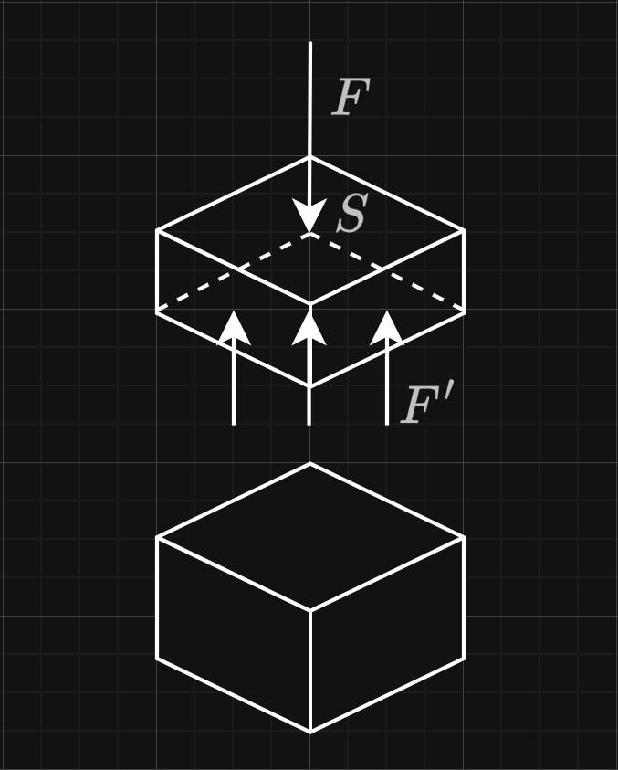
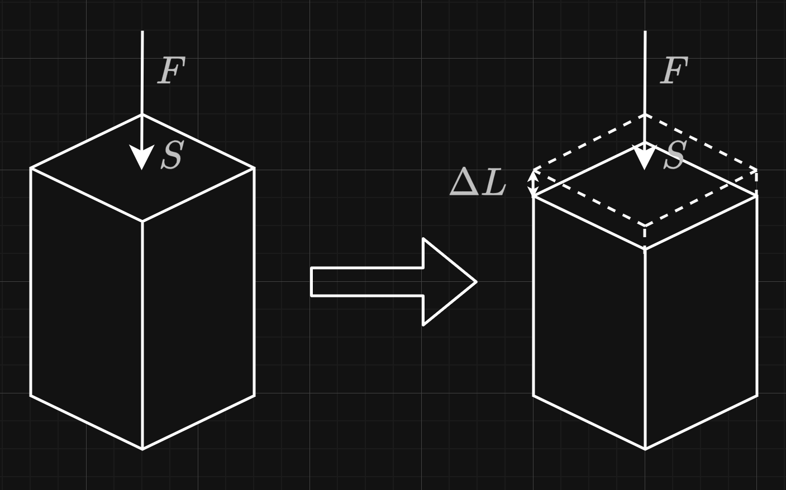
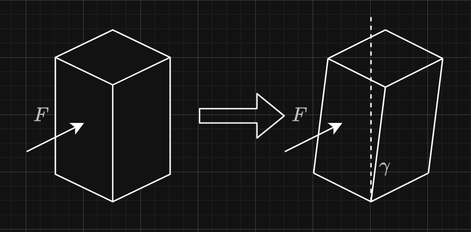

# 杨氏模量
杨氏模量（或称弹性模量），是一个衡量固体材料在弹性范围内**抵抗形变能力**的物理量。

在介绍杨氏模量之前，先引入其它的一些概念，以便更好地说明其定义与其所反映的性质。

## 压强和应力

我们知道压强的概念，压强 $P$ 指的是单位面积 $S$ 上垂直于物体表面施加的力 $F$的大小

$$
P = \frac{F}{S}
$$

现在不妨假设上图的该物体是静止在水平桌面上的，做一个水平面截切该物体，我们可以想到，为了保持物体上部分在受到力 $F$ 时受力平衡且不产生形变，物体上断面的每一部分材料都要受到一定程度的力 $F'$ ，这个力来源于物体内部分子之间的作用，属于物体的内力。

我们称像这样抵抗外力、维持物体的内力在某点处单位截切面上的大小为物体在该点与截面上的应力，计算公式如下

$$\sigma = \frac{F}{A}$$

$\sigma$是应力，单位为帕斯卡；$F$是该点处的沿截面法方向的内力，$A$是受力面积。

在刚才的情况下，选取截面为平行于水平面的面，我们知道维持物体形状的内力和施加的外力在每一个水平截面上都相等，所以在刚才的情况下有 $\sigma = \frac{F}{S}$。

实际生活中的物体受力情况会更加复杂，此时物体在某点处沿不同方向的截切面的内力大小可能不同，所以，在三维空间中考虑某点的应力，一般我们用九个参量确定：三个截切平面的法向量方向 $\hat{i}, \hat{j}, \hat{k}$，某点的截切面积元大小 $S_{\hat{i}}, S_{\hat{j}}, S_{\hat{k}}$，沿着三个法方向的应力大小 $F_{\hat{i}}, F_{\hat{j}}, F_{\hat{k}}$。

为了简化分析模型，我们称当截平面的法向量和外力作用方向一致时算得的应力为正应力，其它方向上的应力称为切应力，刚才情况下我们算得的为正应力，可以知道在该情况下垂直于正应力方向的切应力应为 $0$。

## 应变

还是刚才这个上图的场景，当用力去压缩这个立方块时，立方块在竖直方向上会产生形变。

我们把这种由于外力引起的物体相对于其本来形态的变化，例如拉伸和压缩，称为形变。在此基础上，定义物体形变的程度为应变。

应变有两种形式，正应变与切应变。

### 正应变

正应变是指材料在力作用方向上的伸长或压缩形变。如上图所示，当立方体受到竖直方向压力时，其高度减小，这种沿着力的作用方向的形变称为正应变。

正应变用符号 $\varepsilon$ 表示，它是物体在外力作用下，沿力的方向上长度的相对变化量，计算公式为：

$$\varepsilon = \frac{\Delta L}{L_0}$$

其中，$\varepsilon$ 是正应变，无量纲
；$\Delta L$ 是物体长度的变化量；$L_0$ 是物体的原始长度（未受力时的长度）

根据上面的公式，也可以看出拉伸时的正应变值为正（$\varepsilon > 0$），压缩时为负（$\varepsilon < 0$）。总而言之，正应变表示物体相对于原始尺寸的伸长或压缩程度。

### 切应变

切应变是指材料受到切向力作用时，产生的角度变形。与正应变不同，切应变表示的是材料内部发生的剪切变形，通常用角度变化量 $\gamma$ 来表示。

当一个立方体的顶面受到平行于面的切向力时，立方体会发生如图所示的变形，这种变形即为切应变。

切应变 $\gamma$ 定义为变形前后两个原本垂直的线之间角度的变化：

$$\gamma = \tan\theta \approx \theta \quad \text{(当变形较小时)}$$

## 杨氏模量的定义

终于，了解了应力和应变后，我们引入杨氏模量，它是一个描述了正应力和正应变之间关系的量，定义为

$$E = \frac{\sigma}{\varepsilon} = \frac{F/A}{\Delta L/L}$$

其中 $E$ 是杨氏模量，单位为帕斯卡（Pa）。$\sigma$ 为正应力， $\varepsilon$ 为正应变。

可以发现，杨氏模量越大，在同样的正应力下，正应变更小，这表明材料的刚度越高。所以，杨氏模量是一个反映物体被拉伸或压缩难易度的量。

值得注意的是，我强调了该量描述了**正**应力和**正**应变之间的关系，它不能描述切应力或者切应变之间的关系，也就是没法体现物体的切向强度，这种情况下，我们会引入剪切模量来描述，不过这就不是本节的内容了。