# 波动光学

## 电磁波

由[麦克斯韦方程](https://frp-arm.com:19964/%E7%89%A9%E7%90%86%E5%B1%82/%E9%BA%A6%E5%85%8B%E6%96%AF%E9%9F%A6%E6%96%B9%E7%A8%8B%E7%BB%84%E7%AE%80%E8%BF%B0/)，我们可以知道，空间中变化的电场会产生磁场，又有变化的磁场也会产生电场，电场和磁场交替催生，在空间中不断传递。这就是电磁波——电场和磁场相互作用而产生的波动现象。

电磁波是一种横波，电场的震荡方向、磁场的振荡方向与传播方向三者两两垂直，且遵循右手定则（右手大拇指指向传播方向，四指从电场方向弯曲到磁场方向）。

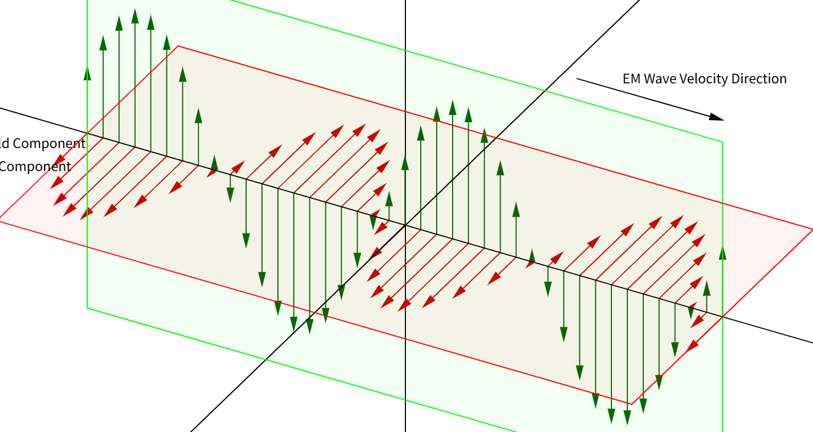

> 其中绿色为电场，红色为磁场，引用自：https://www.geogebra.org/m/xhYwXSsH

电磁波是横波的性质可以用麦克斯韦方程组来证明，在自由空间（无自由电荷与电流，$\rho = 0$，$J = 0$）中，假设电磁波为沿 $z$ 轴传播的平面波，电场和磁场可先假定表示为如下的简谐波形式

$$
\mathbf{E}(z, t) = \mathbf{E}_0 e^{i(kz - \omega t + \phi_E)}, \quad \mathbf{B}(z, t) = \mathbf{B}_0 e^{i(kz - \omega t + \phi_B)}
$$

> 注：最终表征场的强度是复变量的实部，即 $\text{Re}(\mathbf{E}), \text{Re}(\mathbf{B})$

将平面波形式代入高斯定律，出于空间中并无自由电荷与电流，电场的散度为 $0$，有

$$
\nabla \cdot \mathbf{E} = \frac{\partial E_z}{\partial z} = ikE_z = 0 \implies E_z = 0
$$

同理

$$
\nabla \cdot \mathbf{B} = 0 \implies B_z = 0
$$

所以在传播方向 $z$ 上，电场和磁场的分量均为 $0$，电磁波当然是横波。

同时，电场和磁场是正交的，这是因为

$$
\nabla \times \mathbf{E} = i\mathbf{k} \times \mathbf{E} = -\frac{\partial \mathbf{B}}{\partial t} = -i\omega \mathbf{B}
$$

> 在这一步计算中，我们将电场看作 $\mathbf{E}(z, t) = \mathbf{E}_0 e^{i(kz - \omega t + \phi_E)} \hat{i}$，那么旋量的结果就是 $ik \mathbf{E}_0 e^{i(kz - \omega t + \phi_E)} \hat{j}$，令 $\mathbf{k}$ 为朝向 $z$ 轴的单位矢量，那么 $i \mathbf{k} \times \mathbf{E}$ 就是该旋量的结果。

化简得

$$
\mathbf{k} \times \mathbf{E} = -\omega \mathbf{B}
$$

同理，代入安培定律

$$
\nabla \times \mathbf{B} = i\mathbf{k} \times \mathbf{B} = \mu_0 \epsilon_0 \frac{\partial \mathbf{E}}{\partial t} = -i\omega \mu_0 \epsilon_0 \mathbf{E}
$$

化简得

$$
\mathbf{k} \times \mathbf{B} = -\omega \mu_0 \epsilon_0 \mathbf{E}
$$

所以，我们得到对于麦克斯韦方程组中安培-麦克斯韦定律与法拉第电磁感应定律的 $E$ 和 $B$ 的一对解，在这对解中两个量正交，所以电矢量和磁矢量是正交的。

## 光的电磁波特性

光是一种电磁波，遵循[麦克斯韦方程组](https://frp-arm.com:19964/%E7%89%A9%E7%90%86%E5%B1%82/%E9%BA%A6%E5%85%8B%E6%96%AF%E9%9F%A6%E6%96%B9%E7%A8%8B%E7%BB%84%E7%AE%80%E8%BF%B0/)，上述电磁波的传导方式也是光的传导方式，结论同样适用于光。

人眼中视细胞感光的光学刺激主要由电磁波中的电场引起，所以定义光波的电场 $\mathbf{E}$ 为光矢量，这便是我们描述光波的方式。

## 光源

能够发出一定波长电磁波的物体称为光源。

生活中我们能见到很多用于照明的光源，它们发出的电磁波的波长范围在 380nm 到 780nm 之间，这个范围的电磁波可以被人眼感知，被称为可见光，像这样的光源被称作可见光源。

诸如白炽灯，LED，甚至是太阳，它们发出的电磁波的光矢量的方向是随机的，也就是它们发出的光在各个方向上都有光震动。

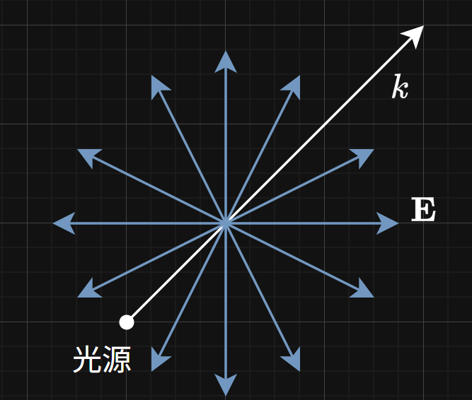

这样的光源被称为各向同性光源。

还有一些光源，它发出的光仅在特定方向上有较强的光振动，这样的光源被称为各向异性光源。

## 光的速度

考虑电磁波传播满足的方程

$$
\begin{cases}
\mathbf{k} \times \mathbf{E} = -\omega \mathbf{B} \\
\mathbf{k} \times \mathbf{B} = -\omega \mu_0 \epsilon_0 \mathbf{E}
\end{cases}
$$

对一式两边做叉乘

$$
\mathbf{k} \times (\mathbf{k} \times \mathbf{E}) = -\omega \mathbf{k} \times \mathbf{B}
$$

> 先介绍向量的叉乘恒等式 $\mathbf{a} \times (\mathbf{b} \times \mathbf{c}) = (\mathbf{a} \cdot \mathbf{c})\mathbf{b} - (\mathbf{a} \cdot \mathbf{b})\mathbf{c}$，所以我们可以将 $\mathbf{k} \times (\mathbf{k} \times \mathbf{E})$ 化简为 $(\mathbf{k} \cdot \mathbf{E})\mathbf{k} - (\mathbf{k} \cdot \mathbf{k})\mathbf{E} = k^2\mathbf{E}$。

$$
k^2\mathbf{E} = -\omega \mathbf{k} \times \mathbf{B}
$$

代换磁场为电场

$$
k^2\mathbf{E} = -\omega^2 \mu_0 \epsilon_0 \mathbf{E}
$$

而考虑电场的表达式

$$
\mathbf{E}(z, t) = \mathbf{E}_0 e^{i(kz - \omega t + \phi_E)}
$$

有电场的波速

$$
v = \frac{\omega}{k} = \frac{1}{\sqrt{\mu_0 \epsilon_0}}
$$

代入真空中的介电常数和真空中的磁导率，有

$$
v = \frac{1}{\sqrt{4\pi \times 10^{-7} \times 8.854... \times 10^{-12}}} = 299,792,458\text{ m/s}
$$

这就是光在真空中的速度，传统的运动学认为速度的测定必然依赖于一个参考系，而麦克斯韦方程组指出光的速度是一个定值，那么这个速度是依赖于哪个参考系得出的呢？

在爱因斯坦的狭义相对论中有光速不变原理，即在所有惯性参考系中，光在真空中的传播速度恒定，为299,792,458米/秒，且不随光源或观察者的运动状态改变。这个原理是狭义相对论的基础。

---

在非真空的介质中，光的传播速度应当会减慢，因为介质的介电常数和磁导率都大于真空中的介电常数和磁导率，所以光在介质中的传播速度为

$$
v = \frac{1}{\sqrt{\mu \epsilon}} = \frac{c}{\sqrt{\mu_r \epsilon_r}} = \frac{c}{n}
$$

其中 $\mu_r, \epsilon_r$ 分别为介质的相对磁导率和相对介电常数，是该介质的介电常数和磁导率与真空中的介电常数和磁导率的比值。

定义介质有

$$
n = \sqrt{\mu_r \epsilon_r}
$$

称为其折射率，折射率是一个无量纲的量，表示光在该介质中的传播速度与真空中的传播速度之比。

## 光的叠加

光的叠加是指两束或多束光波在空间中相遇时，它们的电场和磁场会相互叠加，形成新的电场和磁场分布，从而形成新的光束。

考虑到麦克斯韦方程组是线性方程组，外积和内积都满足对加法的分配律，所以要计算光波的叠加情况，我们可以简单将两束光的电场和磁场叠加起来，得到新的电场和磁场分布。

$$
E = \sum_{i=1}^{n} E_i
$$

## 光的强度

### 能量密度

光的传导伴随着能量的传递，这种能量的主要表现在伴随光波传递的电磁场上。

考虑光波激发出的电场 $\mathbf{E}$，那么不妨将这个电场看作是由一个电容 $C$ 产生的，该电容所存储的能量即为电场的能量，有

$$
C = \frac{\epsilon_r S}{4 \pi k d}
$$

考虑到我们在麦克斯韦方程组中[关于高斯定律的推导](https://frp-arm.com:19964/%E7%89%A9%E7%90%86%E5%B1%82/%E9%BA%A6%E5%85%8B%E6%96%AF%E9%9F%A6%E6%96%B9%E7%A8%8B%E7%BB%84%E7%AE%80%E8%BF%B0/#_2)，有

$$
k = \frac{1}{4 \pi \epsilon_0}
$$

代入有电容的表达式

$$
C = \frac{\epsilon S}{d}
$$

考虑电容的储能公式，有

$$
W = \frac{1}{2} C U^2 = \frac{1}{2} \frac{\epsilon S}{d} (Ed)^2
$$

令体积 $V = Sd$，则有

$$
\frac{W}{V} = \frac{1}{2} \epsilon E^2
$$

我们称 $\frac{W}{V}$ 为光的能量密度，能量密度是一个体积单位内的能量，单位为 $\text{J/m}^3$。

同理，根据电感的计算公式

$$
L = \mu \frac{N^2 S}{L}
$$

也可以计算出磁场的能量密度

$$
\frac{W}{V} = \frac{1}{2 \mu} B^2
$$

所以，电磁波的能量密度为

$$
u = \frac{1}{2} \epsilon E^2 + \frac{1}{2 \mu} B^2
$$

### 坡印廷定理 & 坡印廷矢量

由麦克斯韦方程组，我们有

$$
\nabla \times \mathbf{E} = -\frac{\partial \mathbf{B}}{\partial t}
$$

$$
\nabla \times \mathbf{H} = \mathbf{J} + \frac{\partial \mathbf{D}}{\partial t}
$$

其中 $\mathbf{D} = \epsilon \mathbf{E}$ 且 $\mathbf{B} = \mu \mathbf{H}$，它们分别为电位移矢量和磁场强度。

考虑 $\nabla \cdot (\mathbf{E} \times \mathbf{H})$ 的展开

$$
\nabla \cdot (\mathbf{E} \times \mathbf{H}) = \mathbf{H} \cdot (\nabla \times \mathbf{E}) - \mathbf{E} \cdot (\nabla \times \mathbf{H})
$$

代入麦克斯韦方程组

$$
\nabla \cdot (\mathbf{E} \times \mathbf{H}) = -\mathbf{H} \cdot \frac{\partial \mathbf{B}}{\partial t} - \mathbf{E} \cdot (\mathbf{J} + \frac{\partial \mathbf{D}}{\partial t})
$$

$$
= -\mathbf{H} \cdot \frac{\partial \mathbf{B}}{\partial t} - \mathbf{E} \cdot \mathbf{J} - \mathbf{E} \cdot \frac{\partial \mathbf{D}}{\partial t}
$$

注意到能量密度 $u = \frac{1}{2}\epsilon E^2 + \frac{1}{2\mu}B^2 = \frac{1}{2}\mathbf{E}\cdot\mathbf{D} + \frac{1}{2}\mathbf{B}\cdot\mathbf{H}$，因此

$$
\frac{\partial u}{\partial t} = \mathbf{E} \cdot \frac{\partial \mathbf{D}}{\partial t} + \mathbf{H} \cdot \frac{\partial \mathbf{B}}{\partial t}
$$

代入上式

$$
\nabla \cdot (\mathbf{E} \times \mathbf{H}) = -\frac{\partial u}{\partial t} - \mathbf{E} \cdot \mathbf{J}
$$

应用高斯公式

$$
\iiint_V \nabla \cdot (\mathbf{E} \times \mathbf{H}) dV = \iint_{\partial V} (\mathbf{E} \times \mathbf{H}) \cdot d\mathbf{S}
$$

所以

$$
\iint_{\partial V} (\mathbf{E} \times \mathbf{H}) \cdot d\mathbf{S} = -\iiint_V \frac{\partial u}{\partial t} dV - \iiint_V \mathbf{E} \cdot \mathbf{J} dV
$$

整理得到

$$
-\frac{\partial}{\partial t} \iiint_V u dV = \iint_{\partial V} \mathbf{E} \times \mathbf{H} \cdot d\mathbf{S} + \iiint_V \mathbf{J} \cdot \mathbf{E} d\mathbf{V}
$$

这就是坡印廷定理，其物理意义是：区域内能量的减少率（左侧，能量对时间的偏导）等于通过边界流出的能量流率（第一项）加上区域内焦耳热损耗（第二项，即电场力驱动电流做功）。

> 学习过高中物理的我们都知道，洛伦茨力不做功，所以这里没有磁场所耗散的能量。

为了更直观地了解边界流出的能量速率，我们定义坡印廷矢量

$$
\mathbf{S} = \mathbf{E} \times \mathbf{H}
$$

它表示单位时间内通过单位面积的能量流率，单位为 $\text{W/m}^2$。容易知道它的方向和电场和磁场的方向是正交的，且遵循右手定则，也就是和电磁波传播方向一致。

所以，实际问题中，我们选取一个截面，计算通过该截面的坡印廷矢量的积分，即可得到通过该截面的能量流率。

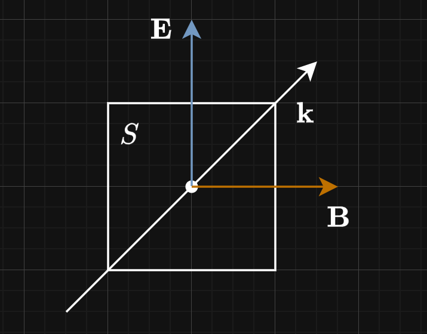

$$
P = \iint_S \mathbf{S} \cdot d\mathbf{A}
$$

## 惠更斯-菲涅耳原理

惠更斯-菲涅耳原理是描述波传播的普遍几何法则，它指出对于波的传播而言，波阵面上的每一点都可行做是发射子波的波源，在其后的任一时刻，这些**子波的包迹**就成为新的波阵面。

> 波阵面指的是波动的相位相同的点所组成的面，通常是一个平面或球面，而包迹是指这些子波的相位相同的点所组成的面。

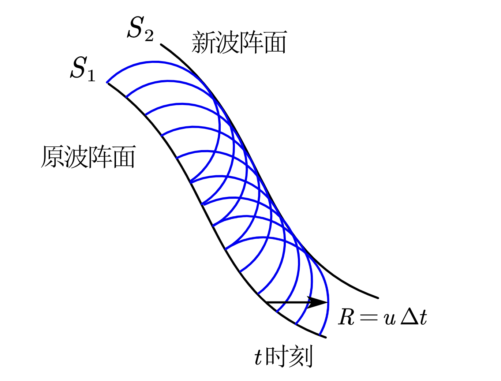

> 引用自：https://wuli.wiki/online/Huygen.html

所以，当我们分析光的传播时，我们可以认为光的传播形式是电磁场的波阵面（或者说是波扰）在空间中的传播。

## 光的反射定律

波的波阵面从一种介质接触另一种折射率不同的介质时，部分或全部的波在两介质界面处，波阵面的传播方向发生改变且返回原介质，这种波的传播现象被称为反射。

光的反射遵循反射定律，即入射光线、反射光线和法线在同一平面内，且入射角等于反射角。

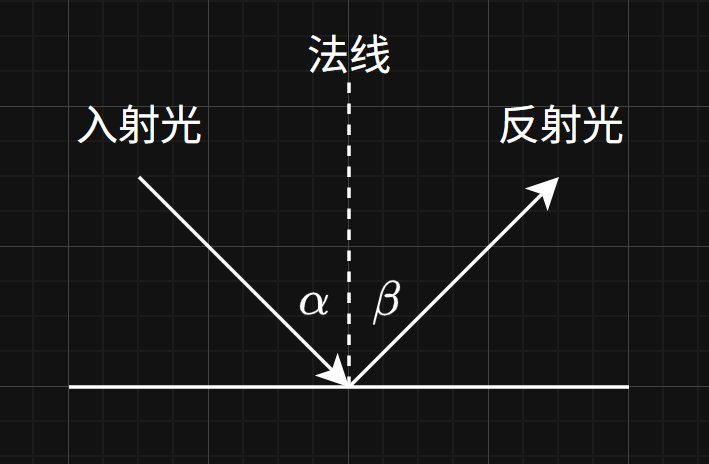

---

光在发生反射时，有时其相位会发生变化，反射光的相位会比入射光的相位多 $\pi$，这就是半波损失现象。

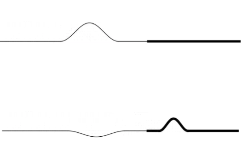

> 引用自：https://www.zhihu.com/question/267529217

如上图所示，光从一种介质接近另一种介质时（上图），同时发生反射和折射（下图），反射光的相位变化了 $\pi$。

发生半波损失的一个充分不必要条件是

1. 光波发生反射；
2. 光是从光疏介质进入光密介质的；
3. 光是垂直交界面入射的。

我们将在后面的部分介绍其具体原理。

## 斯涅尔定律（光的折射定律）

波的波阵面从一种介质穿入另一种折射率不同的介质时，其传播方向发生改变，这种波的传播现象被称为折射。

在先前“光的速度”部分中，我们曾推导光在介质中的传播速度为

$$
v = \frac{c}{n}
$$

其中 $n = \sqrt{\mu_r \epsilon_r}$ 是介质的折射率。

那么我们不妨考虑接下来的情况，一平面波阵面以 $\theta$ 夹角从 $n_1$ 折射率的材料接触 $n_2$ 的材料。

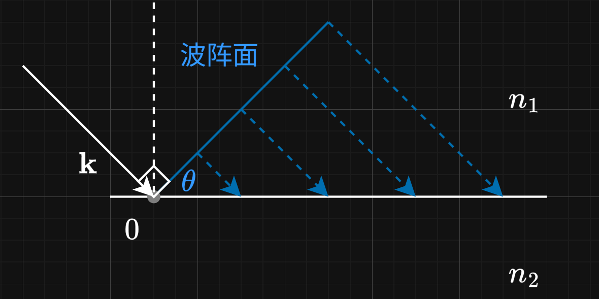

图中蓝色是波阵面，白色为两材料交界线，$\mathbf{k}$ 为光波传来的方向。

以当前波阵面和交界线的交点为原点，正方向为沿交界线向右，建立坐标系，那么我们知道波阵面和 $x$ 位置发生接触所需的时间为

$$
t_{i} = \frac{x \sin{\theta}}{\frac{c}{n_1}} = \frac{n_1 x \sin{\theta}}{c}
$$

在波阵面和交界线接触后，根据惠更斯原理，接触点成为一个新的子波源，向介质中发射子波，子波的传播速度为 $v = \frac{c}{n_2}$，那么从一开始计时，在时间 $t$ 内，子波传播的距离为

$$
r_{s} = \frac{c}{n_2} (t - t_{i})
$$

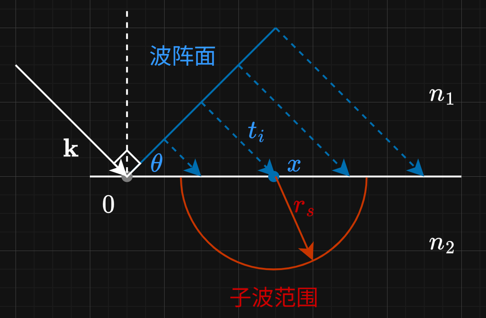

所以，在 $t = t_0$ 时刻，交界面上所有 $x \in [0, \frac{c t_0}{n_1 \sin{\theta}}]$ 都会有子波发射出来，且子波的传播距离为

$$
r_{s} = \frac{c}{n_2} (t_0 - \frac{n_1 x \sin{\theta}}{c})
$$

考虑 $x$ 到 $t = t_0$ 时刻波阵面和交界线最右边的交点的距离为 $x_l$，则有

$$
x_l = \frac{c t_0}{n_1 \sin{\theta}} - x
$$

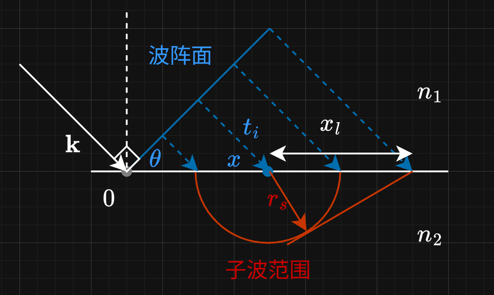

此时发现 $x_l$ 与 $r_s$ 的比值为

$$
\frac{x_l}{r_s} = \frac{\frac{c t_0}{n_1 \sin{\theta}} - x}{\frac{c}{n_2} (t_0 - \frac{n_1 x \sin{\theta}}{c})} = \frac{n_2}{n_1 \sin{\theta}}
$$

这是一个定值，意味着从最右边的交点向传播距离的圆弧引出切线，该切线和交界线的夹角为 $\frac{n_2}{n_1 \sin{\theta}}$ 不变，所以我们有下图的情况，新的由子波源构成的波阵面的包络是平面且和交界线的夹角为 $\frac{n_2}{n_1 \sin{\theta}}$。

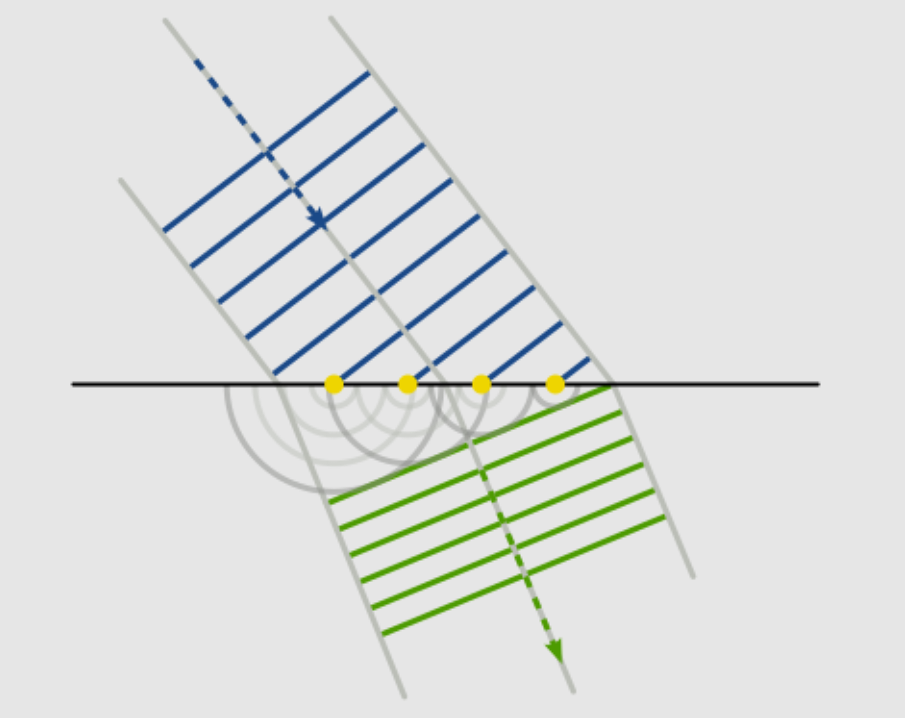

如图，设新的波阵面，即所有子波的包络（绿色）和交界面夹角为 $\theta_2$

$$
\theta_2 = \frac{n_2}{n_1 \sin{\theta}} \implies n_1 \sin{\theta_1} = n_2 \sin{\theta_2}
$$

所以我们就知道，折射现象中，入射光线和折射光线的夹角正弦值和介质的折射率成一定的比值关系，有

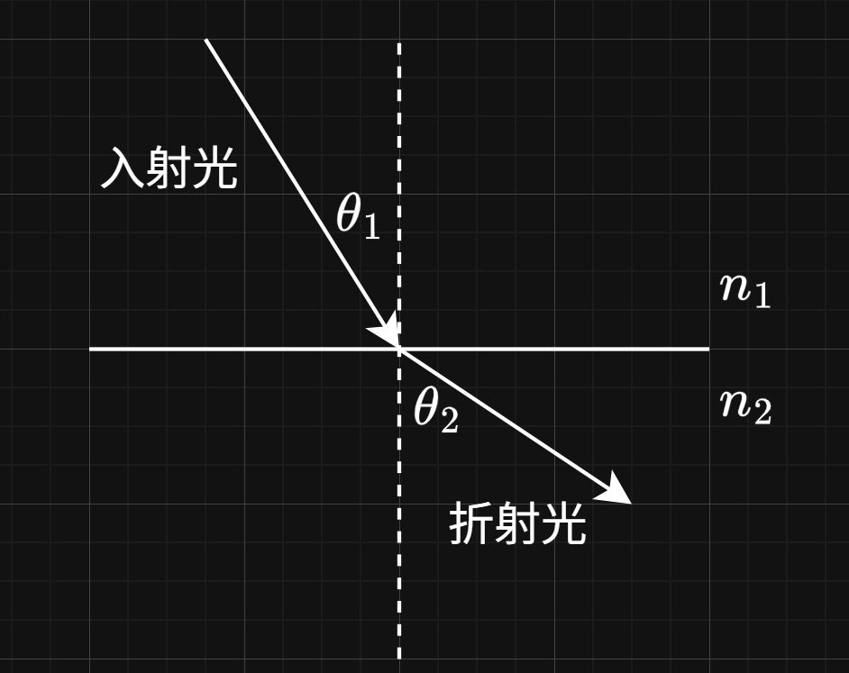

$$
n_1 \sin{\theta_1} = n_2 \sin{\theta_2}
$$

以上关于光折射传播方向变化规律的阐述就是斯涅尔定律。

## 菲涅耳方程

波阵面接触交界面时，反射和折射可能是同时发生的，此时光的强度会被其反射光和折射光分担，描述这两种光强度比例的方程被称为菲涅耳方程。

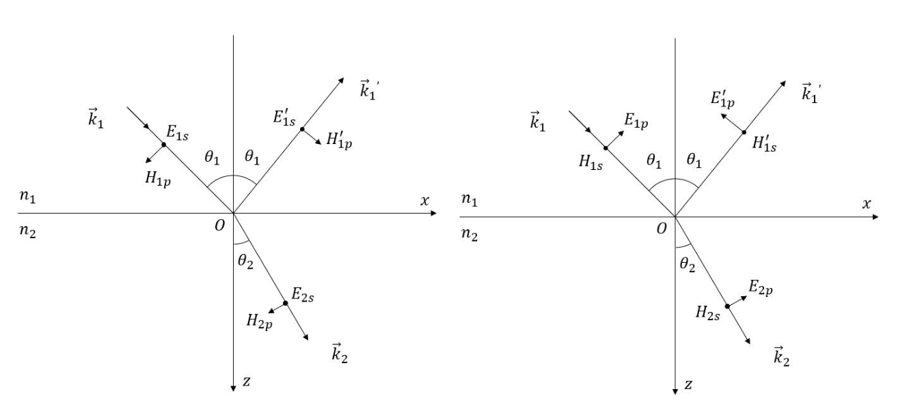

> 引用自：https://zhuanlan.zhihu.com/p/520141099

上图展示了两种光震动不同的入射光线，左边的我们称作 $s$ 波，右边的我们称作 $p$ 波，$s$ 波是指电场垂直于入射光和反射光所在的平面，$p$ 波是指电场平行于入射光和反射光所在的平面。

我们从 $s$ 波的入射光开始分析，考虑在光与交界面的交点处，根据光的叠加原理，有

$$
\begin{cases}
E_{1s} + E'_{1s} = E_{2s} \\
H_{1s} \cos{\theta_1} - H'_{1s} \cos{\theta_1} = H_{2s} \cos{\theta_2}
\end{cases}
$$

考虑我们推算电磁波传播规律中的方程

$$
\mathbf{k} \times \mathbf{E} = -\omega \mathbf{B}
$$

又有 $\frac{k}{\omega} = \frac{n}{c}, \mathbf{B} = \mu \mathbf{H}$，所以将磁场强度用电场表示，有

$$
|\mathbf{H}| = \sqrt{\frac{\epsilon}{\mu}} |\mathbf{E}|
$$

所以

$$
\sqrt{\frac{\epsilon_1}{\mu_1}} E_{1s} \cos{\theta_1} - \sqrt{\frac{\epsilon_1}{\mu_1}} E'_{1s} \cos{\theta_1} = \sqrt{\frac{\epsilon_2}{\mu_2}} E_{2s} \cos{\theta_2}
$$

出于大部分材料的磁导率和真空中的磁导率相同，考虑 $\mu_1 = \mu_2 = \mu_0$，那么就有 $n = \sqrt{\epsilon \mu_0}$，代换有

$$
n_1 E_{1s} \cos{\theta_1} - n_1 E'_{1s} \cos{\theta_1} = n_2 E_{2s} \cos{\theta_2}
$$

**请注意：接下来的推导都建立在两种介质的磁导率和真空磁导率接近的情况下！若该条件不成立，则下列结论失效。**

接下来，不妨假设反射系数和透射系数分别为 $r_s$ 和 $t_s$

$$
r_s = \frac{E'_{1s}}{E_{1s}}, \quad t_s = \frac{E_{2s}}{E_{1s}}
$$

那么根据 $E_{1s} + E'_{1s} = E_{2s}$，将 $E_{2s}$ 代换有

$$
n_1 E_{1s} \cos{\theta_1} - n_1 E'_{1s} \cos{\theta_1} = n_2 \left( E_{1s} - E'_{1s} \right) \cos{\theta_2}
$$

两边同时除去 $E_{1s}$，有

$$
n_1 \cos{\theta_1} - n_1 r_s \cos{\theta_1} = n_2 \left( 1 - r_s \right) \cos{\theta_2}
$$

整理得到

$$
r_s = \frac{n_1 \cos{\theta_1} - n_2 \cos{\theta_2}}{n_1 \cos{\theta_1} + n_2 \cos{\theta_2}}
$$

同理代换 $E'_{1s} = E_{2s} - E_{1s}$，则有

$$
n_1 E_{1s} \cos{\theta_1} - n_1 \left( E_{2s} - E_{1s} \right) \cos{\theta_1} = n_2 E_{2s} \cos{\theta_2}
$$

两边除去 $E_{1s}$，有

$$
n_1 \cos{\theta_1} - n_1 \left( 1 - t_s \right) \cos{\theta_1} = n_2 t_s \cos{\theta_2}
$$

整理得到

$$
t_s = \frac{2 n_1 \cos{\theta_1}}{n_1 \cos{\theta_1} + n_2 \cos{\theta_2}}
$$

这就是 $s$ 波的菲涅耳方程，对于 $p$ 波的菲涅耳方程，我们可以用类似的方法推导出

$$
r_p = \frac{n_2 \cos{\theta_1} - n_1 \cos{\theta_2}}{n_2 \cos{\theta_1} + n_1 \cos{\theta_2}}
$$

$$
t_p = \frac{2 n_1 \cos{\theta_1}}{n_2 \cos{\theta_1} + n_1 \cos{\theta_2}}
$$

所以有菲涅尔方程组

$$
\begin{cases}
r_s = \frac{n_1 \cos{\theta_1} - n_2 \cos{\theta_2}}{n_1 \cos{\theta_1} + n_2 \cos{\theta_2}} \\
r_p = \frac{n_2 \cos{\theta_1} - n_1 \cos{\theta_2}}{n_2 \cos{\theta_1} + n_1 \cos{\theta_2}} \\
t_s = \frac{2 n_1 \cos{\theta_1}}{n_1 \cos{\theta_1} + n_2 \cos{\theta_2}} \\
t_p = \frac{2 n_1 \cos{\theta_1}}{n_2 \cos{\theta_1} + n_1 \cos{\theta_2}}
\end{cases}
$$

$r_s$ 和 $t_s$（或者 $r_p$ 和 $t_p$ ）之间的关系可以用坡印廷矢量表示，考虑透过交界面的能量守恒

$$
S_1 \cos{\theta_1} = S_{1'} \cos{\theta_1} + S_2 \cos{\theta_2}
$$

> 注：这不是矢量方程，指的是坡印廷矢量的模长乘上夹角余弦值之间的关系。

而 $\mathbf{S_n} = \mathbf{E_n} \times \mathbf{H_n}$，所以说

$$
\begin{cases}
S_1 = E_1 \times H_1 \\
S_{1'} = E_{1'} \times H_{1'} \\
S_2 = E_2 \times H_2
\end{cases}
$$

代入有

$$
E_1 \times H_1 \cos{\theta_1} = E_{1'} \times H_{1'} \cos{\theta_1} + E_2 \times H_2 \cos{\theta_2}
$$

两边同时除去 $E_1, H_1$ 有

$$
\cos{\theta_1} = \frac{E_{1'} \times H_{1'} \cos{\theta_1} + E_2 \times H_2 \cos{\theta_2}}{E_1 \times H_1}
$$

考虑到 $|\mathbf{H}| = \sqrt{\frac{\epsilon}{\mu}} |\mathbf{E}| = n |\mathbf{E}|$（认为 $\mu \approx 1$，则 $n = \sqrt{\epsilon_r \mu_r} = \sqrt{\epsilon_r}$），有

$$
\cos{\theta_1} = n_1 r^2 \cos{\theta_1} + n_2 t^2 \cos{\theta_2}
$$

这便是反射系数和透射系数之间的关系。

如果我们定义透射率 $T$ 和反射率 $R$ 为

$$
\begin{cases}
R = r^2 \\
T = t^2 \frac{n_2 \cos{\theta_2}}{n_1 \cos{\theta_1}}
\end{cases}
$$

那么代入原方程就有

$$
R + T = 1
$$

透射率和反射率分别对应原方程的两个坡印廷矢量模长，所以它们的值就表明了光的能量在反射和折射时的分配情况。

---

我们都知道，自然光是各向同性的光源，其同时含有等量的 $s$ 偏振和 $p$ 偏振，此时应当有 $|\mathbf{S}|_s = |\mathbf{S}|_p$

$$
|\mathbf{S}| \propto \mathbf{E}^2, R \propto r^2
$$

两者次数相同，可以知道有

$$
|\mathbf{S}|_{r} = |\mathbf{S}|_s I_s + |\mathbf{S}|_p I_p
$$

考虑到两种偏振光的坡印廷矢量方向相同叠加有 $|\mathbf{S}| = |\mathbf{S}|_s + |\mathbf{S}|_p$，有

$$
|\mathbf{S}|_{r} = \frac{1}{2} \left( R_s + R_p \right) |\mathbf{S}|
$$

所以，对于自然光的反射率有

$$
R = \frac{1}{2} \left( R_s + R_p \right)
$$

同理，透射率也有

$$
T = \frac{1}{2} \left( T_s + T_p \right)
$$

## 全反射与临界角

考虑到当各向同性光的反射率 $R = 1$ 时，有 $r_s = r_p = 1$

$$
(n_1 \cos{\theta_1} - n_2 \cos{\theta_2})^2 = (n_1 \cos{\theta_1} + n_2 \cos{\theta_2})^2
$$

$$
(n_2 \cos{\theta_1} - n_1 \cos{\theta_2})^2 = (n_2 \cos{\theta_1} + n_1 \cos{\theta_2})^2
$$

即

$$
n_1 n_2 \cos{\theta_1} \cos{\theta_2} = 0
$$

不妨假设 $n_1 < n_2$，那么 $\theta_1 > \theta_2 \in [0, \frac{\pi}{2}]$，要使得该式等于 $0$，则 $\theta_1 = \frac{\pi}{2}$，此时根据斯涅尔定理

$$
\sin{\theta_2} = \frac{n_1}{n_2}
$$

所以说，当光从光密介质射入光疏介质时，如果入射角的正弦值等于 $\frac{n_1}{n_2}$ 时，透射光的透射率为 $0$，光全部反射会介质，像这样的现象被称作全反射。

实际上，经验表明，若入射角的正弦值大于 $\frac{n_1}{n_2}$，全反射情况也会出现。

## 布儒斯特角

当入射角和反射角有

$$
\theta_1 + \theta_2 = \frac{\pi}{2}
$$

那么对于

$$
r_p = \frac{n_2 \cos{\theta_1} - n_1 \cos{\theta_2}}{n_2 \cos{\theta_1} + n_1 \cos{\theta_2}}
$$

根据斯涅耳定律（$n_1 \sin{\theta_1} = n_2 \sin{\theta_2}$）有它的分子为

$$
n_2 \cos{\theta_1} - n_1 \cos{\theta_2} = \frac{n_1}{\sin{\theta_2}} \cdot (\sin{\theta_1} \cos{\theta_1} - \cos{\theta_2} \sin{\theta_2})
$$

右边的式子只考虑括号，有

$$
\sin{\theta_1} \cos{\theta_1} - \cos{\theta_2} \sin{\theta_2} = \frac{1}{2} (\sin{2 \theta_1} - \sin{2 \theta_2})
$$

代入 $\theta_2 = \frac{\pi}{2} - \theta_1$ 有

$$
\sin{2 \theta_2} = \sin{(\pi - 2 \theta_1)} = \sin{2 \theta_1}
$$

所以 $\sin{2 \theta_1} - \sin{2 \theta_2} \equiv 0$，这也就意味着有

$$
r_p \equiv 0
$$

所以，当 $\theta_1 + \theta_2 = \frac{\pi}{2}$ 时，$p$ 偏振光，即平行于入射光和反射光所在平面的光矢量无法通过，反射光即为垂直于入射光和反射光所在平面的线偏振光。

我们称此时的入射角 $\theta_1$ 为布儒斯特角，以该角入射光的反射光具有线偏振性质。

根据相关数学原理，布儒斯特角可以由下列公式求出

$$
\theta_B = \arctan\left(\frac{n_2}{n_1}\right)
$$

## 光的强度的叠加和光的干涉

一般情况下，我们知道对于光波来讲，有它的坡印廷矢量

$$
\mathbf{S} = \mathbf{E} \times \mathbf{H}
$$

考虑到有

$$
\frac{\epsilon}{\mu} |\mathbf{E}| = |\mathbf{H}|
$$

所以

$$
|\mathbf{S}| = \frac{\epsilon}{\mu} |\mathbf{E}|^2
$$

于是我们知道，光的能量传递强度 $I$ 和电场强度成正比

$$
I \propto |\mathbf{E}|^2
$$

对于 $|\mathbf{E}| = E_0 \sin(\omega t + \phi)$，将该强度值对时间求平均有

$$
\bar{I} = \frac{1}{T} \int_0^T I dt = \frac{1}{T} \int_0^T \frac{\epsilon}{\mu} E_0^2 \sin^2(\omega t + \phi) dt
$$

使用三角函数降幂公式容易得到

$$
\bar{I} = \frac{\epsilon}{2 \mu} E_0^2
$$

这便是一束光的平均光强表达式。

我们也知道光矢量是满足叠加定理的

$$
\mathbf{E} = \mathbf{E_1} + \mathbf{E_2}
$$

故两束光波叠加成的光的强度由两个矢量的矢量和决定，有

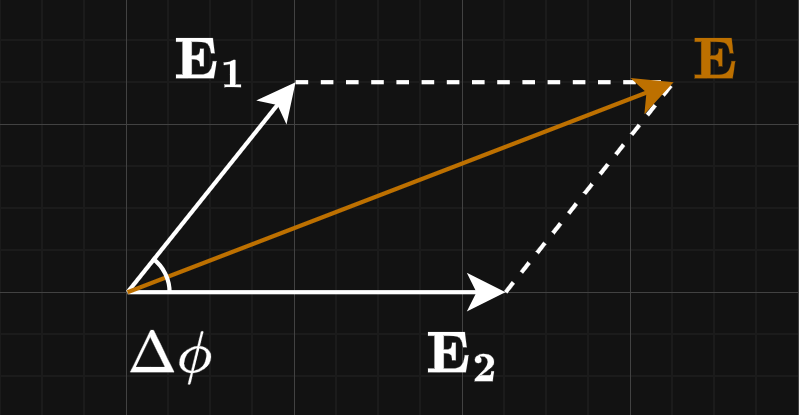

其中 $\Delta \phi$ 为两束光波的相位差。

根据余弦定理，我们有

$$
\mathbf{E}^2 = \mathbf{E_1}^2 + \mathbf{E_2}^2 + 2 \mathbf{E_1} \cdot \mathbf{E_2} \cos{\Delta \phi}
$$

我们知道 $\mathbf{E_1}$ 和 $\mathbf{E_2}$ 的强度实际上是按照正弦规律不断变化的，有

$$
\mathbf{E_1} = E_1 \sin(\omega_1 t + \phi_1), \quad \mathbf{E_2} = E_2 \sin(\omega_2 t + \phi_2)
$$

假如说 $E_1$ 和 $E_2$ 是两束频率不相同的光波，即 $\omega_1 \neq \omega_2$，那么根据三角函数的正交性，有

$$
\int_0^{T} \sin(\omega_1 t + \phi_1) \sin(\omega_2 t + \phi_2) dt = 0
$$

所以无论光振动的相位差如何，在对时间平均的意义上，总有

$$
\mathbf{E}^2 = \mathbf{E_1}^2 + \mathbf{E_2}^2
$$

即

$$
\bar{I} = \bar{I_1} + \bar{I_2}
$$

---

若 $\omega_1 = \omega_2$，那么事情就变得复杂起来了，我们考虑有两光矢量同方向振动，有

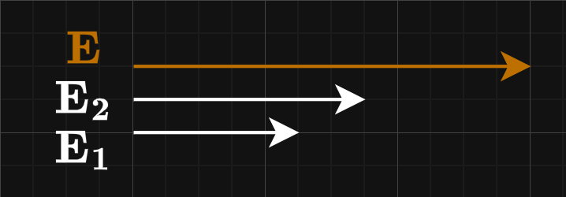

那么就有新的光矢量

$$
\mathbf{E} = \mathbf{E_1} + \mathbf{E_2}
$$

考虑 $\mathbf{E_1} = E_1 \sin(\omega t + \phi_1), \quad \mathbf{E_2} = E_2 \sin(\omega t + \phi_2)$，将它们化为相位形式有

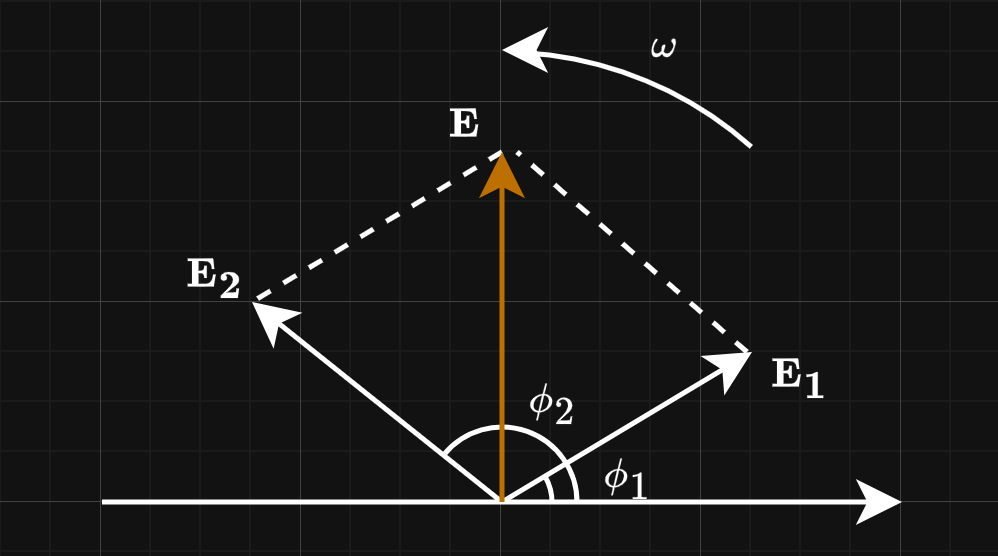

由此我们可以知道，叠加光的振幅应当为

$$
\mathbf{E} = \sqrt{E_1^2 + E_2^2 + 2 E_1 E_2 \cos{\Delta \phi}}
$$

又有光强和振幅的关系

$$
\bar{I} = \frac{\epsilon}{2 \mu} E_0^2 = \frac{\epsilon}{2 \mu} \left(E_1^2 + E_2^2 + 2 E_1 E_2 \cos{\Delta \phi} \right)
$$

该公式告诉我们改变光振动的相位差，光叠加的强度会受到相位差的影响。

考虑两个光矢量振动的方向垂直，有

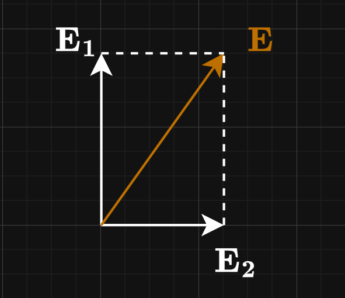

那么就有新的光矢量

$$
\mathbf{E}^2 = \mathbf{E_1}^2 + \mathbf{E_2}^2
$$

所以有

$$
\bar{I} = \bar{I_1} + \bar{I_2}
$$

此时，虽然 $\omega_1 = \omega_2$，但由于光矢量的方向不同，光的强度仍然是相互独立叠加，不受到光振动相位差的影响。

综上所述，我们可以总结出光的强度叠加的规律：

1. 当两束光的频率不相同，或者两束光的光矢量正交，则两束光的强度叠加是相互独立的，满足 $\bar{I} = \bar{I_1} + \bar{I_2}$；

2. 当两束光的频率相同，且两束光的光矢量方向相同，则两束光的强度叠加是相互依赖的，满足 $\bar{I} = \bar{I_1} + \bar{I_2} + 2 \sqrt{\bar{I_1} \bar{I_2}} \cos{\Delta \phi}$；

针对第二种情况，我们可以进一步分析其物理意义。由于两束光的频率相同，且光矢量不完全正交，导致它们在光强的叠加上依赖于它们的相位差，我们称之为光的干涉现象。

实际情况中，光矢量的夹角不一定是 $0$ 或 $\frac{\pi}{2}$，更可能是一个一般的角度，此时要分析干涉现象，可以将光矢量做正交分解。只要两束相同频率的光存在平行的振动分量，干涉就可以在一定程度上发生。

## 菲涅耳-基尔霍夫公式

惠更斯-菲涅耳原理的数学表述是菲涅耳-基尔霍夫公式，它描述了从波前到任意观察点的光场分布。

假设有一波前 $\Sigma$ 上的光场分布为 $U(P_0)$，我们想要计算空间中某点 $P$ 处的光场 $U(P)$。根据惠更斯-菲涅耳原理，$P$ 点的光场是 $\Sigma$ 上所有点发出的子波在 $P$ 点的叠加。

菲涅耳-基尔霍夫公式可表示为

$$
U(P) = -\frac{i}{\lambda}\iint_\Sigma U(P_0)\frac{e^{ikr}}{r}\frac{1+\cos\theta}{2}dS
$$

其中

- $U(P_0)$ 是波前 $\Sigma$ 上点 $P_0$ 处的光场分布情况，代表 $P_0$ 处的光场振幅

- $r$ 是从 $P_0$ 到 $P$ 的距离

- $k = \frac{2\pi}{\lambda}$ 是波数

- $\theta$ 是 $\vec{n}$ (波前 $\Sigma$ 在 $P_0$ 处的法向量)与 $\overrightarrow{P_0P}$ 的夹角

- $\frac{1+\cos\theta}{2}$ 是倾斜因子，代表子波的方向性

- $dS$ 是波前上的面元

要证明该公式，我们要解一系列非齐次微分方程，且引用诸多电动力学的分析方法，出于笔者水平不足，暂不进行详细推导。

## 光的衍射

根据惠更斯-菲涅耳原理，在光透过狭缝或绕过障碍物时，光波会在狭缝处形成新的子波源，这些子波源所发出的光波会向空间中扩散，将光传播到原本按照直线传播无法波及的区域。

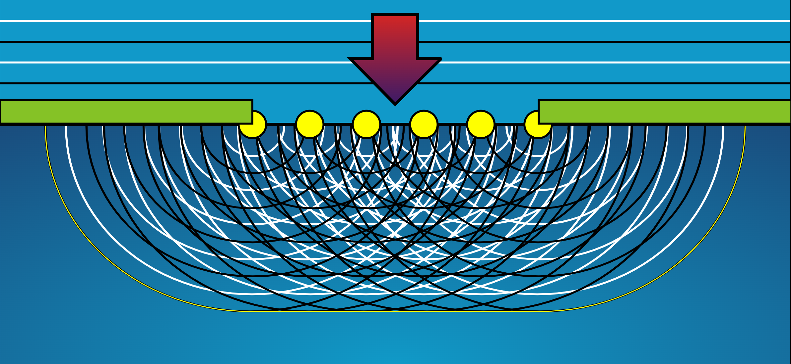

> 引用自：https://zh.wikipedia.org/wiki/%E8%A1%8D%E5%B0%84

这就是光的衍射现象。

我们一般比较关注光在产生衍射现象后，场内的光强分布情况，接下来我们运用相关数学方法进行分析。

### 单缝的夫琅禾费衍射

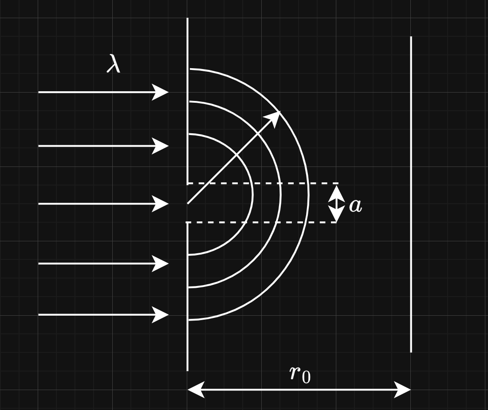

考虑这样一个情况，在有狭缝的遮光板的**非常远**处 $r_0 \gg a$，有另一块遮光板，光波发生衍射，并打到后方的遮光板，在其上显示光斑，我们称这种衍射现象为单缝的夫琅禾费衍射。

采用 MATLAB 对 $r_0 = 1$ m，$a = 0.1$ mm，$\lambda = 500$ nm 的单缝衍射进行模拟，得到如下图像

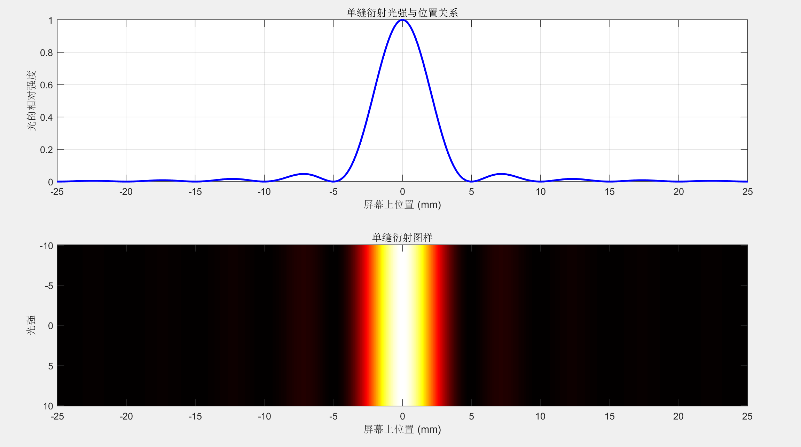

我们发现，远处的遮光板上有多级亮条纹，其中中间的强度最大，向两侧逐渐减弱。中间的亮条纹宽度明显大于 $1$ mm。

运用惠更斯-菲涅耳原理的数学公式，我们可以解释这种现象的成因。

菲涅耳-基尔霍夫公式告诉我们，对于非常远处的挡板上的观察点 $P$，其光场分布情况为

$$
U(P) = -\frac{i}{\lambda}\iint_\Sigma U(P_0)\frac{e^{ikr}}{r}\frac{1+\cos\theta}{2}dS
$$

其中 $\Sigma$ 是有狭缝的挡板区域，$P_0$ 是该挡板上任意一点。

不妨考虑狭缝衍射是一个二维衍射问题，且带狭缝的挡板上发出的光有

$$
\begin{cases}
U(P_0) = U_0 & -\frac{a}{2} < x < \frac{a}{2} \\
0 & x \leq -\frac{a}{2} \text{ or } x \geq \frac{a}{2}
\end{cases}
$$

即只有狭缝处有光透过，其他地方光强均为 $0$，那么改写公式为

$$
U(P) = -\frac{i}{\lambda}\int_{-\frac{a}{2}}^{\frac{a}{2}} U(P_0)\frac{e^{ikr}}{r}\frac{1+\cos\theta}{2} dx
$$

出于 $r_0$ 非常大，观察点 $P$ 与波阵面 $\Sigma$ 的距离远大于波阵面本身的尺寸 $a$ 和光波波长 $\lambda$ 。在这种情况下，我们可以对菲涅耳-基尔霍夫公式进行如下简化

1. 倾斜因子 $\frac{1+\cos\theta}{2}$ 近似为常数 $1$，因为远场中 $\theta$ 几乎相同，为 $0$。

2. 分母中的 $r$ 可近似为常数 $r_0$（从波源中心到观察点的距离）

3. 指数项中的 $r$ 比分母中的 $r$ 影响大得多，我们考虑对 $r$ 进行泰勒展开

    考虑 $\vec{\xi}$ 是波前上点 $P_0$ 相对于波前中心的位置矢量，$\vec{s}$ 是从波源中心指向观察点的**单位**方向矢量。

    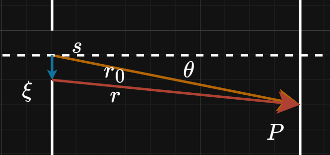

    根据余弦定理，从波面点到观测点的距离$r$可以表示为

    $$
    r^2 = r_0^2 + \xi^2 - 2r_0\xi\sin\theta
    $$

    利用二项式定理对 $r$ 进行展开

    $$
    r = \sqrt{r_0^2 + \xi^2 - 2r_0\xi\sin\theta} = r_0\sqrt{1 + \frac{\xi^2}{r_0^2} - \frac{2\xi\sin\theta}{r_0}}
    $$

    当$\xi \ll r_0$时，$\frac{\xi^2}{r_0^2} \approx 0$，于是约去二次小量

    $$
    r \approx r_0\sqrt{1 - \frac{2\xi\sin\theta}{r_0}}
    $$

    应用泰勒展开 $\sqrt{1+x} \approx 1 + \frac{x}{2}$（当$|x| \ll 1$时

    $$
    r \approx r_0(1 - \frac{\xi\sin\theta}{r_0}) = r_0 - \xi\sin\theta
    $$

    由于 $\vec{\xi} \cdot \vec{s} = \xi\sin\theta$ ，所以最终简化为： $r \approx r_0 - \vec{\xi} \cdot \vec{s} = r_0 - \xi\sin\theta$

经过这些近似，远场衍射的菲涅耳-基尔霍夫公式可简化为

$$
U(P) \approx -\frac{i}{\lambda}\frac{e^{ikr_0}}{r_0} \int_{-a/2}^{a/2} U_0 e^{-ikx\sin\theta} dx
$$

计算积分，有了合适的近似这一步反倒难度不大

$$
U(P) \approx -\frac{i}{\lambda}\frac{e^{ikr_0}}{r_0} U_0 \int_{-a/2}^{a/2} e^{-ikx\sin\theta} dx = -\frac{i}{\lambda}\frac{e^{ikr_0}}{r_0} U_0 \frac{\sin(ka\sin\theta/2)}{ka\sin\theta/2}
$$

光强正比于复振幅的模方，所以

$$
I(\theta) \propto |U(P)|^2 \propto \left|\frac{\sin(ka\sin\theta/2)}{ka\sin\theta/2}\right|^2
$$

所以我们推得单缝的夫琅禾费衍射光强分布公式为

$$
I(\theta) = I_0 \left|\frac{\sin(ka\sin\theta/2)}{ka\sin\theta/2}\right|^2
$$

### 圆孔的夫琅禾费衍射

考虑一个半径为 $a$ 的圆形孔径，光波垂直入射到孔径上，离圆形孔径足够远的位置有一挡板，光在孔径处发生干涉并在该挡板上形成衍射图样，这就是圆孔的夫琅禾费衍射。

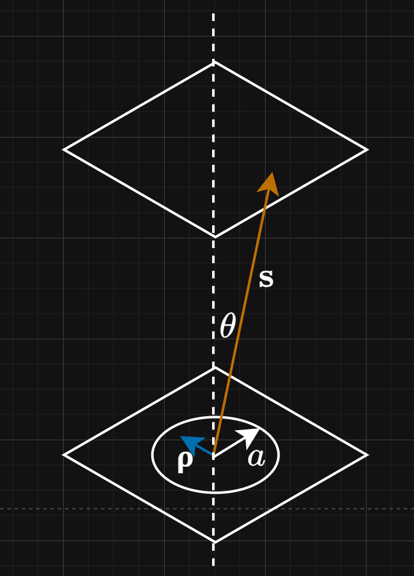

在圆孔平面上，我们用极坐标 $(r,\phi)$ 表示孔径上的点，而在远场观察平面，我们用 $\theta$ 表示与光轴的夹角，$\varphi$ 表示绕光轴的方位角。

根据前一节的推导，对于远场衍射，菲涅耳-基尔霍夫公式可以简化为

$$
U(P) \approx -\frac{i}{\lambda}\frac{e^{ikr_0}}{r_0} \iint_{\text{S}} U_0 e^{-ik\vec{\rho}\cdot\vec{s}} d\rho
$$

其中 $\vec{\rho}$ 是圆孔平面上的位置矢量，$\vec{s}$ 是从孔径中心指向观察点的单位矢量。

在极坐标下，$\vec{\rho}\cdot\vec{s} = \rho\sin\theta\cos(\phi-\varphi)$，其中 $\theta$ 为 $\vec{s}$ 与中轴线的夹角，而 $\phi$ 与 $\varphi$ 为两矢量极坐标方位角。同时积分区域是半径为 $a$ 的圆，所以有

$$
U(P) \approx -\frac{i}{\lambda}\frac{e^{ikr_0}}{r_0} U_0 \int_{0}^{a}\int_{0}^{2\pi} e^{-ik\rho\sin\theta\cos(\phi-\varphi)} \rho d\phi d\rho
$$

引入贝塞尔函数

$$
\int_{0}^{2\pi} e^{-ik\rho\sin\theta\cos(\phi-\varphi)} d\phi = 2\pi J_0(k\rho\sin\theta)
$$

---

贝塞尔函数指的是形如

$$
J_n(x) = \frac{1}{\pi} \int_{0}^{\pi} \cos(n \theta - x \sin \theta) d\theta
$$

的函数，其中 $n$ 是整数，它的图像如下所示

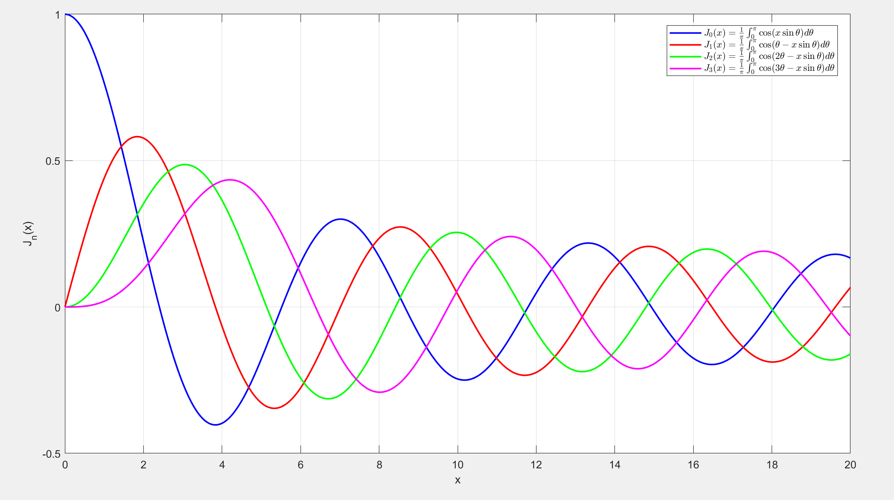

贝塞尔函数具有如下的积分性质

$$
\int x J_n(x) dx = x J_{n+1}(x) + C
$$

这些性质在此不做具体推导。

原函数 $\int_{0}^{2\pi} e^{-ik\rho\sin\theta\cos(\phi-\varphi)} d\phi$ 推导到贝塞尔函数的过程如下所示

设 $\alpha = \phi-\varphi$，则原式化为

$$
\int_{0}^{2\pi} e^{-ik\rho\sin\theta\cos\alpha} d\alpha
$$

零阶贝塞尔函数有复指数形式

$$
J_0(x) = \frac{1}{2\pi}\int_{0}^{2\pi} e^{ix\cos\alpha} d\alpha
$$

将 $x = -k\rho\sin\theta$ 代入，我们得到

$$
J_0(-k\rho\sin\theta) = \frac{1}{2\pi}\int_{0}^{2\pi} e^{-ik\rho\sin\theta\cos\alpha} d\alpha
$$

由于贝塞尔函数 $J_0(x)$ 是偶函数，即

$$
J_0(k\rho\sin\theta) = \frac{1}{2\pi}\int_{0}^{2\pi} e^{-ik\rho\sin\theta\cos\alpha} d\alpha
$$

因此

$$
\int_{0}^{2\pi} e^{-ik\rho\sin\theta\cos(\phi-\varphi)} d\phi = 2\pi J_0(k\rho\sin\theta)
$$

---

代入原式

$$
U(P) \approx -\frac{i}{\lambda}\frac{e^{ikr_0}}{r_0} U_0 \cdot 2\pi \int_{0}^{a} J_0(k\rho\sin\theta) \rho d\rho
$$

利用贝塞尔函数的性质，可以计算出

$$
\int_{0}^{a} J_0(k\rho\sin\theta) \rho d\rho = \frac{a^2}{2} \frac{J_1(ka\sin\theta)}{ka\sin\theta/2}
$$

最终，有圆孔的远场衍射复振幅

$$
U(P) \approx -\frac{i}{\lambda}\frac{e^{ikr_0}}{r_0} U_0 \cdot \pi a^2 \cdot \frac{2J_1(ka\sin\theta)}{ka\sin\theta}
$$

光强正比于复振幅的模方，所以圆孔衍射的光强分布为

$$
I(\theta) = I_0 \left[\frac{2J_1(ka\sin\theta)}{ka\sin\theta}\right]^2
$$

这个分布被称为艾里斑。根据贝塞尔函数零点的数值，第一个暗环出现在 $J_1(ka\sin\theta) = 0$ 的位置，即当 $ka\sin\theta \approx 3.832$ 时

$$
\sin\theta \approx \frac{3.832\lambda}{2\pi a} \approx 1.22\frac{\lambda}{2a}
$$

对于小角度，$\sin\theta \approx \theta$，所以第一个暗环的角半径约为

$$
\theta \approx 1.22\frac{\lambda}{2a} = 1.22\frac{\lambda}{D}
$$

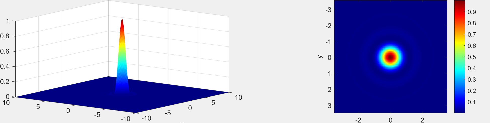

### 光学仪器的分辨率

上述推导让我们明白，一个直径为 $D$ 的圆孔在远场衍射时，会形成一个角半径约为 $1.22\frac{\lambda}{D}$ 的艾里斑图样。

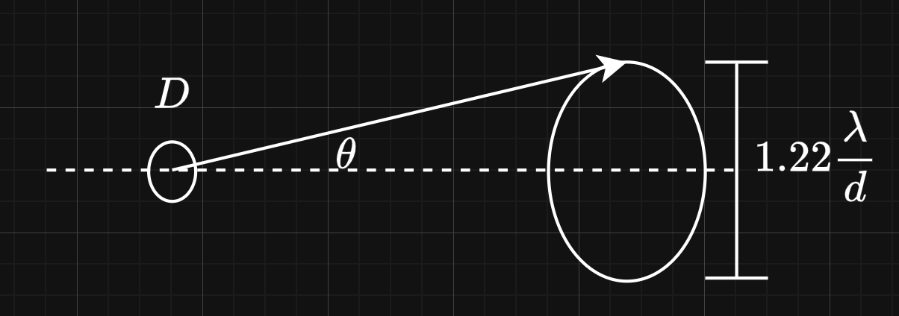

这就意味着，当两个点光源靠的足够近，它们的衍射图像会重叠在一起，从而导致光学系统无法分辨它们。

经验表明，当一个点光源产生的艾里斑的中心和另一个点光源的艾里斑的第一个暗环重叠时，光学系统恰好能够分辨这两个点光源，所以，两个点光源恰好能被分辨的条件是两者的角半径满足

$$
\Delta \theta \ge 1.22\frac{\lambda}{D}
$$

这就被称为光学系统的分辨率极限，又名瑞利判据。

### 光栅的夫琅禾费衍射

想象一块非常光滑的玻璃板，这块玻璃板可以透射光线，现在在这块玻璃板上用刻刀刻出许多平行的刻刀痕迹，痕迹处的玻璃板变得不透明，无法再透过光线。

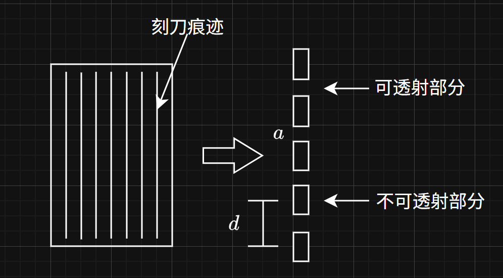

我们称这样的光学器件为光栅，光栅是由很多平行狭缝组成的光学元件。

假设光栅有 $N$ 个狭缝，每个狭缝宽度为 $a$，相邻狭缝中心间距为 $d$。当平行光垂直入射到光栅上时，根据惠更斯-菲涅耳原理，每个狭缝都会成为次波源，这些次波源发出的光波在远处形成衍射图样。

我们可以将光栅的衍射看作是多个单缝衍射的叠加。对于每个宽度为 $a$ 的单缝，我们已经推导出其远场衍射公式

$$
I(\theta) = I_0 \left|\frac{\sin(ka\sin\theta/2)}{ka\sin\theta/2}\right|^2
$$

出于我们将分析多个狭缝的叠加效应，不妨将光强改写为复振幅形式，令 $k = \frac{2\pi}{\lambda}$，有

$$
U_{\text{s}}(\theta) = U_0 \frac{\sin(ka\sin\theta/2)}{ka\sin\theta/2} e^{ikr}
$$

对于 $N$ 个狭缝组成的光栅，认为每个狭缝的中心位置为 $x_n = nd$，其中 $n = 0, 1, 2, ..., N-1$，$d$ 为相邻两光栅之间的间距。

我们再分析分析从两个狭缝出射出光的光程差，有

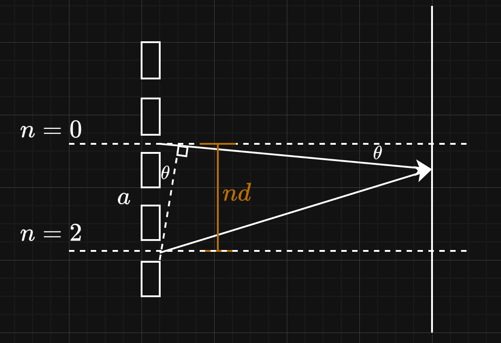

发现两束光之间的光程差为 $nd\sin\theta$，因此每个狭缝的复振幅可以写成

$$
U_{\text{t}}(\theta) = \sum_{n=-N}^{N} U_{\text{s}}(\theta) e^{-iknd\sin\theta}
$$

其中，出于指数函数的影响比前面的多项式大得多，且在远场条件下各个狭缝到挡板上的方位角几乎相同，所以我们认为方位角 $\theta$ 在累加中保持不变，而影响光强叠加的主要因子是相位，也就是后方的指数项。

接下来将上方级数进行整理

$$
U_{\text{t}}(\theta) = U_0 \frac{\sin(ka\sin\theta/2)}{ka\sin\theta/2} e^{ikr_0} \sum_{n=-N}^{N} e^{-iknd\sin\theta}
$$

将后面的等比数列求和写作

$$
\sum_{n=-N}^{N} e^{-iknd\sin\theta} = \sum_{n=-N}^{N} (e^{-ikd\sin\theta})^n
$$

这是一个以 $q = e^{-ikd\sin\theta}$ 为公比，首项为 $q^{-N} = e^{ikNd\sin\theta}$ 的有限等比数列，根据等比数列求和公式

$$
\sum_{n=-N}^{N} q^n = \frac{q^{-N} - q^{N+1}}{1 - q} = \frac{e^{ikNd\sin\theta} - e^{-ikd\sin\theta(N+1)}}{1 - e^{-ikd\sin\theta}}
$$

进一步整理，将复指数转化为正弦函数形式：

$$
\sum_{n=-N}^{N} e^{-iknd\sin\theta} = \frac{\sin[(2N+1)kd\sin\theta/2]}{\sin(kd\sin\theta/2)}
$$

因此，光栅的远场衍射复振幅为：

$$
U_{\text{t}}(\theta) = U_0 \frac{\sin(ka\sin\theta/2)}{ka\sin\theta/2} \frac{\sin[(2N+1)kd\sin\theta/2]}{\sin(kd\sin\theta/2)} e^{ikr_0}
$$

光强正比于复振幅的模方，所以光强分布为：

$$
I(\theta) = I_0 \left|\frac{\sin(ka\sin\theta/2)}{ka\sin\theta/2}\right|^2 \left|\frac{\sin[(2N+1)kd\sin\theta/2]}{\sin(kd\sin\theta/2)}\right|^2
$$

这个公式由两部分组成：左边的 $\left|\frac{\sin(ka\sin\theta/2)}{ka\sin\theta/2}\right|^2$ 为单缝衍射因子，右边的 $\left|\frac{\sin[(2N+1)kd\sin\theta/2]}{\sin(kd\sin\theta/2)}\right|^2$ 为多缝干涉因子，共同决定了光栅衍射的光强分布。

绘制该函数的图像，有

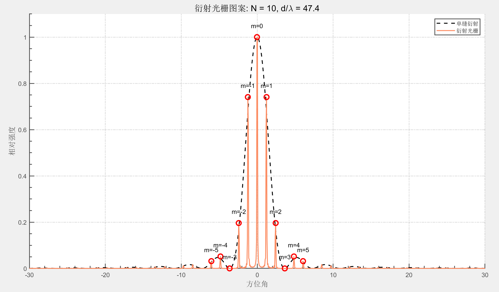

在这张图中，我们绘制了 $N = 0$ 即单缝衍射情况下的图线（黑色虚线）和 $N = 10$ 的多缝干涉情况（红色实线），可以观察到多缝干涉加持情况下，光强分布峰值变得更加尖锐，且越靠近中心的光强峰值越高。

出现这么尖锐的光强变化，全拜多缝干涉因子的分母所赐，当

$$
\sin(kd\sin\theta/2) \to 0
$$

光强就会表现出极大值，此时满足

$$
d\sin\theta = m\lambda, \quad m = 0, \pm 1, \pm 2, \cdots
$$

又有当 $\sin(ka\sin\theta/2) = 0$ 时，按照单缝衍射因子的限制，此时无论多缝衍射因子表现如何，光强都为 $0$。我们称这种现象为缺级现象。

缺级现象发生的条件是

$$
a\sin\theta = n\lambda, \quad n = 0, \pm 1, \pm 2, \cdots
$$

又或者说，对于任何 $m$ 若有

$$
m \in \{ m | \frac{m}{n} = \frac{d}{a}, n \in \mathbb{Z} \text{ and } m \in \mathbb{Z} \}
$$

则 $m$ 处的条纹会缺级。

### X 光的晶体衍射与布拉格定律

X 光指的是波长在 $0.01$ nm 到 $10$ nm 之间的电磁波，具有很强的穿透能力。现代科技会使用 X 光进行医学成像、材料分析等。

以前的人们并不知道 X 光是一种电磁波，因为要验证其电磁波性质，就要针对其设计观测其衍射现象的实验，但是这种光的波长极短，这种规格的光栅是没办法人为制作的。

直到 1912 年，德国物理学家马克斯·冯·劳厄（Max von Laue）想到，某些天然晶体本身就可以被看作是一个光栅，且晶体的原子排列具有周期性，间距通常在 $0.1$ nm 到 $0.5$ nm 之间，正好适合 X 光的波长。

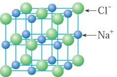

> 图示为 NaCl 晶体

英国物理学家威廉·亨利·布拉格（William Henry Bragg）和他的儿子威廉·劳伦斯·布拉格（William Lawrence Bragg）对晶体的衍射进行了深入的研究。

考虑一个简单的晶体模型，其中原子排列在平行的晶面上，相邻晶面间距为 $d$。

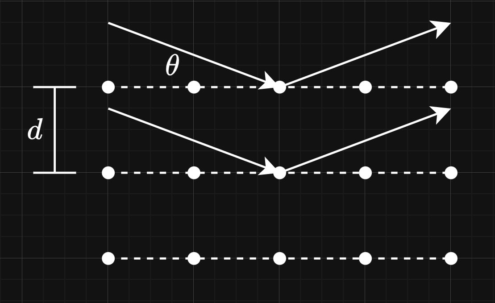

当 X 射线以角度 $\theta$ 入射到晶体上时，每个原子都会成为次级波源。以上图为例，相邻晶面上的原子散射的 X 射线之间存在光程差。

从几何关系可以看出，从第二个晶面反射的光线比从第一个晶面反射的光线多走了距离 $2d\sin\theta$。

对于发生相长干涉（即形成强衍射）的情况，这个光程差必须等于波长的整数倍：

$$
2d\sin\theta = n\lambda, \quad n = 1, 2, 3, \ldots
$$

这就是布拉格定律。

## 起偏器和马吕斯定律

我们曾提到过，光是一种电磁波，其电场矢量 $\mathbf{E}$ 在空间中以波动的方式传播。

若对于一束光而言，其光的电场矢量在传播过程中具有某种特定的方向性，即仅在一个特定的方向上振动，则我们称这种光具有偏振特性。

在现代光学中，一种特殊的仪器：起偏器（偏振片）被广泛应用于产生和分析偏振光。通过选择性地透过光的某一方向的电场分量，从而将未偏振光转变为偏振光。

现代工艺普遍采用聚乙烯醇（PVA）作为偏振片的基座材料，并将碘单质（$I_2$）与之结合，形成复合材料。

生产过程中，聚乙烯醇薄膜会被进行拉伸处理，使得碘分子沿着拉伸方向排列，薄膜的电导率就会成各向异性，致使偏振片吸收指定方向上的电场，从而使得透过薄膜的光的电场方向具有特异性。

---

像这样的偏振片，线偏振光透过时，只有与偏振片的光轴平行的电场分量能够通过，而垂直于光轴的分量则被吸收

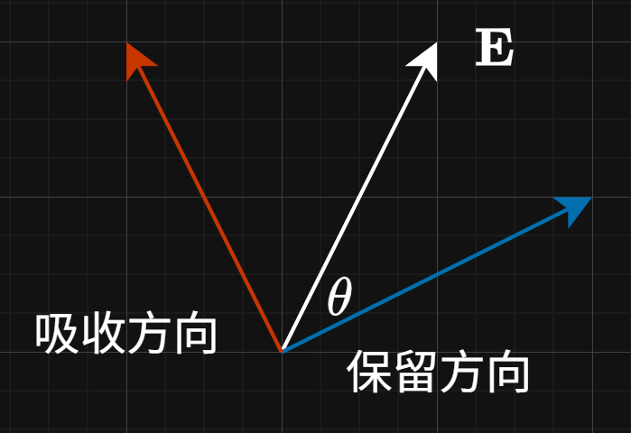

这也就意味着，当未偏振光通过偏振片时，只有与偏振片光轴平行的电场分量能够透过，而垂直于光轴的分量则被吸收，所以透过偏振片的电场强度为

$$
E_t = E \cos\theta
$$

考虑光强和电场的关系，我们就得到了马吕斯定律，即透过偏振片的光强与入射光强的关系为

$$
I = I_0 \cos^2\theta
$$

其中，$I_0$ 为入射光强，$\theta$ 为入射光与偏振片光轴之间的夹角。

---

至此，我们完成了对大学物理中波动光学部分的基本概念和重要定律的梳理与总结。要深入研究光学，我们还需要学习量子物理等更进一步的内容，这些知识我可能以后会有所涉猎，敬请期待。
