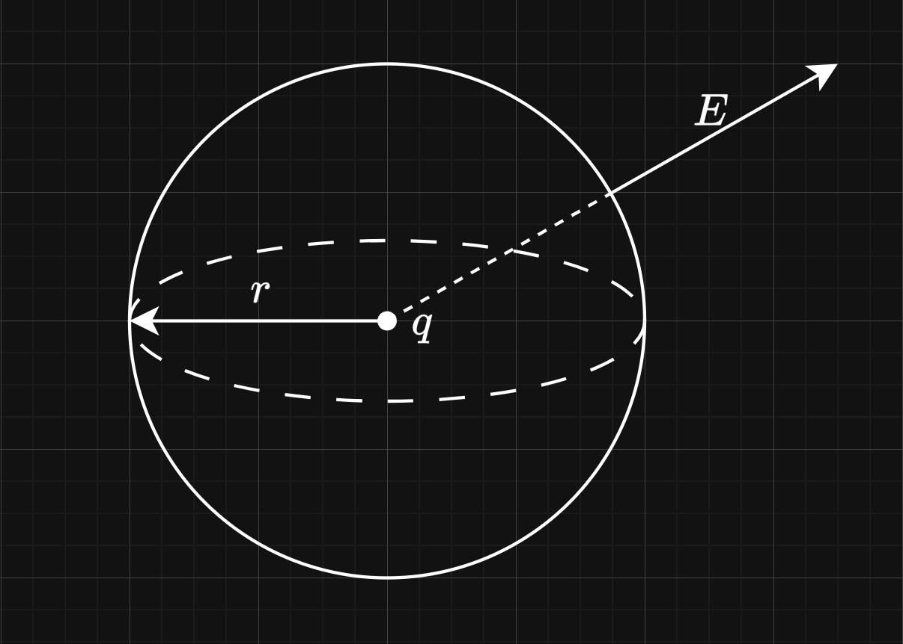
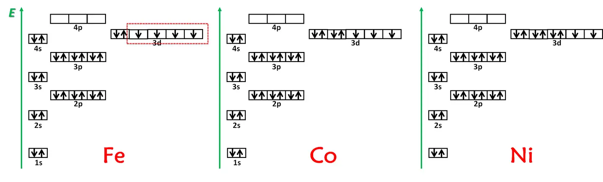
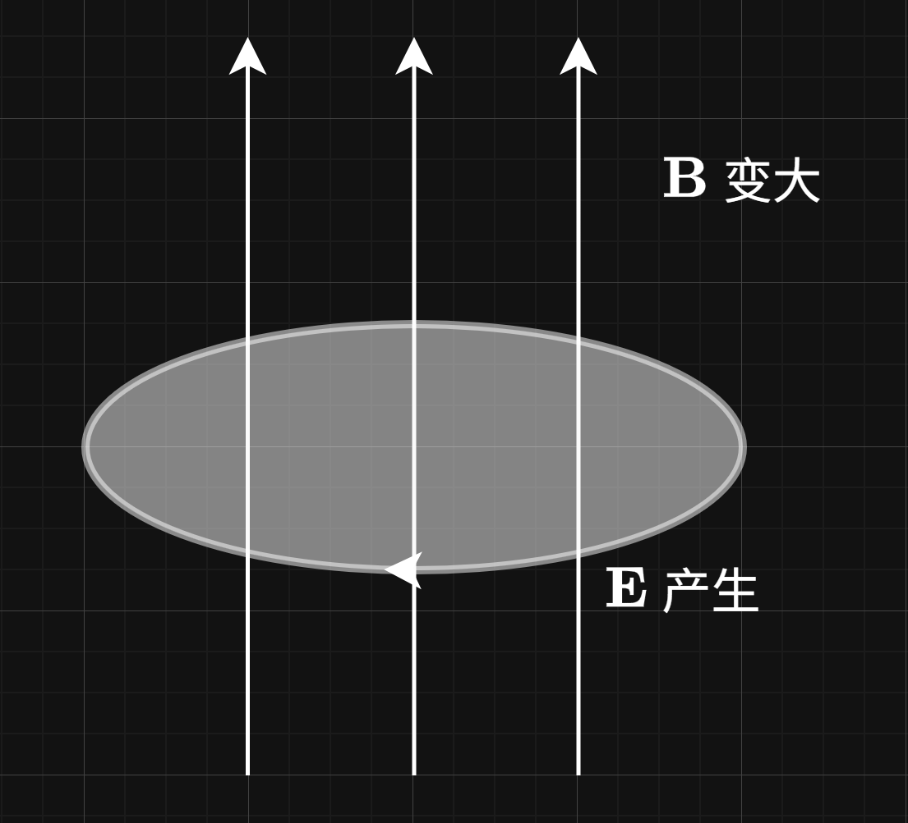
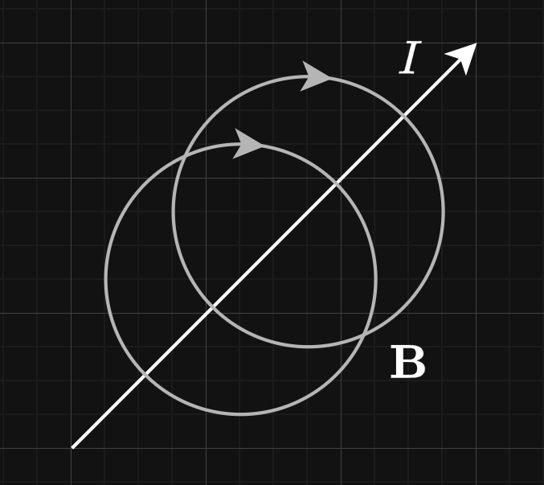
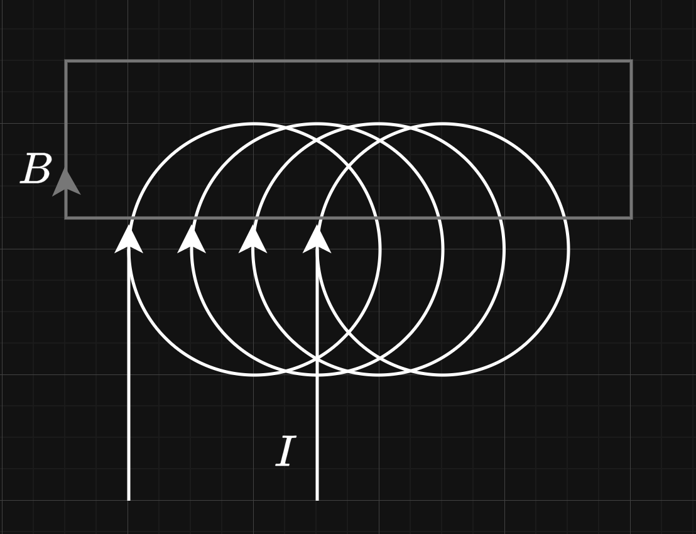

# 麦克斯韦方程组简述

麦克斯韦方程组是描述电磁场的基本方程组，概括了电场和磁场的相互作用规律。

$$
\nabla \cdot \mathbf{E} = \frac{\rho}{\varepsilon_0}
$$

$$
\nabla \cdot \mathbf{B} = 0
$$

$$
\nabla \times \mathbf{E} = -\frac{\partial \mathbf{B}}{\partial t}
$$

$$
\nabla \times \mathbf{B} = \mu_0 \mathbf{J} + \mu_0 \varepsilon_0 \frac{\partial \mathbf{E}}{\partial t}
$$

## 高斯定律

$$
\nabla \cdot \mathbf{E} = \frac{\rho}{\varepsilon_0}
$$

其中，$\mathbf{E}$ 是电场强度，$\rho$ 是电荷密度，$\varepsilon_0$ 是传导介质的介电常数。

这个公式告诉我们电场的强度和电荷的分布有关，且电荷密度越大，电场强度越大。

---

我们可以举一个简单的例子，比如说，对于空间中的一个点电荷 $q$，分析它在空间中产生的电场强度

考虑一个以点电荷为中心的球面，半径为 $r$，我们接下来计算这个点电荷在球面上贡献的电场强度。

$$
\nabla \cdot \mathbf{E} = \frac{\rho}{\varepsilon_0} = \frac{q}{\frac{4}{3} \pi r^3 \varepsilon_0}
$$

采用高斯公式，将散度转换为面积分

$$
\iint_S \mathbf{E} \cdot d\mathbf{S} = \int_V \nabla \cdot \mathbf{E} dV = \int_V \frac{q}{\frac{4}{3} \pi r^3 \varepsilon_0} dV = \frac{q}{\varepsilon_0}
$$

出于我们知道电荷在球面上的电场贡献是均匀的，而 $S = 4 \pi r^2$，所以有

$$
\mathbf{E} = \frac{q}{4 \pi r^2 \varepsilon_0}
$$

不妨令 $k = \frac{1}{4 \pi \varepsilon_0}$，那么

$$
\mathbf{E} = k \frac{q}{r^2}
$$

这便是中学物理中常见的点电荷产生的电场强度公式。

## 高斯磁定律

$$
\nabla \cdot \mathbf{B} = 0
$$

这个公式告诉我们磁场是无源场。

我们知道电荷有正负之分，一个单独的电荷可以是正电荷、也可以是负的。而磁体却没有类似的性质。我们无法找到单独的 N 极磁体或 S 极磁体。即对于**任何**磁体而言，它都同时具有 N 极和 S 极。

这就是为什么高斯磁定律表征磁场的散度为零，因为选定任何一个区域，其磁体一定会同时有 N 极和 S 极，其强度相互抵消，磁场线流入和流出该区域的强度是相等的，故其散度为零。

---

现实生活中，我们会使用磁铁，磁铁具有产生磁场的能力，是因为其内部原子电子的轨道运动产生的

构成物质的原子中，电子的轨道运动会产生磁场。根据泡利不相容原理，大部分电子成对运动，它们产生的磁场相互抵消，所以很多物体是不显磁性的。

而对于Fe、Co、Ni这类原子来讲，由于这些金属元素的原子中有未成对的电子，这些单个电子运动产生的磁矩不会相互抵消，致使其累计成的整体就得以产生总的磁场。

> 引用自：https://www.zhihu.com/question/37709367

所以，对于一个磁铁而言，它的 N 极和 S 极是由其内部原子中电子的轨道运动产生的，即便只分割其中一极的一部分分析，其内部的原子仍然同时具有 N 极和 S 极，其磁场散度仍然为 0 。

*注：实际上，磁铁带磁的原理比文中提到的还要复杂得多，除了文中提到的原子产生磁矩是带磁的重要因素以外，磁铁中原子产生的磁矩还要方向一致才能在整体上产生磁场，所以很多其它有未成对电子的原子之所以没能表现出磁性，是和它们结合成的晶体结构使其磁矩方向难以一致有关。*

## 法拉第电磁感应定律

$$
\nabla \times \mathbf{E} = -\frac{\partial \mathbf{B}}{\partial t}
$$

这个公式告诉我们，变化的磁场会在周围空间中产生电场，电场的旋度和磁场的变化率成正比。

---

举个例子，高中时期我们学习过感生电动势的概念，在闭合回路中，穿过其中磁通量的变化会在回路中产生电动势，这便是法拉第电磁感应定律的一种体现。

我们将该式两边对一面区域积分

$$
\oint_{\partial S} \mathbf{E} \cdot d\mathbf{l} = -\frac{d}{dt} \iint_S \mathbf{B} \cdot d\mathbf{S}
$$

运用斯托克斯公式，将左边的面积分换为线积分，所以有沿闭合回路的电动势等于穿过该回路的磁通量的变化率

$$
E = -\frac{d}{dt} \Phi_B
$$

这便是我们在高中时期学习过的法拉第电磁感应定律，$\Phi_B$ 是穿过回路的磁通量，$E$ 是回路中的电动势。

## 安培-麦克斯韦定律

$$
\nabla \times \mathbf{B} = \mu_0 \mathbf{J} + \mu_0 \varepsilon_0 \frac{\partial \mathbf{E}}{\partial t}
$$

其中 $\mathbf{J} = \frac{\sum \mathbf{I}}{\mathbf{S}}$ 是电流密度，为通过选定面积的电流总和除以面积；$\mu_0$ 是真空的磁导率；$\varepsilon_0$ 是真空的介电常数。

这个公式告诉我们，电流和变化的电场会在周围空间中产生磁场，磁场的旋度和电流密度以及电场的变化率成正比。

---

同样也举个例子，对于一段电流稳定的长直导线，电流会在周围的空间产生磁场

我们可以量化计算它产生的磁场，取以导线方向为中轴线，垂直于导线的圆形截面。

对原公式两边积分，有

$$
\iint_S \mathbf{B} \cdot d\mathbf{l} = \mu_0 \iint_S \mathbf{J} \cdot d\mathbf{S} + \mu_0 \varepsilon_0 \frac{d}{dt} \iint_S \mathbf{E} \cdot d\mathbf{S}
$$

将左边的式子用斯托克斯公式转换为圆形截面边界上的环量，即

$$
\oint_{\partial S} \mathbf{B} \cdot d\mathbf{l} = \mu_0 \iint_S \mathbf{J} \cdot d\mathbf{S} + \mu_0 \varepsilon_0 \frac{d}{dt} \iint_S \mathbf{E} \cdot d\mathbf{S}
$$

出于电流稳定，所以 $\frac{d\mathbf{E}}{dt} = 0$，有

$$
\oint_{\partial S} \mathbf{B} \cdot d\mathbf{l} = \mu_0 I
$$

圆的周长为 $2 \pi r$，所以圆环上某点的磁场强度为

$$
\mathbf{B} = \frac{\mu_0 I}{2 \pi r}
$$

---

再分析一个典型，对于一个电流稳定的 N 匝螺线圈，分析其产生的磁场

取一段矩形截面，其下边界为 N 匝螺线圈的中轴线，上边界在线圈外，左右边界垂直于导线方向。

对原公式两边积分，有

$$
\oint_{\partial S} \mathbf{B} \cdot d\mathbf{l} = \mu_0 N I
$$

假设线圈是**无限长**的，那么长方形的左右边界相对于上下边界就可以忽视，考虑每两匝线圈之间的间隔是 $d$，那么矩形的周长就应当为

$$
C = 2 N d
$$

同时，对无限长螺线管而言，其外部磁场接近于 0（此处不做详细推导），所以 $\mathbf{B}$ 的有效积分区域只在线圈内部。

所以有 $L = \frac{C}{2} = Nd$，代入原方程

$$
\mathbf{B} = \frac{\mu_0 I}{d}
$$

这就是理想螺线管的磁场强度公式，令密绕密度 $n = \frac{1}{d}$ 得到

$$
\mathbf{B} = \mu_0 n I
$$

这便是该公式的更常见形式。