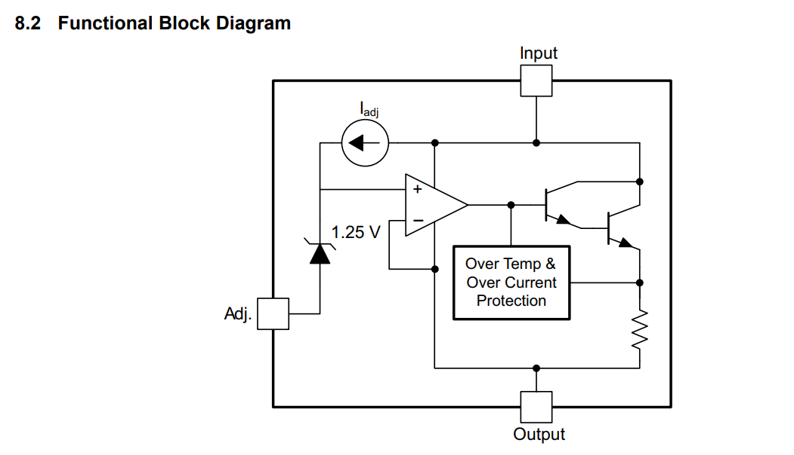
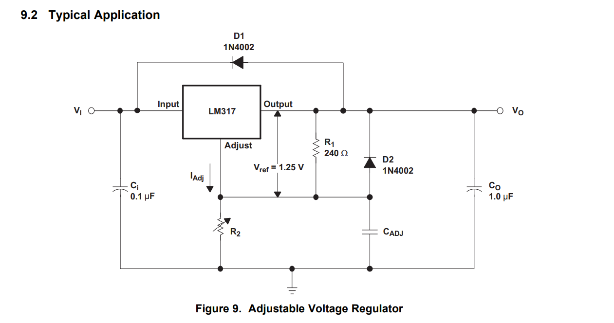
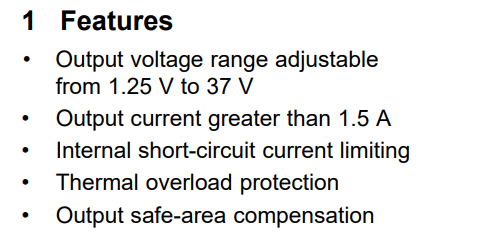

# LM317可调线性稳压器

> LM317 器件是一款可调节 3 端正电压稳压器，能够在 1.25V 至 37V 的输出电压范围内提供超过 1.5A 的电流。它仅需要使用两个外部电阻器来设置输出电压。此器件 具有 0.01% 的典型线性调整率和 0.1% 的典型负载调整率。它包含电流限制、热过载保护和安全工作区保护功能。即使“调节”端处于断开状态，过载保护功能仍然起作用。

[德州仪器官网介绍](https://www.ti.com.cn/product/cn/LM317#description)

[LM317 数据手册](https://www.ti.com.cn/cn/lit/ds/symlink/lm317.pdf?ts=1745368976159&ref_url=https%253A%252F%252Fwww.ti.com.cn%252Fproduct%252Fcn%252FLM317)

LM317是一款可调线性稳压器，本文将简单介绍该元件的原理，特性以及应用。

## 原理图概览

1. 我们从 Adj 端口开始分析，首先由于运算放大器虚短的特性，其输入区域接近于断路，所以 Adj 端口的电流与上方电流源的电流相同 $i_{adj} = I_{adj}$。

> 注：$I_{adj}$ 是一个小电流，通常在 $50\mu A$ 左右。

2. 由于 Adj 端口的电流不为 $0$，可以断定齐纳二极管被击穿，所以我们知道运算放大器的输入端口电压为 $U_{+} = U_{adj} + 1.25V$，其中 $U_{adj}$ 为 Adj 端口的电压，$1.25V$ 为齐纳二极管的击穿电压。

3. 由于运算放大器的反馈特性，我们知道 $U_{+} = U_{-}$，所以我们可以得到 $U_{-} = U_{adj} + 1.25V$。

4. 所以说，我们可以得到 $U_{out} = U_{adj} + 1.25V$，同时不难观察到 $U_{adj}$ 和 $U_{out}$ 之间的电压差值是恒定的，我们称这个电压差值为 LM317 的参考电压， $U_{ref} = 1.25V$。

利用这个参考电压不变的关键特性，我们可以用 LM317 来实现一个稳压器，接下来来看一个实际的电路应用。

## 应用案例分析

上图是一个典型的 LM317 稳压电路，输入端口 Vin 连接到一个电源，输出端口 Vout 连接到负载, LM317 在其中起到稳压的作用。

1. 为了简化电路分析，我们忽略电路中的所有电容，将它们全部作为断路（对于直流电来说）。

2. 我们知道 $U_{out} = U_{adj} + 1.25V$，$U_{out} > U_{adj}$，所以 D2 二极管处于截止状态，不导电。

3. 又有此时流过 R1 的电流为 $I_{R_{1}} = \frac{U_{out} - U_{adj}}{R_{1}} = \frac{U_{ref}}{R_{1}}$。从而推出流过 R2 的电流为 $I_{R_{2}} = \frac{U_{ref}}{R_{1}} + I_{adj}$。

---

运用欧姆定律，根据 $I_{R_{1}}$ 和 $I_{R_{2}}$ 的值，我们知道

$$
U_{out} = U_{R_{1}} + U_{R_{2}} = I_{R_{1}} \cdot R_{1} + I_{R_{2}} \cdot R_{2}
$$

代入上方的电流表达式

$$
U_{out} = \frac{U_{ref}}{R_{1}} \cdot R_{1} + \left(\frac{U_{ref}}{R_{1}} + I_{adj}\right) \cdot R_{2}
$$

算得最终的输出电压为

$$
U_{out} = U_{ref} \cdot \left(1 + \frac{R_{2}}{R_{1}}\right) + I_{adj} \cdot R_{2}
$$

所以，利用这款稳压器，仅需调整 R2 的阻值，即可实现对 $U_{out}$ 的调整，我们就实现了一个输出可调的直流电源。

另外，为了实现对电路的一些保护和滤波功能，在电路中还有一些其它的电容和二极管，在这里对它们的作用做一个简单分析。

1. C_ADJ 是一个纹波抑制电容，当 Vin 的电压突然升高，使得 Vout 的电压也随之升高时，C_ADJ 会吸收一部分电流，避免 Vout 突然升高，起到稳定输出电压，抑制输入信号的作用。

2. D2 是配合上面的纹波抑制电容工作的，平常不导通，只有在 C_ADJ 放电时才会导通，提供一个从 D1 到 R1 到 R2 的回路，避免 C_ADJ 放电到负载。

3. Ci 是一个滤波电容，负责滤去 Vin 上的纹波电压，避免 Vin 上的纹波电压影响到 Vout 的稳定性。

4. Co 是一个滤波电容，负责滤去 Vout 上的纹波电压，提高在输出电压突变时输出端口的稳定性，避免 Vout 上的纹波电压影响到负载。

5. D1 是配合上面的纹波抑制电容工作的，平常不导通，只有在 Co 放电时才会导通，提供一个从 D1 到 R1 到 R2 的回路，避免 Co 放电到负载。

## 元件基本特性

1.25V 至 37V 可调节输出电压范围  
输出电流大于 1.5A  
内部短路电流限制  
热过载保护  
输出安全区域补偿  

得益于达林顿管（即上图中级联的三极管）为其提供了电流输出增益，LM317 的输出电流可以达到 1.5A。良好的热过载保护和短路电流限制功能（上图中运放输出端的检测反馈电路）使得 LM317 在工作时不会轻易地过载而损坏。